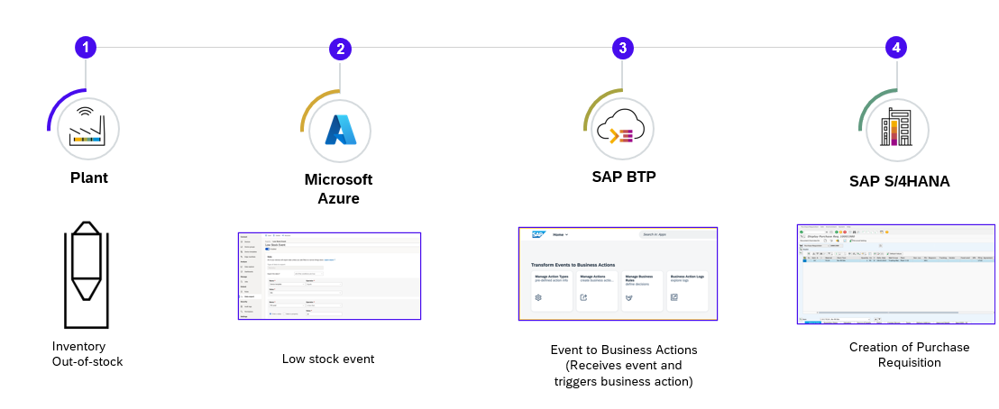

# Build Events-to-Business Actions scenarios with SAP BTP and Microsoft Azure

Power Industry 4.0 scenarios with “Events-to-Business” actions leveraging SAP BTP and Azure IoT
Create Business Actions in SAP from Events using SAP BTP
Manage Events to Business Actions using Events2Actions Framework in SAP BTP
Translate Events to SAP Business Actions with SAP BTP

This repository contains code samples and instructions for developing an extension application  in SAP BTP. The sample application has been developed in a partner collaboration to help customers integrate any type of events from systems into SAP ecosystem via SAP BTP. This application helps to configure  actions that needs to be taken in SAP LoB systems based on the events that is received in SAP Event Mesh.

There are two scenarios described in this repository. In this tutorial, the events are received from Azure IoT Platform and the actions for these events are taken in SAP S/4HANA. You can use this application to further customize it for other systems as well.

1. Inbound to SAP S/4HANA

    In this scenario, Azure IoT Events are sent to SAP Event Mesh using the Data Export functionality in Azure IoT Central Application. The Node.js extension application subscribes to SAP Event Mesh queue and executes the action that is required to be taken based on the event details. In this case, SAP Event Mesh is used. 

2. Outbound from SAP S/4HANA

    In this scenario, any event that is triggerred from SAP S/4HANA is sent to SAP Event Grid. With the latest Beta Releease of SAP Event Mesh - Connectivity Plan, event is propogated to Azure Event Grid with direct connectivity. As the Connecivity Plan is currently available for only SAP Event Mesh to Azure Event Grid flow, the event consumption from Azure Event Grid to outlook notification to the user is implemented.You can further extend this scenario to communicate back to device from the event info received from SAP S/4HANA. This is not covered in this tutorial.

> **Important Note** : Please be aware that this GitHub repository is still work in progress for improvements and additional scenarios. Make sure you're pulling the repository from time to time and redeploying it in SAP BTP.

## Table of Contents

[Scenario](#scenario)\
[Business Process Flow ](#business-process-flow)\
[Solution Architecture](#solution-architecture)\
[Requirements](#requirements)\
[Implementation: Configuration and Development](#configuration-and-development)\
[Additional Resources](#additional-resources)\
[Known Issues](#known-issues)\
[Reference](#reference)\
[Disclaimer](#disclaimer)\
[How to Obtain Support](#how-to-obtain-support)\
[Code of Conduct](#codeofconduct)\
[Contributing](#contributing)\
[License](#license)

## Scenario:
The business scenario you will be implementing here is to integrate real time events generated from industrial production processes in factories, plants, and warehouses into SAP business processes to enrich the outcome of enterprise operations and facilitate rapid decision making. In this use-case you will see how an IoT Event from Azure IoT Central is handled for performing business operations in SAP S/4HANA. The framework can be extended to any platform and to any kind of event.

## Business Process Flow 
The **Event to Business** Application has been developed in SAP BTP to help customers and partners to help create event-driven application using CAP and deploying them in SAP BTP. For this use-case, the Cloud Foundry Runtime was chosen. 

The example configured here focuses on using Azure IoT Central, SAP Event Mesh, SAP CAP, SAP Workflow Management integrating with SAP S/4HANA. You can choose to configure and integrate with any SAP LoB solutions which exposes business services as OData APIs.

This sample application which is part of this repository is configured for Azure IoT Central to send critical and actionable events to SAP BTP. These events are received by SAP Event Mesh and the extension application in SAP BTP initiates process business actions in SAP S/4HANA based on the configurations.

## Solution Architecture

The key services used from Microsoft Azure are the Azure IoT Central, Azure Blob Storage, Azure Communication Service, Azure Event Grid and Azure Active Directory.

The services used from SAP BTP are the Cloud Foundry Runtime, SAP Event Mesh, SAP Connectivity service, SAP Private Link service, SAP Workflow Management, SAP Event Mesh Connectivity Plan(Beta) and SAP Destination service. 

SAP Private Link service is used in thie scenario as SAP BTP and SAP S/4HANA are running on Azure Infrastructure, however you can use the SAP Connectivity service and Cloud Connector for integration of SAP BTP and SAP S/4HANA as well. 

For more information, see [Set Up Connectivity Between SAP BTP and SAP S/4HANA Using SAP Private Link Service](./documentation/Scenario1-Inbound-to-SAPS4HANA/Step4b-Setup-SAPPrivateLinkService/README.md) page.

For outbound from SAP S/4HANA scenario using SAP Event Mesh Connectivity Plan(Beta), see [Integrate Events Between SAP and Microsoft using SAP Event Mesh - Connectivity Bridge Service](https://github.com/SAP-samples/btp-event-mesh-connectivity-bridge) page. You will find the detailed architecture and business scenario for SAP Event Mesh and Azure Event Grid direct connectivity.

## Requirements 

These are the technical prerequistics for an integration between Microsoft Azure IoT Central, SAP BTP and SAP S/4HANA. 

**Services in SAP BTP**
- Cloud Foundry Runtime
    > - Foundation for running the CAP extension application for translating events to business actions.
    > - Required for the trust between Microsoft Azure Active Directory and SAP BTP
- Memory/Runtime quota
    > - Required for deploying and running the extension application in SAP BTP
- Authorization & Trust Management Service
    > - Required for securing the extension application in SAP BTP
- SAP Event Mesh 
    >- Required to receive events from Azure IoT Platform
- SAP Workflow Management
    >- Business Rules service to configure business decisions that needs to be taken based on the type of event received from Azure IoT Platform.
- SAP Event Mesh Connectivity Plan(Beta)
    >- As of now, this service supports SAP Event Mesh to Azure Event Grid direct connectivity. This is available as Beta for Enterprise accounts only for now.

**Microsoft Azure**
- A valid Microsoft Azure subscription
- A Microsoft Azure Active Directory
    > - Required for the trust between Microsoft Azure Active Directory and SAP BTP
    > - User management
    > - Application registrations to allow access to Microsoft Azure IoT Central REST API and SAP BTP

- An Azure IoT Central Service
    > - Service for configuring Azure IoT Central Application
    > - Required for configuring device template, event producer and event routing.

- An Azure Storage Account
    > - Required for storing the events received from Azure Event Grid in case of outbound from SAP S/4HANA scenario using SAP EVent Mesh Connecivity service.

- An Azure Communication Service
    >- Required to send email notificiations and SMS to users.

## Configuration and Development

This repository is documented for 2 scenarios:

1. Inbound to SAP S/4HANA from Azure IoT Central.
2. Outbound from SAP S/4HANA to Azure Event Grid.

These are the steps to configure SAP S/4HANA, SAP BTP and Microsoft Azure for **Scenario 1 - Inbound to SAP S/4HANA from Azure IoT Central**.

[Step 1: Set Up the Subaccount in SAP BTP](./documentation/Scenario1-Inbound-to-SAPS4HANA/Step1-Setup-SAPBTP-Subaccount/README.md)

[Step 2: Configure Microsoft Azure IoT](./documentation/Scenario1-Inbound-to-SAPS4HANA/Step2-Setup-AzureIoT/README.md)

[Step 3: Check SAP S/4HANA Readiness](./documentation/Scenario1-Inbound-to-SAPS4HANA/Step3-SAPS4HANA-Readiness/README.md)

Step 4: Connect SAP BTP and SAP S/4HANA

   - [(Option 1) Using SAP BTP Connectivity Service](./documentation/Scenario1-Inbound-to-SAPS4HANA/Step4a-SetupCloudConnector/README.md)

   - [(Option 2) Using SAP Private Link Service](./documentation/Scenario1-Inbound-to-SAPS4HANA/Step4b-Setup-SAPPrivateLinkService/README.md)

[Step 5: Build and Deploy the Extension Application](./documentation/Scenario1-Inbound-to-SAPS4HANA/Step5-Build-Deploy-ExtensionApplication/README.md)

[Step 6: Create SAP Business Rules Project](./documentation/Scenario1-Inbound-to-SAPS4HANA/Step6-Configure-BusinessRules-Part1/README.md)

[Step 7: Configure SAP S/4HANA Business Actions in the extension application](./documentation/Scenario1-Inbound-to-SAPS4HANA/Step7-Configure-BusinessActions/README.md)

[Step 8: Update and Activate SAP Business Rule Project](./documentation/Scenario1-Inbound-to-SAPS4HANA/Step8-Configure-BusinessRules-Part2/README.md)

[Step 9: Test the Extension Application](./documentation/Scenario1-Inbound-to-SAPS4HANA/Step9-Test-ExtensionApplication/README.md)

For **Scenario 2 - Outbound from SAP S/4HANA to Azure Event Grid**, please refer to 
[Outbound from SAP S/4HANA to Azure Event Grid](./documentation/Scenario2-Outbound-from-SAPS4HANA/README.md) link.

## Additional Resources

This project has been implemented based on the following SAP CAP sample repository.

- [Cloud-cap-samples](https://github.com/SAP-samples/cloud-cap-samples/)

## Known Issues

## Reference

### Creation of Azure IoT solutions
[Azure IoT Central](https://azure.microsoft.com/en-in/products/iot-central/)

## Disclaimer
This project has been a proof of concept, including several limitations and prerequisites. The objective was to build a extension application for receiving and automating the actions in SAP S/4HANA. For this reason, the coding should not be seen as any recommendation for productive implementation. It fulfils the purpose and requirements of a proof of concept and is not intended for productive usage. It has been declared as pure proof of concept only to give the development teams ideas for solving potential challenges when integrating events from other platforms and SAP S/4HANA using SAP BTP. This can be extended to integrate with any other SAP LoB system as well.

## How to Obtain Support
[Create an issue](https://github.com/SAP-samples/<repository-name>/issues) in this repository if you find a bug or have questions about the content.
For additional support, [ask a question in the SAP Community](https://answers.sap.com/questions/ask.html).

## Contributing

If you wish to contribute code, offer fixes or improvements,  send a pull request. Due to legal reasons, contributors will be asked to accept a DCO when they create the first pull request to this project. This happens in an automated fashion during the submission process. SAP uses [the standard DCO text of the Linux Foundation](https://developercertificate.org/).

Refer to the [CONTRIBUTING](CONTRIBUTING.md) file for guidelines to contributions from external parties.

For additional support, [ask a question in the SAP Community](https://answers.sap.com/questions/ask.html).

## Code of Conduct
Refer to the [CODE OF CONDUCT](CODE_OF_CONDUCT.md) file.

## License
Copyright (c) 2022 SAP SE or an SAP affiliate company. All rights reserved. This project is licensed under the Apache Software License, version 2.0, except as noted otherwise in the [LICENSE](LICENSE) file.