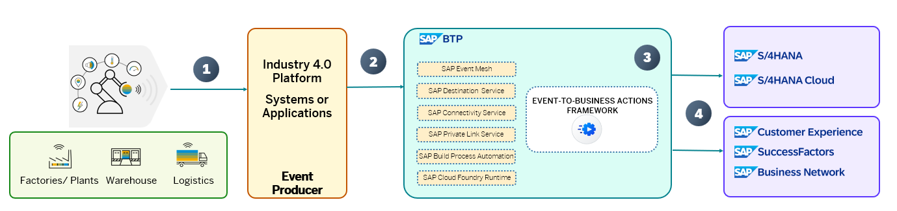

# OVERVIEW

# Build Events-to-Business Actions Scenarios with SAP BTP and Microsoft Azure/AWS

Companies are driving the digitization of the factory, plants, warehouses, and business networks and creating an ecosystem by linking Information Technology (IT) with Operational Technology (OT). Bridging the gaps between different landscapes and processes with integrated frameworks is key for building a seamless, efficient, bi-directional collaborative ecosystem.

As businesses expand, their enterprise IT landscapes become more intricate, and they need to automate and optimize daily tasks with various software applications, systems, and processes. To facilitate communication across these landscapes without overburdening the systems, decoupled/asynchronous communication between application endpoints is an effective solution to improve performance and scalability. One of the ways to achieve this  on SAP BTP is to develop and extension applications based on event-driven architecture. 

This repository contains code samples and instructions for developing an event-driven side-by-side extension application that integrates any type of event from systems/applications(providers) into the SAP ecosystem(consumer) via SAP BTP. This application helps to configure actions that need to be executed in SAP LoB systems based on the events that are received in SAP Event Mesh. The application scenario you will develop in this tutorial leverages the Events-To-Business actions framework (extension application). 

In the scenario explained in this repository, the events are published from IoT Platform(Microsoft Azure IOT and AWS IoT) and the actions for these events are triggerred in SAP S/4HANA for a simple purchase order business process using the Events-to-Business Actions framework. You can use this application to further customize it for other systems as well.

> **Important Note** : Please be aware that this GitHub repository will be updated for improvements and additional scenarios. Make sure you're pulling the repository from time to time and redeploying it in SAP BTP.

## Table of Contents

[Scenario](#scenario)\
[Business Process Flow](#business-process-flow)\
[Solution Architecture](#solution-architecture)\
[Implementation: Configuration and Development](#configuration-and-development)\
[Additional Resources](#additional-resources)\
[Known Issues](#known-issues)\
[Reference](#reference)\
[Disclaimer](#disclaimer)\
[How to Obtain Support](#how-to-obtain-support)\
[Code of Conduct](#codeofconduct)\
[Contributing](#contributing)\
[License](#license)

## Scenario

The business scenario you will be implementing here is to integrate real time events generated from Microsoft Azure IoT Platform/AWS IoT into SAP business processes to enrich the outcome of enterprise operations and facilitate rapid decision making. The framework can be extended to any platform and to any kind of event.

You can choose to configure and integrate events with any SAP LoB solution.

## Business Process Flow

In this event-driven scenario, based on the real-time status of the IoT Devices , actionable events are sent to SAP BTP to decide on the critical business actions to be taken in the SAP Enteprise Business systems based on business rules defined in the system.

1. Data from IoT Devices are sent to Microsoft Azure IoT Central/AWS IoT which includes all the streaming data from the devices.

2. Based on the rules in Microsoft Azure IoT/AWS IoT, the data is published to SAP Advanced Event Mesh/SAP Event Mesh in case of any actions which needs attention. This is configured in IoT Rules in the IOT Platform. Similar decisions can be configured in other systems and applications as well.

3. SAP BTP acts as consumer. Once the event details are received, the SAP BTP extension application which is configured with all necessary actions (For example, configuring the decisions in SAP Build Process Automation to decide on action to be taken, executing the chain of actions which needs to be taken based on the event received, configure the OData API call to be executed etc) executes the respective chain of actions.

5. The extension application in SAP BTP executes the business actions in respective SAP Enterprise systems.

## Solution Architecture

The solution architecture and detailed documentation for integrating with Microsoft Azure IoT can be found at

[Integration-With-Microsoft Azure-IoT](./project-panel/Integration-With-Azure-IoT/README.md).

The solution architecture and detailed documentation for integrating with AWS IoT can be found at

[Integration-with-AWS-IoT](./project-panel/Integration-With-AWS-IoT/README.md).

## Additional Resources

This project has been implemented based on the following SAP CAP sample repository.

- [Cloud-cap-samples](https://github.com/SAP-samples/cloud-cap-samples/)

## Known Issues

No known issues.

## Reference

### Creation of Azure IoT solutions

[Azure IoT Central](https://azure.microsoft.com/en-in/products/iot-central/)

### Creation of AWS IoT solutions

[AWS IoT](https://docs.aws.amazon.com/iot/latest/developerguide/what-is-aws-iot.html)

## Disclaimer

This project has been a proof of concept, including several limitations and prerequisites. The objective was to build a extension application for receiving and automating the actions in SAP S/4HANA. For this reason, the coding should not be seen as any recommendation for productive implementation. It fulfils the purpose and requirements of a proof of concept and is not intended for productive usage. It has been declared as pure proof of concept only to give the development teams ideas for solving potential challenges when integrating events from other platforms and SAP S/4HANA using SAP BTP. This can be extended to integrate with any other SAP LoB system as well.

## How to Obtain Support

[Create an issue](https://github.com/SAP-samples/<repository-name>/issues) in this repository if you find a bug or have questions about the content.
For additional support, [ask a question in the SAP Community](https://answers.sap.com/questions/ask.html).

## Contributing

If you wish to contribute code, offer fixes or improvements,  send a pull request. Due to legal reasons, contributors will be asked to accept a DCO when they create the first pull request to this project. This happens in an automated fashion during the submission process. SAP uses [the standard DCO text of the Linux Foundation](https://developercertificate.org/).

Refer to the [CONTRIBUTING](CONTRIBUTING.md) file for guidelines to contributions from external parties.

For additional support, [ask a question in the SAP Community](https://answers.sap.com/questions/ask.html).

## Code of Conduct

Refer to the [CODE OF CONDUCT](CODE_OF_CONDUCT.md) file.

## License

Copyright (c) 2022 SAP SE or an SAP affiliate company. All rights reserved. This project is licensed under the Apache Software License, version 2.0, except as noted otherwise in the [LICENSE](LICENSE) file.
