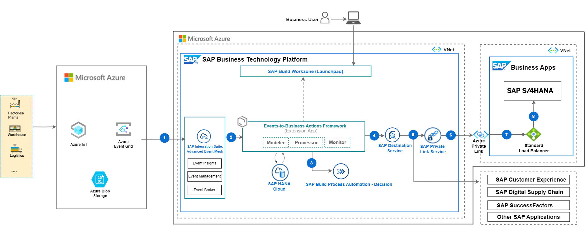
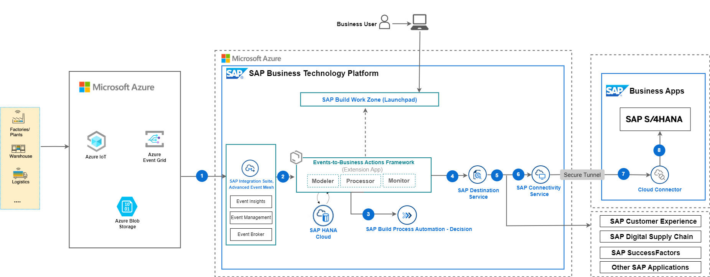

# Introduction

### Build Events-to-Business Actions Scenarios with SAP BTP and Microsoft Azure

In this tutorial, the events are received from Microsoft Azure IoT Platform and the business actions for these events are triggered in SAP S/4HANA. You can use this application to further customize it for other systems as well.

In this scenario, Azure IoT Events are sent to SAP Event Mesh or SAP Advanced Event Mesh(based on the eventing option selected) using the Data Export functionality in Azure IoT Central Application. The Node.js extension application subscribes to the SAP Event Mesh queue and executes the action that is required to be taken based on the event details.  

## Table of Contents

[Scenario](#scenario)\
[Business Process Flow](#business-process-flow)\
[Solution Architecture](#solution-architecture)\
[Requirements](#requirements)\
[Implementation: Configuration and Development](#configuration-and-development)

## Scenario

The business scenario you will be implementing here is to integrate real-time events generated from the Microsoft Azure IoT Platform into SAP business processes to enrich the outcome of enterprise operations and facilitate rapid decision-making. The framework can be extended to any platform and any kind of event.

You can choose to configure and integrate events with any SAP LoB solution.

## Business Process Flow

In this event-driven scenario, based on the real-time status of the IoT Devices from Microsoft Azure IoT Central, actionable events are sent to SAP BTP to decide on the critical business actions to be taken in the SAP Enterprise Business systems based on business rules defined in the system.

1. Data from IoT Devices are sent to Microsoft Azure IoT Central.

2. Rules in Microsoft Azure IoT trigger a call to SAP Event Mesh in case of any actions that need attention. This is defined in IoT Rules for devices.

3. SAP Event Mesh receives the events.

4. The extension application is configured with all necessary actions (For example, calling SAP Business Rules API to read the decision tables to decide on the action to be taken, configuring the OData API call to be executed, and service call back to the device) to be taken.

5. The extension application executes the business actions.

6. For this sample application, based on the fill level of the waste container a new Purchase Order Requisition is created in SAP S/4HANA.

## Solution Architecture

The key services used by Microsoft Azure are the Azure IoT Central, Azure Blob Storage, Azure Communication Service, Azure Event Grid and Azure Active Directory.

The services used by the SAP BTP are the Cloud Foundry Runtime, SAP Event Mesh or SAP Advanced Event Mesh, SAP Connectivity service, SAP Private Link service, SAP Build Process Automation(Decisions) and SAP Destination service. 

SAP Private Link service is used for connectivity between SAP BTP and SAP S/4HANA when both systems are running on Microsoft Azure Infrastructure. Alternatively, you can use SAP Connectivity service and Cloud Connector for integration of SAP BTP and SAP S/4HANA as well. 

 **Figure-1: High-level architecture (with SAP S/4HANA on Azure)**

    
 **Figure 2: High-level architecture with SAP S/4HANA on-premise and private cloud**

The following steps depict the information flow across systems (in both scenarios)

(1) The event is triggered from Microsoft Azure and sent to SAP Event Mesh.

(2) The Event-to-Business-Action framework(extension app) processor module's endpoint is subscribed to SAP Event Mesh, hence receiving this event.

(3) Event-to-Business-Action framework(extension app) processor module leverages the Business Rules capability of SAP Build Process Automation to derive business action (for example, Purchase Order Requisition creation in SAP S/4HANA system) based on certain characteristics of the incoming event.

(4), (5), (6) (7) and (8) Event-to-Business-Action framework (extension app) processor module triggers the defined action in the SAP S/4HANA system by using the SAP Destination Service and SAP Private Link Service.  

For more information, see [Set Up Connectivity Between SAP BTP and SAP S/4HANA Using SAP Private Link Service](./Scenario1-Inbound-to-SAPS4HANA/Step4b-Setup-SAPPrivateLinkService/README.md) page.

In case SAP S/4HANA is on-premise and private cloud (refer to Figure-2)– communication with SAP S/4 HANA integrates via SAP Connectivity Service and Cloud Connector.

(9) and (10) SAP S/4HANA publishes an event for Purchase Requisition creation and is sent to Microsoft Azure Event Grid via SAP Event Mesh Connectivity Bridge for further processing by Microsoft Azure applications.

## Requirements 

These are the technical prerequisites for integration between Microsoft Azure IoT Central, SAP BTP and SAP S/4HANA. 

**Services in SAP BTP**
- Cloud Foundry Runtime
    > - Foundation for running the CAP extension application for translating events to business actions.
    > - Required for the trust between Microsoft Azure Active Directory and SAP BTP
- Memory/Runtime quota
    > - Required for deploying and running the extension application in SAP BTP
- Authorization & Trust Management Service
    > - Required for securing the extension application in SAP BTP
- SAP Event Mesh 
    >- Required to receive events from Azure IoT Platform
- SAP HANA Cloud 
    >- Required to store action configuration and logs for CAP application
- SAP Build Process Automation, Decisions
    >- Decisions are leveraged to configure business decisions that needs to be taken based on the type of event received from Azure IoT Platform.

**Microsoft Azure**
- A valid Microsoft Azure subscription
- A Microsoft Azure Active Directory
    > - Required for the trust between Microsoft Azure Active Directory and SAP BTP
    > - User management
    > - Application registrations to allow access to Microsoft Azure IoT Central REST API and SAP BTP

- An Azure IoT Central Service
    > - Service for configuring Azure IoT Central Application
    > - Required for configuring device template, event producer and event routing.

- An Azure Storage Account
    > - Required for storing the events received from Azure Event Grid in case of outbound from SAP S/4HANA scenario using SAP Event Mesh Connecivity service.

## Configuration and Development

This repository is documented for below scenario:
Inbound to SAP S/4HANA from Azure IoT Central.

These are the steps to configure SAP S/4HANA, SAP BTP and Microsoft Azure for **Scenario 1 - Inbound to SAP S/4HANA from Azure IoT Central**.

[Step 1: Set Up the Subaccount in SAP BTP](./Step1-Setup-SAPBTP-Subaccount/README.md)

[Step 2: Configure Microsoft Azure IoT](./Step2-Setup-AzureIoT/README.md)

[Step 3: Check SAP S/4HANA Readiness](./Step3-SAPS4HANA-Readiness/README.md)

Step 4: Connect SAP BTP and SAP S/4HANA

   - [(Option 1) Using SAP BTP Connectivity Service](./Step4a-SetupCloudConnector/README.md)

   - [(Option 2) Using SAP Private Link Service](./Step4b-Setup-SAPPrivateLinkService/README.md)

[Step 5: Build and Deploy the Extension Application](./Step5-Build-Deploy-ExtensionApplication/README.md)

[Step 6: Configure Decisions Project](./Step6-Configure-Decisions-Part1/README.md)

[Step 7: Configure SAP S/4HANA Business Actions in the extension application](./Step7-Configure-BusinessActions/README.md)

[Step 8: Update and Activate SAP Business Rule Project](./Step8-Configure-BusinessRules-Part2/README.md)

[Step 9: Test the Extension Application](./Step9-Test-ExtensionApplication/README.md)

