# Test the End-to-End Scenario

Now that you have successfully deployed the extension application in SAP BTP and completed the configurations in Microsoft Azure, SAP BTP and SAP S/4HANA, follow these steps to test the application.

### 1. Trigger Process by Enabling Data Export

1. Open [Microsoft Azure IoT Central](https://industry-40.azureiotcentral.com/). Choose **Data Export**. 

    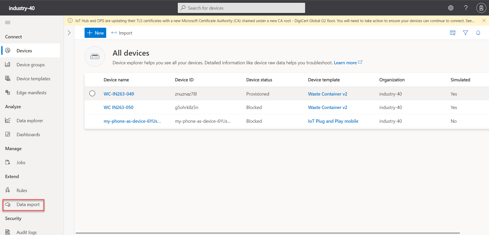

2. Click on the disabled toggle button to **Enable** the data export.

   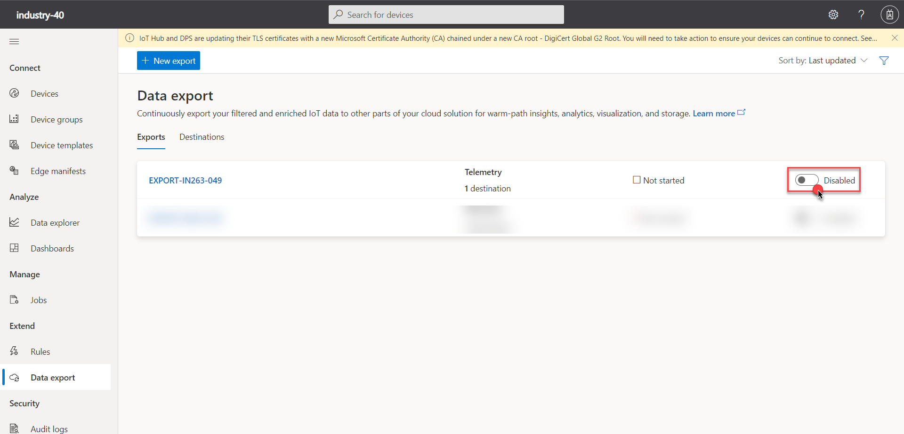

3. Upon enabling your screen will look as shown below. This might take couple of minutes to send an event. You can wait for 3-5 minutes.

    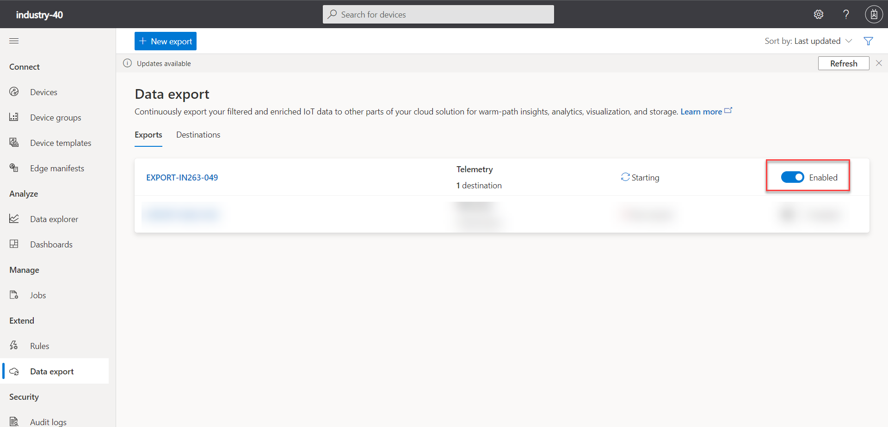

<!-- 2. Choose **Devices** and find your device and check the status. It should be in **Connected** state.

     -->

4. Log into your SAP S/4HANA System and Search for **Purchase Professional**. Choose **Manage Puchase Requisitions Professional** application.

    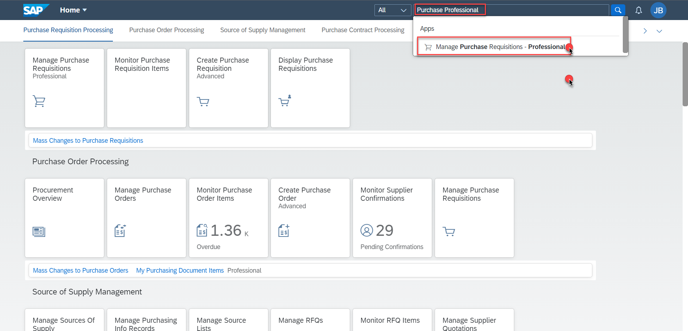
    <!--  -->

5. The **Manage Purchase Requisitions-Professional** application opens. Choose **Go** to list all the purchase requisitions created. 

    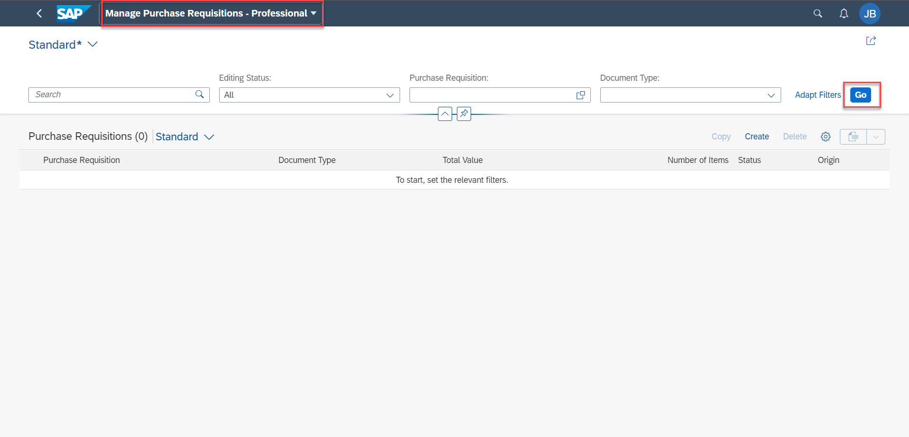
    <!--  -->

6. Choose the latest purchase requsition.

    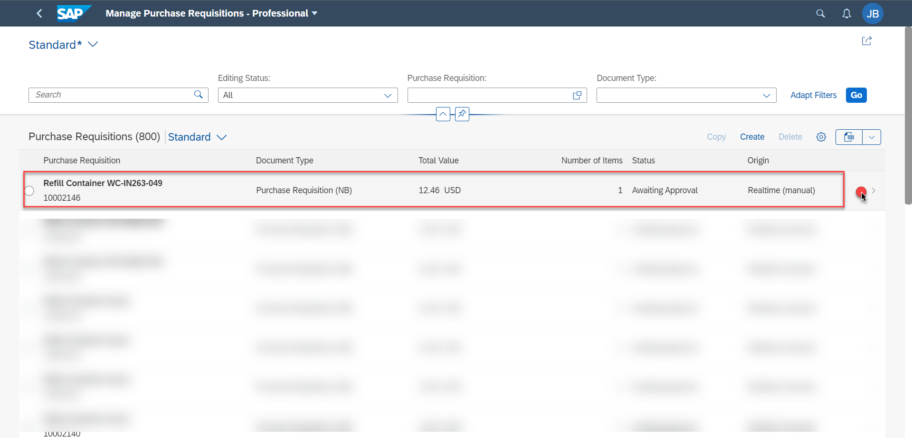

7. You can see that a **Purchase Requisition** was created for your device.

    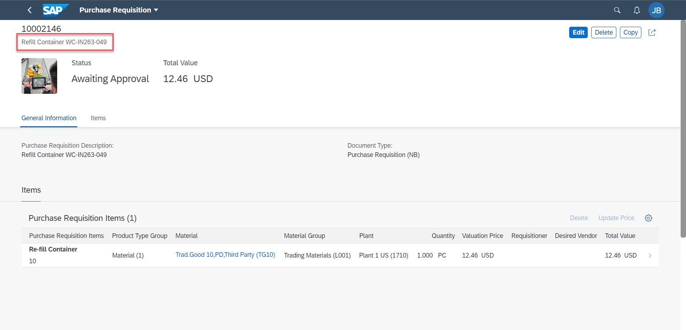
    <!--  -->

8. Now go back to [Microsoft Azure IOT Central Application](https://industry-40.azureiotcentral.com/) and **Disable** the data export. Then navigate to **Devices**

    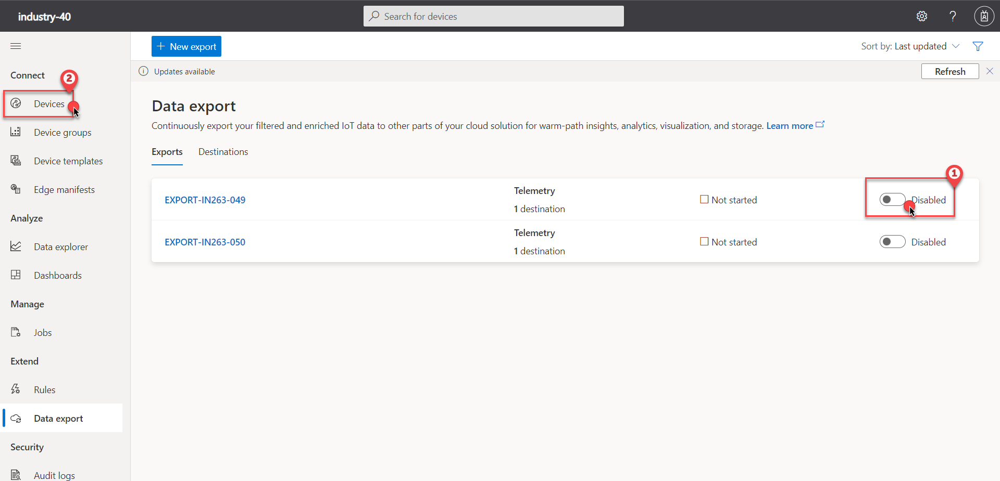
    <!--  -->

9. Choose your device to see if the **status** of your device was updated.

    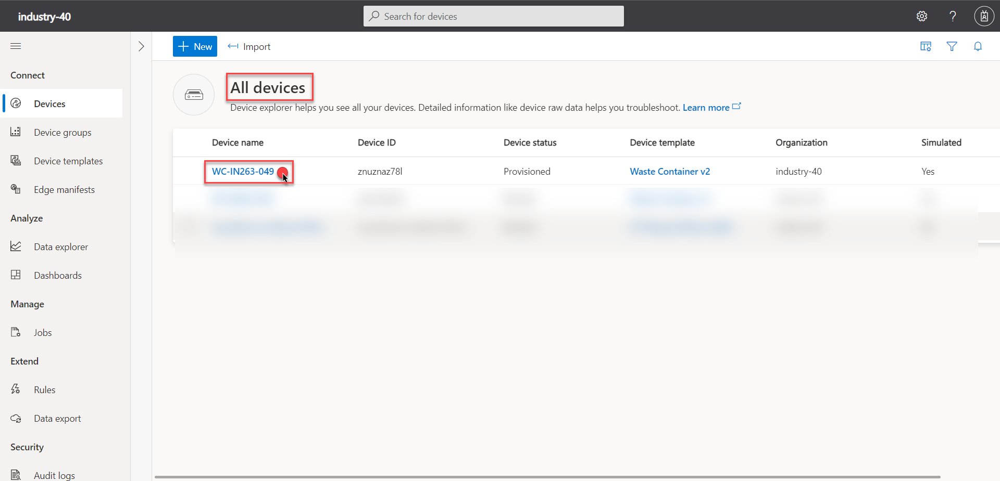
10. You can see that the **status** of your device is updated to **Under Maintenance**

    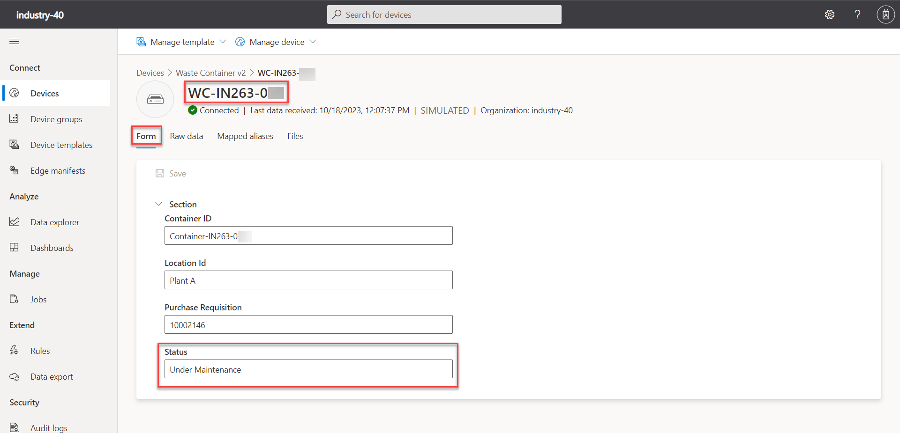

    <!--  -->

### 2. Explore the Action Logs

1. Open **action-management** application in your cloud foundry space using BTP Cockpit. Click on the url provided under Application Routes section.

    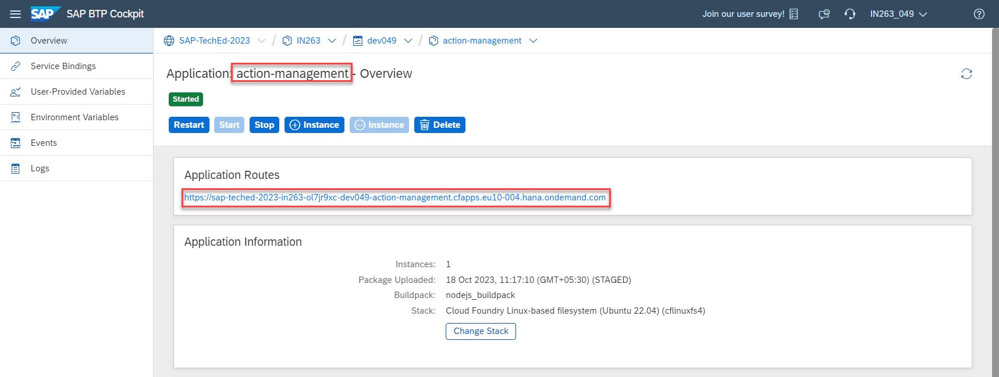

2. Click on **Business Action Logs** tile.

     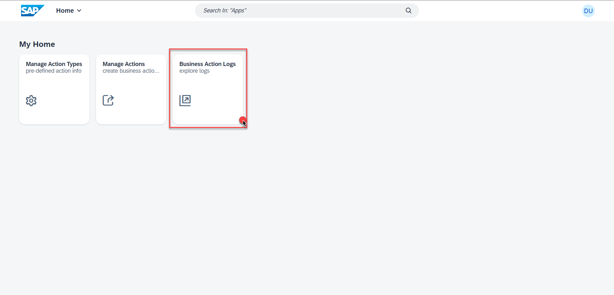
    <!--  -->

3. Choose **Go** to View Logs information, then choose the latest log entry.

    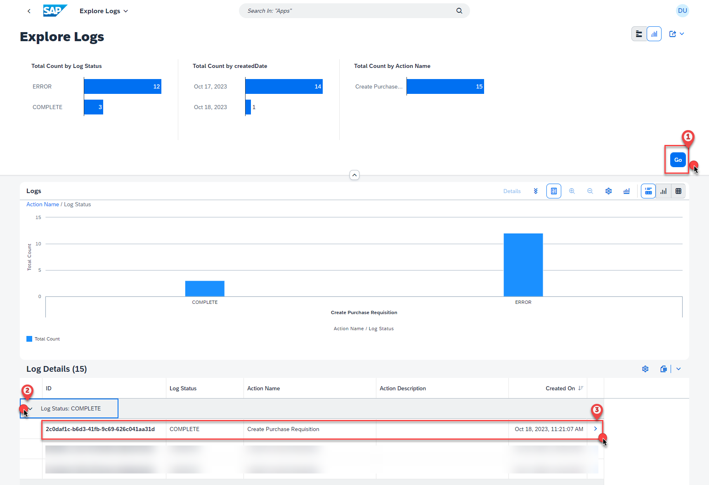
    <!--  -->

4. You can see the detailed logs. It also shows the **Log status** as **COMPLETE** upon successful creation of **Purchase Requisition** in the SAP S/4HANA System.

    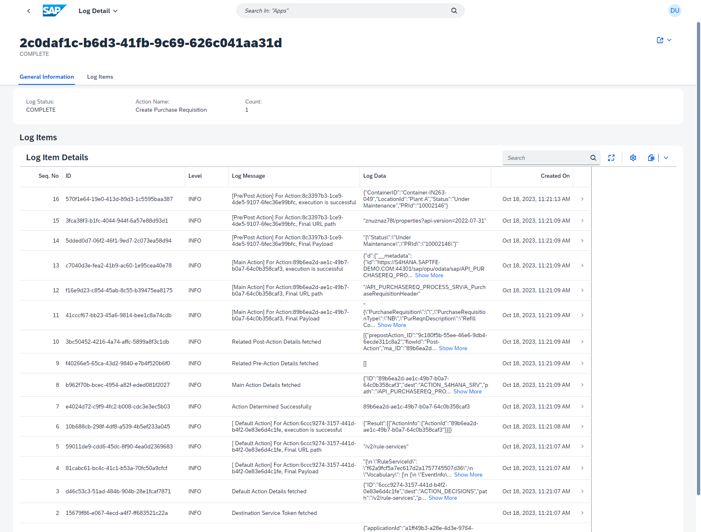
    <!--  -->

### 3. Congratulations!

Congratulations on completing your Exercise 7! You have successfully completed the end-to-end integration of events to business actions from Microsoft Azure IoT Central to SAP S/4HANA with SAP BTP.

#### For Additional Information on this use case you can refer following resources:

- Use Case: [Build Events-to-Business Actions Scenarios with SAP BTP and Microsoft Azure/AWS](https://github.com/SAP-samples/btp-events-to-business-actions-framework)
- DC mission: [Build Events-to-Business Actions Apps with SAP BTP and MS Azure/AWS](https://discovery-center.cloud.sap/missiondetail/4172/4422/)
- 5 Part Blog Series: [“Events-to-Business Actions”: An event-driven architecture on SAP BTP to implement Industry 4.0 scenarios with Microsoft Azure Services](https://blogs.sap.com/2023/01/27/part-1-events-to-business-actions-architecture-an-event-driven-framework-on-sap-btp-to-implement-industry-4.0-scenarios-with-microsoft-azure-services/)
- [Set Up Connectivity Between SAP BTP and SAP S/4HANA Using Cloud Connector](https://github.com/SAP-samples/btp-events-to-business-actions-framework/tree/main/documentation/Integration-With-Azure-IoT/Scenario1-Inbound-to-SAPS4HANA/Step4a-SetupCloudConnector)
- [Set Up Connectivity Between SAP BTP and SAP S/4HANA Using SAP Private Link Service](https://github.com/SAP-samples/btp-events-to-business-actions-framework/blob/main/documentation/Integration-With-Azure-IoT/Scenario1-Inbound-to-SAPS4HANA/Step4b-Setup-SAPPrivateLinkService/README.md)

