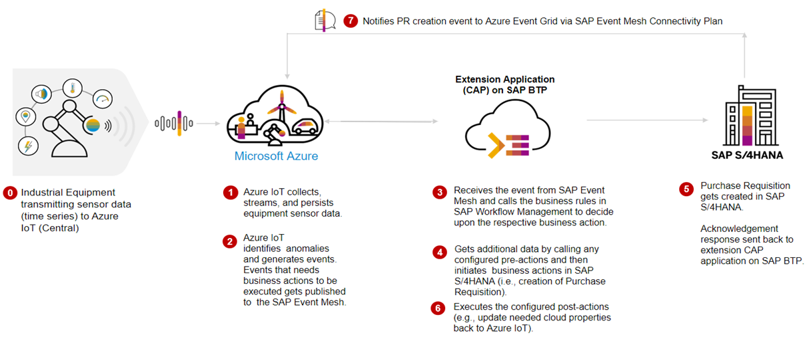
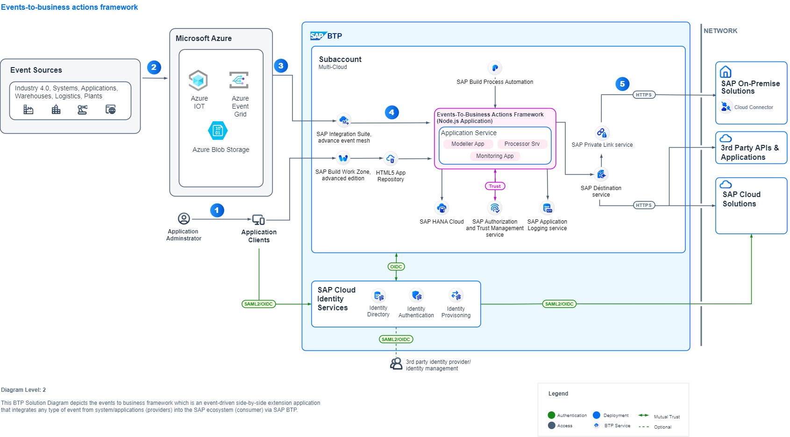
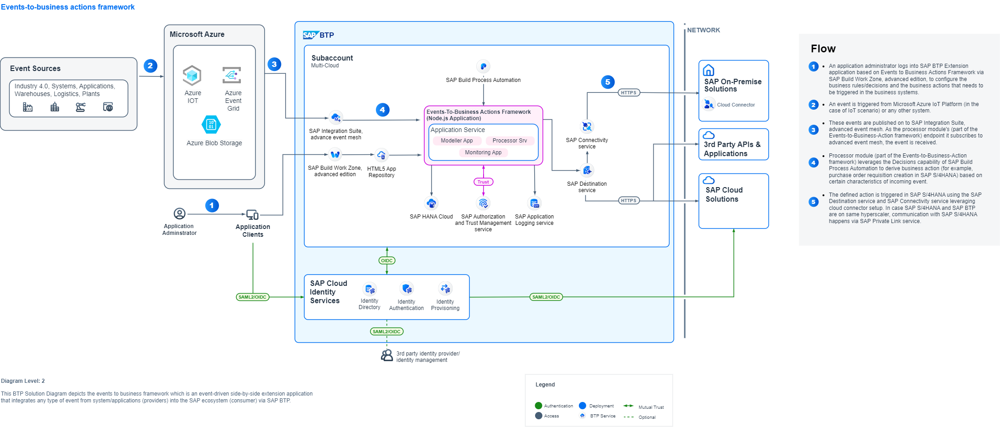

# Build Events-to-Business Actions Scenarios with SAP BTP and Azure

There are two scenarios described in this section. In this tutorial, the events are received from Azure IoT Platform and the actions for these events are taken in SAP S/4HANA. You can use this application to further customize it for other systems as well.

1. Inbound to SAP S/4HANA

    In this scenario, Azure IoT Events are sent to SAP Event Mesh using the Data Export functionality in Azure IoT Central Application. The Node.js extension application subscribes to SAP Event Mesh queue and executes the action that is required to be taken based on the event details.  

2. Outbound from SAP S/4HANA

    In this scenario, any event that is triggerred from SAP S/4HANA is sent to SAP Event Grid Connectivity Bridge. With the latest Beta releease of SAP Event Mesh Connectivity Bridge plan, event is propogated to Azure Event Grid with direct connectivity. This service plan is currently available for only events from SAP S/4HANA to Azure Event Grid. In this scenario, the events from Azure Event Grid is consumed in Azure Function app to send outlook notification to the user. You can further enhance the scenario as per your requirement.

## Table of Contents

[Scenario](#scenario)\
[Business Process Flow](#business-process-flow)\
[Solution Architecture](#solution-architecture)\
[Requirements](#requirements)\
[Implementation: Configuration and Development](#configuration-and-development)\

## Scenario

The business scenario you will be implementing here is to integrate real time events generated from Microsoft Azure IoT Platform into SAP business processes to enrich the outcome of enterprise operations and facilitate rapid decision making. The framework can be extended to any platform and to any kind of event.

You can choose to configure and integrate events with any SAP LoB solution.

## Business Process Flow

In this event-driven scenario, based on the real-time status of the IoT Devices from Microsoft Azure IoT Central, actionable events are sent to SAP BTP to decide on the critical business actions to be taken in the SAP Enteprise Business systems based on business rules defined in the system.

1. Data from IoT Devices are sent to Microsoft Azure IoT Central.

2. Rules in Microsoft Azure IoT triggers an call to SAP Event Mesh in case of any actions which needs attention. This is defined in IoT Rules for devices.

3. SAP Event Mesh receives the events.

4. Extension application is configured with all necessary actions (For example, calling SAP Business Rules API to read the decision tables to decide on action to be taken, configure the OData API call to be executed , service call back to the device) to be taken.

5. Extension application executes the business actions.

6. For this sample application, based on the fill level of waste container a new Purchase Order Requisition is created in SAP S/4HANA.

## Solution Architecture

The key services used from Microsoft Azure are the Azure IoT Central, Azure Blob Storage, Azure Communication Service, Azure Event Grid and Azure Active Directory.

The services used from SAP BTP are the Cloud Foundry Runtime, SAP Event Mesh, SAP Connectivity service, SAP Private Link service, SAP Workflow Management, SAP Event Mesh Connectivity Plan(Beta) and SAP Destination service. 

SAP Private Link service is used for connectivity between SAP BTP and SAP S/4HANA when both the systems are running on Microsoft Azure Infrastructure, you can use Private Link service in the case of AWS as well, in this tutorial you will find implementation steps for SAP BTP Private Link service and Microsoft Azure Private Link service. Alternatively you can use SAP Connectivity service and Cloud Connector for integration of SAP BTP and SAP S/4HANA as well. 

 **Figure-1: High-level architecture (with SAP S/4HANA on Azure)**

    
 **Figure-2: High-level architecture with SAP S/4HANA on-premise and private cloud**

The following steps depicts the information flow across systems (in both the scenarios)

(1) Event is triggered from Microsoft Azure and sent to SAP Event Mesh.

(2) Event-to-Business-Action framework(extension app) processor module's endpoint is subscribed to SAP Event Mesh, hence receives this event.

(3) Event-to-Business-Action framework(extension app) processor module leverages the Business Rules capability of SAP Build Process Automation to derive business action (for example, Purchase Order Requisition creation in SAP S/4HANA system) based on certain characteristics of incoming event.

(4), (5), (6) (7) and (8) Event-to-Business-Action framework (extension app) processor module triggers the defined action in the SAP S/4HANA system by using the SAP Destination Service and SAP Private Link Service.  

For more information, see [Set Up Connectivity Between SAP BTP and SAP S/4HANA Using SAP Private Link Service](./Scenario1-Inbound-to-SAPS4HANA/Step4b-Setup-SAPPrivateLinkService/README.md) page.

In case SAP S/4HANA is on-premise and private cloud (refer to Figure-2)– communication with SAP S/4 HANA integrates via SAP Connectivity Service and Cloud Connector.

(9) and (10) SAP S/4HANA publishes event for Purchase Requisition creation is sent to Microsoft Azure Event Grid via SAP Event Mesh Connectivity Bridge for further processing by Microfost Azure applications.

For outbound from SAP S/4HANA scenario using SAP Event Mesh Connectivity Plan(Beta), see [Integrate Events Between SAP and Microsoft using SAP Event Mesh - Connectivity Bridge Service](https://github.com/SAP-samples/btp-event-mesh-connectivity-bridge) page. You will find the detailed architecture and business scenario for SAP Event Mesh and Azure Event Grid direct connectivity.

## Requirements 

These are the technical prerequistics for an integration between Microsoft Azure IoT Central, SAP BTP and SAP S/4HANA. 

**Services in SAP BTP**
- Cloud Foundry Runtime
    > - Foundation for running the CAP extension application for translating events to business actions.
    > - Required for the trust between Microsoft Azure Active Directory and SAP BTP
- Memory/Runtime quota
    > - Required for deploying and running the extension application in SAP BTP
- Authorization & Trust Management Service
    > - Required for securing the extension application in SAP BTP
- SAP Event Mesh 
    >- Required to receive events from Azure IoT Platform
- SAP HANA Cloud 
    >- Required to store action configuration and logs for CAP application
- SAP Process Automation, Business Rules capability
    >- Business Rules service to configure business decisions that needs to be taken based on the type of event received from Azure IoT Platform.
- SAP Event Mesh Connectivity Plan(Beta)
    >- As of now, this service supports SAP Event Mesh to Azure Event Grid direct connectivity. This is available as Beta for Enterprise accounts only for now.

**Microsoft Azure**
- A valid Microsoft Azure subscription
- A Microsoft Azure Active Directory
    > - Required for the trust between Microsoft Azure Active Directory and SAP BTP
    > - User management
    > - Application registrations to allow access to Microsoft Azure IoT Central REST API and SAP BTP

- An Azure IoT Central Service
    > - Service for configuring Azure IoT Central Application
    > - Required for configuring device template, event producer and event routing.

- An Azure Storage Account
    > - Required for storing the events received from Azure Event Grid in case of outbound from SAP S/4HANA scenario using SAP Event Mesh Connecivity service.

- An Azure Communication Service
    >- Required to send email notificiations and SMS to users.

## Configuration and Development

This repository is documented for 2 scenarios:

1. Inbound to SAP S/4HANA from Azure IoT Central.
2. Outbound from SAP S/4HANA to Azure Event Grid.

These are the steps to configure SAP S/4HANA, SAP BTP and Microsoft Azure for **Scenario 1 - Inbound to SAP S/4HANA from Azure IoT Central**.

[Step 1: Set Up the Subaccount in SAP BTP](./Scenario1-Inbound-to-SAPS4HANA/Step1-Setup-SAPBTP-Subaccount/README.md)

[Step 2: Configure Microsoft Azure IoT](./Scenario1-Inbound-to-SAPS4HANA/Step2-Setup-AzureIoT/README.md)

[Step 3: Check SAP S/4HANA Readiness](./Scenario1-Inbound-to-SAPS4HANA/Step3-SAPS4HANA-Readiness/README.md)

Step 4: Connect SAP BTP and SAP S/4HANA

   - [(Option 1) Using SAP BTP Connectivity Service](./Scenario1-Inbound-to-SAPS4HANA/Step4a-SetupCloudConnector/README.md)

   - [(Option 2) Using SAP Private Link Service](./Scenario1-Inbound-to-SAPS4HANA/Step4b-Setup-SAPPrivateLinkService/README.md)

[Step 5: Build and Deploy the Extension Application](./Scenario1-Inbound-to-SAPS4HANA/Step5-Build-Deploy-ExtensionApplication/README.md)

[Step 6: Create SAP Business Rules Project](./Scenario1-Inbound-to-SAPS4HANA/Step6-Configure-BusinessRules-Part1/README.md)

[Step 7: Configure SAP S/4HANA Business Actions in the extension application](./Scenario1-Inbound-to-SAPS4HANA/Step7-Configure-BusinessActions/README.md)

[Step 8: Update and Activate SAP Business Rule Project](./Scenario1-Inbound-to-SAPS4HANA/Step8-Configure-BusinessRules-Part2/README.md)

[Step 9: Test the Extension Application](./Scenario1-Inbound-to-SAPS4HANA/Step9-Test-ExtensionApplication/README.md)

For **Scenario 2 - Outbound from SAP S/4HANA to Azure Event Grid**, please refer to 
[Receiving events from SAP S/4HANA in Microsoft Azure Event Grid using SAP Event Mesh](./Scenario2-Outbound-from-SAPS4HANA/README.md) link.
