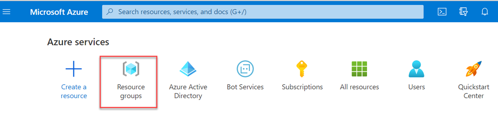
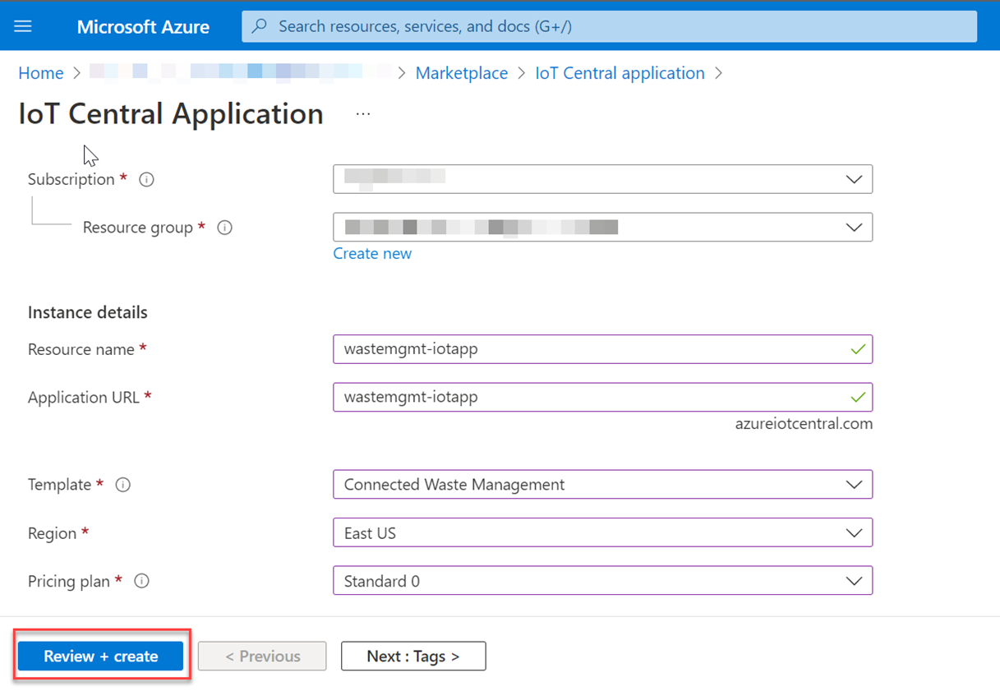
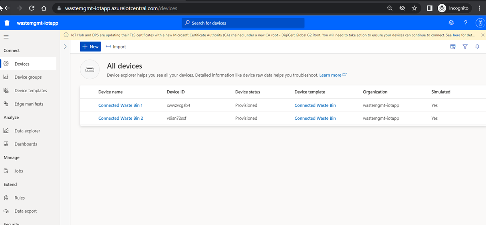
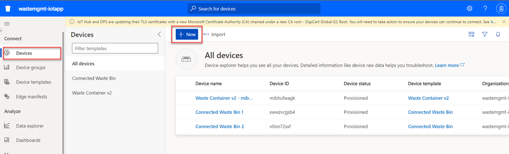

## Configure Microsoft Azure IoT Central

In this tutorial, you will configure Microsoft Azure IoT Central Application. These are the Microsoft Azure services and components you will need for this scenario:

    - Valid Azure Subscription
    - Azure IoT Central
    - Azure Event Grid
    - Azure Function App
    - Azure Communication Service

If you don't have access to a Microsoft Azure account (including a paid or trial subscription), check out the [Unit 3: Microsoft Azure basics and setup](https://open.sap.com/courses/btpma1/items/1f82kP2dhVdZ6e9xia10A8) chapter in the latest openSAP course [Building Applications on SAP BTP with Microsoft Services](https://open.sap.com/courses/btpma1/). 

It explains in detail how to create a new Microsoft Azure account and get a free trial subscription. 

Once you have access to Microsoft Azure account, you will be able to see the list of Azure services in [Microsoft Azure Portal Home Page](http://portal.azure.com).

 

In this section, you will create an Microsoft Azure IoT Central application and configure data export from the devices based on certain rules. Here you will use the GUI-based method to create the application.

### 1. Create Azure Resource Group

1. In the Azure portal, navigate to the **Home** page and choose **Resource groups**.

    

2. In the **Basics** tab, in the **Project details** section, in the **Resource group** field, enter **SAPBusinessActions**.

    

### 2. Create Azure IoT Central application

1. In your Microsoft Azure Portal Home page, choose the created Resource Group.

2. Choose **Create**. 

    

3. From the **Marketplace** search for **IoT Central application**.

    

4. Select the **IoT Central application** tile and then choose **Create**.

    

5. In the **IoT Central application** template page,   

    - In the **Subscription** dropdown menu, select **Free Trial** in case of free trial subscription or select your subscription.
    
    - In the **Resource group**  dropdown menu, select the resource group created in Step 1.

    - In the **Resource name** field, enter  **wastemgmt-iotapp**. This is a unique name you can choose.

    - In the **Application URL** field, enter **wastemgmt-iotapp**.

    - In the **Template** dropdown menu, select **Connected Waste Management**. In this scenario, you are using the template from list of industry-relevant template to get started quickly.

    - In the **Region** dropdown menu, select your preferred location where you would like to create your application.

    - In the **Pricing plan** dropdown menu, select your preferred plan.

6. Choose **Review + create**.

    

 7. If you see a message **Validation Passed**, choose **Create**.

    

### 3. Create a new device template in IoT Central application

1. Select the created IoT Central Application to view the details. Choose the created IoT Central Application URL to open the application.

    

2. Select the IoT Central Application URL to open the application.

    Your application should have two devices added for the device template type **Connected Waste Bin** as shown in the screenshot.

    

3. In this scenario, you will create a new device template based on your custom capabilities. Choose **Device templates** and then select **New**. In the **Select type** > **Create a custom device template**, select **IoT Device** to create a custom device template.

4. Choose **Next:Customize** to create a new device template.

    

5. In the **Device template name** field, enter **Waste Container v2**. Choose **Next: Review**.

   

6. Review and choose **Create**. 

   

7. Choose the created device template and choose **Import a model** to import model file.

    

    **Note**: **Container-Data.json** file is available in [devicetemplate](./devicetemplate/) folder. Upload this model file.

    

8. Choose **Views** and the choose **Editing device and cloud data** to add a test view.

    

9. Select the fields as per your requirement. For a sample view, you can choose **Container ID**, **Container Type**, **Location ID** and **Status** fields and choose **Save**.

    

10. Choose **Publish**.

    

11. Choose **Devices** and then choose **+ New** to create a new device. 

    

12. In the **Device Template** dropdown menu, choose the device template you created and then choose **Create**.

    

### 4. Configure Data Export

1. Choose **Data export** and then choose **+ New Data Export** to create new Data export.

    

2. Enter **Waste Container Export** as value. 

    In the **Type of data to export** dropdown menu, select **Telemetry** and then choose **+Message property filter**.

    

3. In the **Export the data if** dropdown menu, select **all of the conditions are true**. You can configure this as per your requirement.

4. In the **Name** field, enter **Device template** as value.

5. In the **Operator** dropdown menu, select **Equals** and in the **Value**, enter **Waste Container v2**.

    

6. Choose **+Filter**.

    

    Enter the details as shown in the below screen shot.

    

    
7. In the **Enrichments** section, choose **+Custom String** and enter the below key value pairs as shown below.

    

8. Choose **+Property** and enter the below key value pairs as shown below.

    

9. Choose **Save**.
