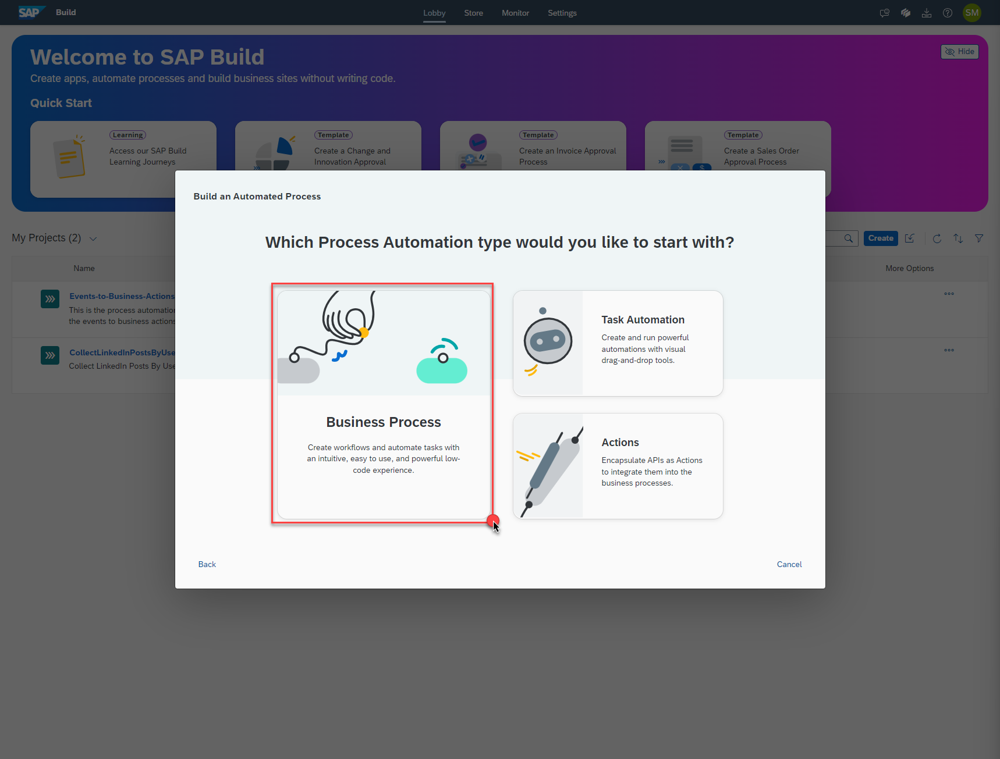
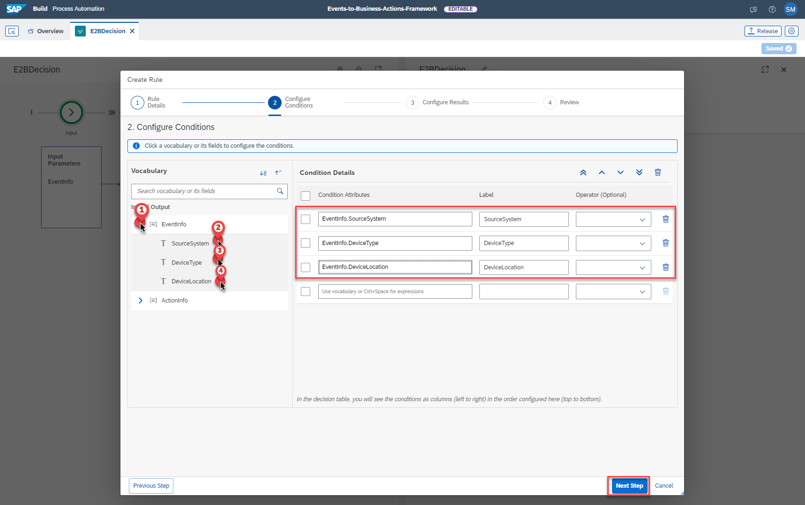
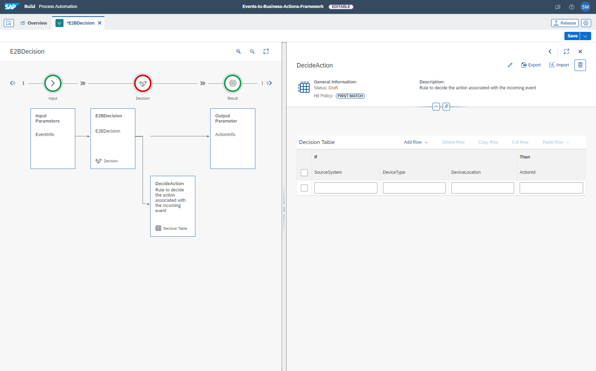

## Create SAP Build Process Automation - Decisions Project
In this section, you will configure SAP Business Rule project which will be used to determine which business action should be executed for an event. Additionally, based on your scenario you can create decision tables and business rules.

### 1. Create SAP Build Process Automation Project

1. In the SAP BTP Cockpit, Navigate to your subaccount -> **Sevices** -> **Instances and Subscriptions** , Open the SAP Build Process Automation Application.

    

2. In the SAP Build Process Automation Application, In the **Lobby** Tab , Click on **Create** button to create a new project.

    

3. Choose the **Build an Automated Process Tile**, and then choose **Business Process** Tile.

    

    

4. Fill the project name as **Events-to-Business-Actions-Framework-xxx** and Choose **Create**

    

    **Accept** the disclaimer if prompted!

        

5. The Project is now created , click on **Cancel** for the **Create Process** pop-up , as we will be creating **Decisions** and it's related **Data Types** in the following steps.

    

6. Under the **Artifacts** Tab of your project, Click on **Create** and then choose **Decision** .

    

    Fill in the Decision Name as **E2BDecision** and Click on **Create**.

    

    You will see the following screeen as the decision is created successfully.

       

### 2. Configure SAP Build Process Automation Decisions

1. The **Decision** configuration requires the **Input and Ouput parameters** as well as the business **Rule** that maps the incoming event to it's associated business action. To configure the Input/Output parameters we need to create the Custom Data Type with the fields that the incoming event payload contains.

 Under the**Artifacts** Tab, Click on **Create** and choose **Data Types**.

 

2. We will be creating two data types namely **eventInfo** and **actionInfo** which will have the structure of the incoming event payload and the action Id respectively. To create the datatypes follow the steps shown below:

    **a.** Create Data Type called **eventInfo**

    

    **b.**  Click on **New Field** and Enter the following three field details and click on **Save**

    

    **c.** Under the**Artifacts** Tab, Click on **Create** and choose **Data Types**.

    

    **d.** Create data type called **actionInfo** 

    

    **e.** Click on **New Field** and Enter the following three field details and click on **Save**

    

3. As we have now created the required data types , let us go to the **E2BDecision** and configure the Input/Output parameters as shown below. Fill the Input Paramter Name as **EventInfo** and Choose the Type from the drop down as **eventInfo** created previously. Fill the Output Parameter Name as **ActionInfo** and choose the Type from the as **actionInfo**.

    

4. Next let us configure the **Rules**. 

    **a.** Click on **Add Rule**

    

    **b.** Fill in the **Rule Name** as **DecideAction** and click on **Next Step**

    

    **c.** To configure the **Conditions** follow the steps shown below. 

    

    **d.** To configure the **Results** follow the steps shown below.

    

    **e.** Verify the **Review** Tab 

    

    **f.** An empty **Decision Table** will be created.

    

    **g.** Fill the fields with following values:
    ```
        SourceSystem: ='Azure',
        DeviceType: ='Silo',
        DeviceLocation: ='Plant A'

        ActionId to be filled later.
    ```
    

5. To use the decision in our CAP extension application we need to deploy the Decision created. 

    First click on **Release** to release the Decisions. 
    
    

    Click on **Release**

    

6. Now that the project is released, it is ready for deployment. Click on the **Deploy**

    

    Follow the steps shown in the following screenshots.

    

    

    

7. The Project is successfully deployed ! 

    


8. Go to **E2BDecision** , Click on the three dots to **View Details** and Click on **View Details**

    

    Copy the **Id** from the **Decision Details** , which will be used in the Next Step.

    
