## Configure SAP S/4HANA Business Actions in the extension application

In this section, you will define business action in the action-management extension application in SAP BTP.

### 1. Create Build Process Automation Instance

1. In the SAP BTP cockpit, navigate to your subaccount and choose **Instances and Subscriptions** and then choose **Create** to create a instance of **SAP Build Process Automation**.

     

2. Choose the **Service** as  **SAP Build Process Automation**, **Plan** as **standard- Instance** as shown below.


    

3. Fill the **Instance Name** as **BPA_Decision** , and Click **Create** button.


    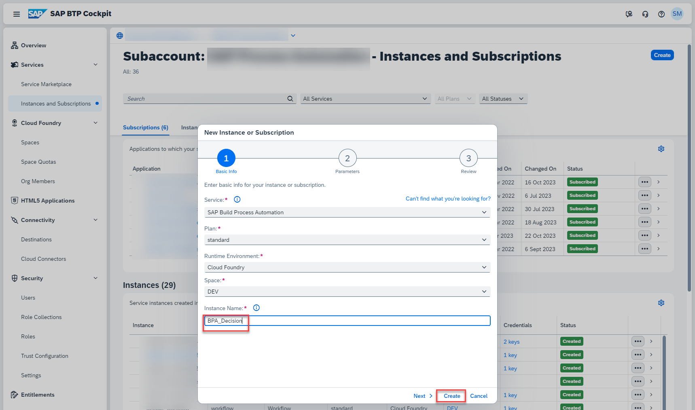

4. In a couple of seconds the instance will be created. **Click** on the instance as shown below.

    

5. Under **Service Keys**, Click on **Create** button, to create a service key for the SAP Build Process Automation instance created.


    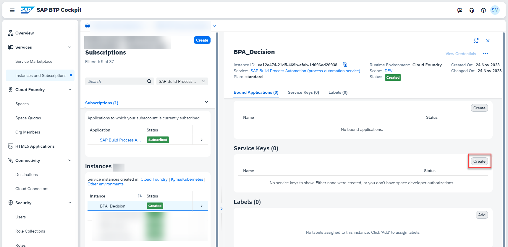

6. Fill the **Service Key Name** as **default** and then click on **Create** button.


    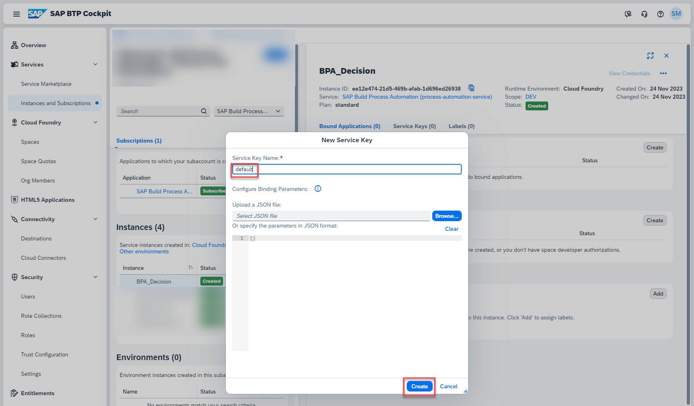

7. You will see that the service key is now created.

    

8. Now click on the three dots and choose **View** to view the service key details.

    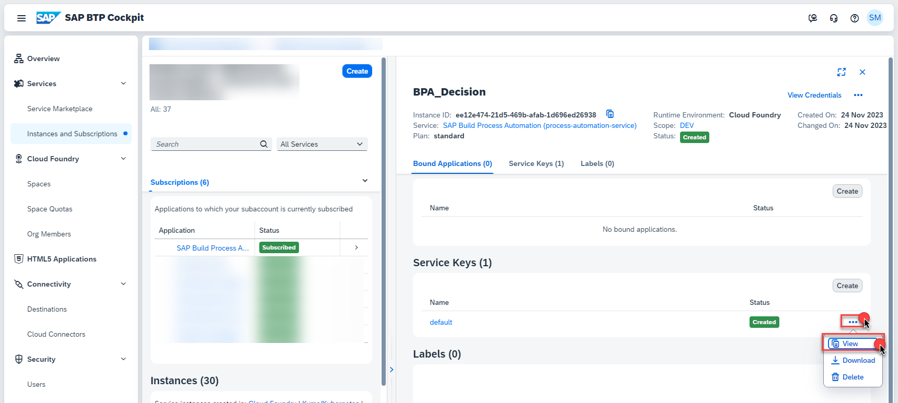

9. Click on **Form** Tab to get the structured display of values as shown below. Copy the values of **api**, **clientid**, **clientsecret**, **url** as you will use them while configuring the destination for SAP Build Process Automation.

    

### 2. Create Destinations

1. In the SAP BTP cockpit, navigate to your subaccount and choose **Connectivity > Destinations**. Click on **New Destination**

    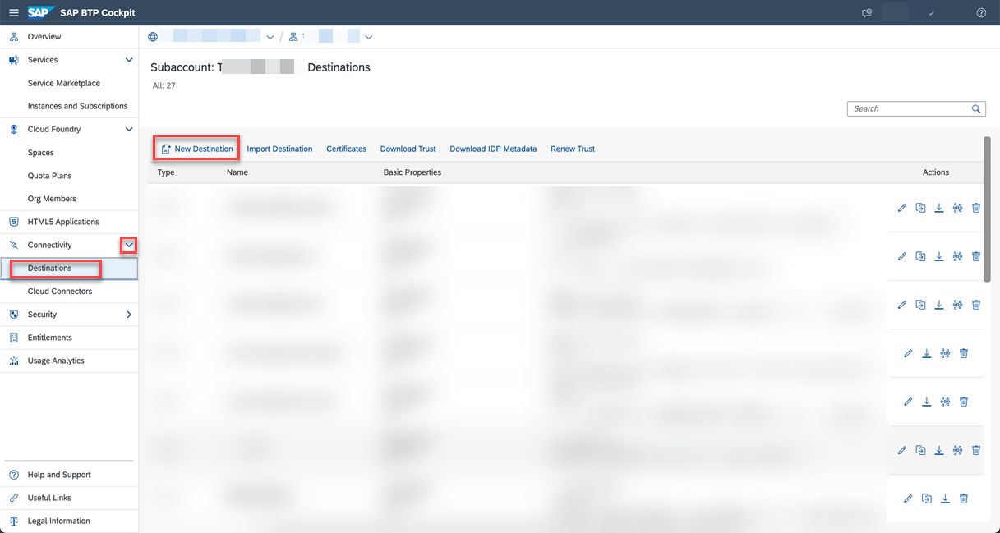

5. Create a new destination with the name **ACTION_DECISIONS** and enter the following configuration values. This is used for calling SAP Build Process Automation Decision capability.

    - Paste the values of `api`, `clientid`, `clientsecret` and `url` which you have copied from previous step and update it for `URL`, `Client ID`, `Client Secret` and `Token Service URL` respectively as instructed below.

    ```
    Name: ACTION_DECISIONS
    Type: HTTP
    URL: `api`/public/rule/runtime/rest
    Proxy: Internet
    Authentication: OAuth2ClientCredentials
    Client ID: `clientid`
    Client Secret: `clientsercret``
    Token Service URL Type: Dedicated
    Token Service URL: `url`/oauth/token

    Additional Properties:
    HTML5.DynamicDestination: true
    ```

    Your destination configuration should look like this:

    

6. Create destination with the name **ACTION_MODELER_S4** and enter the following configuration values.

    Change host name in `URL`, `User`, `Password` as per your SAP S/4HANA system details.

    - In case of SAP S/4HANA system on AWS Private Cloud, choose **Proxy Type** as **PrivateLink** and the private link **hostname** copied from [Step3b-Setup-SAPPrivateLinkService](../Step3b-Setup-SAPPrivateLinkService/README.md) in the **hostname** field.

        ```
        Name: ACTION_MODELER_S4
        Type: HTTP
        URL: https://<hostname>/sap/opu/odata/sap
        Proxy Type: PrivateLink
        Authentication: BasicAuthentication
        User: <SAP S4HANA User>
        Password: <SAP S4HANA Password>

        Additional Properties:
        HTML5.DynamicDestination: true
        WebIDEEnabled: true
        WebIDEUsage: odata_abap
        TrustAll: true
        ```

        Your destination configuration should look like this:

        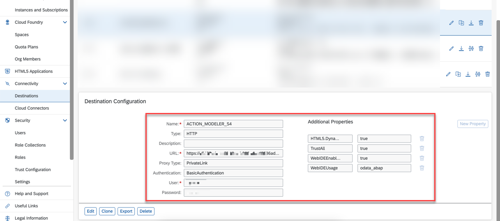

    - In case of SAP S/4HANA On-Premise system, choose **Proxy Type** as **OnPremise** and use the **Virtual Host**:**Virtual Port** in the **hostname** placeholder below created at [Step3a-SetupCloudConnector](../Step3a-SetupCloudConnector/README.md) to connect using Cloud Connector.

        ```
        Name: ACTION_MODELER_S4
        Type: HTTP
        URL: https://<hostname>/sap/opu/odata/sap
        Proxy Type: OnPremise
        Authentication: BasicAuthentication
        User: <SAP S4HANA User>
        Password: <SAP S4HANA Password>

        Additional Properties:
        HTML5.DynamicDestination: true
        WebIDEEnabled: true
        WebIDEUsage: odata_abap
        ```

        Your destination configuration should look like this:

        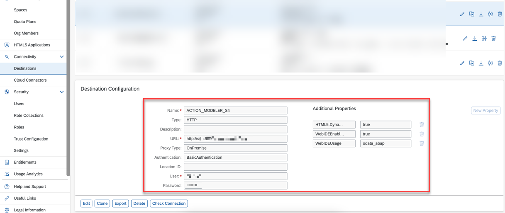

### 3. Configure Business Actions in  Manage Actions application

In this section, you will configure the different business actions that needs to be executed based on the event received.

1. In the SAP BTP cockpit, navigate to your subaccount and choose **Cloud Foundry** > **Spaces**.  Choose your space and then choose **action-management** application. Choose the url provided under **Application Routes** section.

    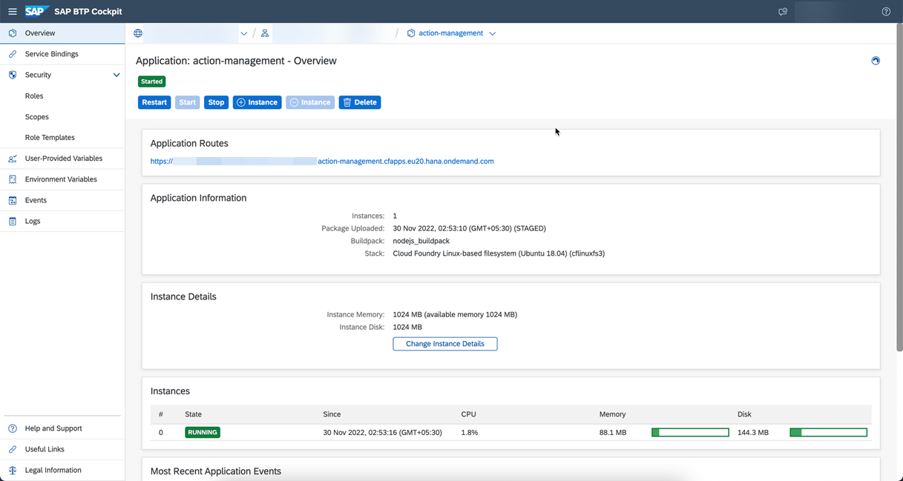

2. Choose **Manage Actions** tile.

    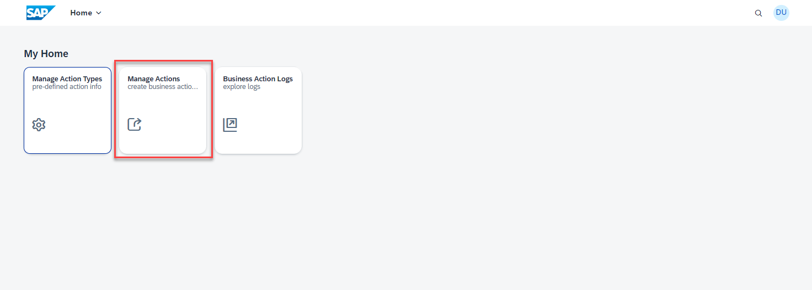

3. Choose **Create** to create default action entry.

    

    

4. In the **Basic Information** section, enter the following configuration values.

    ```
    Action Name: Determine Action from Event Information
    Description: Determine Action from Event Information
    Category: Default Action
    Action Type: Service Integration
    ```

5. In the **HTTP Information** section, enter the following configuration values.

    **Note**: Replace **ID** with the value copied from Create SAP Build Process Automation Decision Project section of the [Step6-Configure Decisions-Part1](../Step6-Configure-BusinessRules-Part1/README.md) page.

    ```
    Destination: ACTION_DECISIONS
    Content-Type: application/json
    Method: POST
    Relative Path: /v2/rule-services
    Payload: { "RuleServiceId": "<E2BDecisionId>","Vocabulary": [ { "EventInfo":{ "SourceSystem": "${{event.data.SourceSystem}}","DeviceLocation": "${{event.data.DeviceLocation}}","DeviceType": "${{event.data.DeviceType}}" } } ] }


    Action Id Path in Response: Result[0].ActionInfo.ActionId
    ```

    Your configuration should look like this:

    

6. Choose **Create**.

7. Create another business action with name **Update Device Cloud Property** and enter the following configuration values.

    ```
    Basic Information:
    
    Action Name: Update Device Status With Purchase Requisition
    Description: Update Device Cloud Property
    Category: Pre/Post Action
    Action Type: Service Integration

    HTTP Information:
    Destination: azure-iot-device-api
    Content-Type: application/json
    Method: PATCH
    Relative Path: ${{event.data.deviceId}}/properties?api-version=2022-07-31
    Payload: {  "Status": "Re-fill Request Created"  }
    ```

    Your configuration should look like this:

    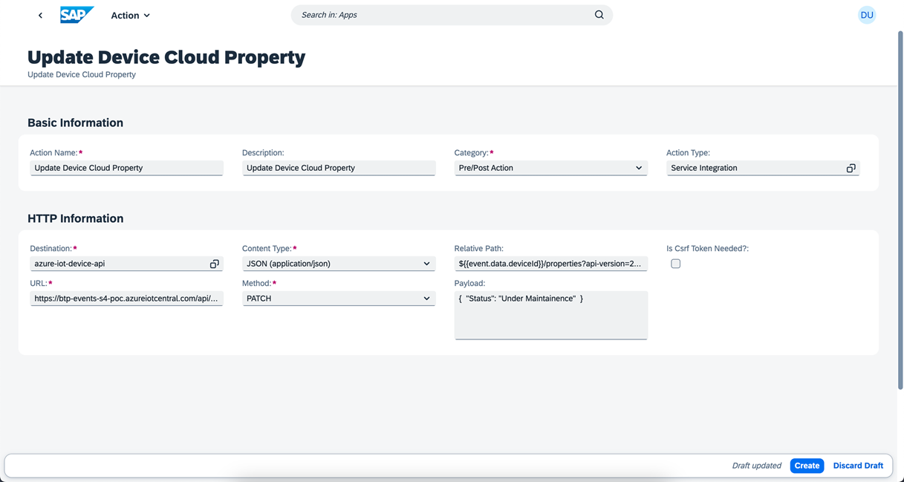

8. Create another business action with name **Create Purchase Requisition** and enter the following  configuration values.

    ```
    Basic Information:

    Action Name: Create Purchase Requisition
    Description: Create Purchase Requisition
    Category: Main Action
    Action Type: Service Integration
    
    HTTP Information:
    Destination: ACTION_MODELER_S4
    Content-Type: application/json
    Method: POST
    Relative Path: /API_PURCHASEREQ_PROCESS_SRV/A_PurchaseRequisitionHeader
    Payload: {
        "PurchaseRequisition": "",
        "PurchaseRequisitionType": "NB",
        "PurReqnDescription": "Refill Silo ${{event.data.enrichments.DeviceName}}",
        "SourceDetermination": false,
        "PurReqnDoOnlyValidation": false,
        "to_PurchaseReqnItem": {
        "results": [
        {
        "PurchaseRequisition": "",
        "PurchaseRequisitionItem": "10",
        "PurchaseRequisitionType": "NB",
        "PurchaseRequisitionItemText": "Re-fill Silo",
        "Material": "TG10",
        "MaterialGroup": "L001",
        "RequestedQuantity": "1",
        "PurchasingOrganization": "1710",
        "PurchasingGroup": "001",
        "Plant": "1710",
        "OrderedQuantity": "1",
        "DeliveryDate": "2023-03-28T00:00:00"
        }
        ]
        }
        }
    Is Csrf Token Needed?: true

    Related Actions: 
    Flow Type: Post Action
    Action: Update Device Status With Purchase Requisition
    ```

    Your configuration should look like this:

    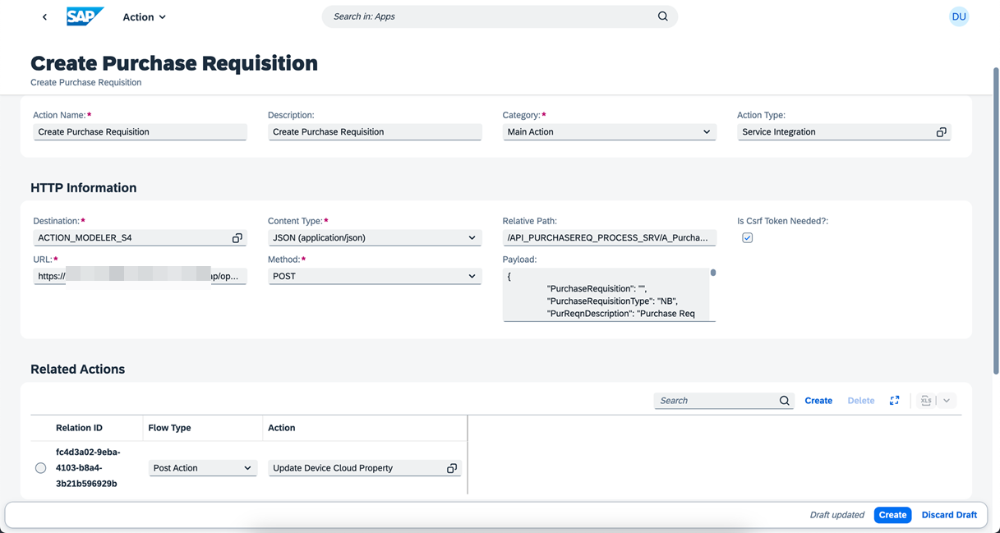
