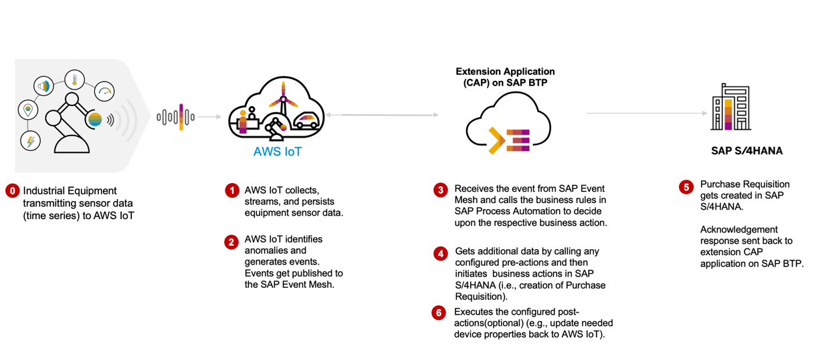
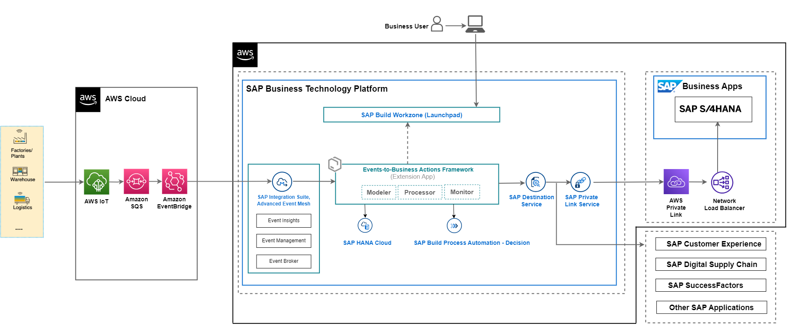

# Build Events-to-Business Actions Scenarios with SAP BTP and AWS

> **Important Note** : This branch is work in progress. Please use "main" branch for released code.

In this scenario, AWS IoT Events are sent to SAP Event Mesh using the rules and actions functionality in AWS IoT Core. The Node.js extension application subscribes to SAP Event Mesh queue and executes the action that is required to be taken based on the event details.  

## Table of Contents

[Scenario](#scenario)\
[Business Process Flow](#business-process-flow)\
[Solution Architecture](#solution-architecture)\
[Requirements](#requirements)\
[Implementation: Configuration and Development](#configuration-and-development)\

## Scenario

The business scenario you will be implementing here is to integrate real time events generated from Amazon AWS IoT Platform into SAP business processes to enrich the outcome of enterprise operations and facilitate rapid decision making. The framework can be extended to any platform and to any kind of event.

You can choose to configure and integrate events with any SAP LoB solution.

## Business Process Flow

In this event-driven scenario, based on the real-time status of the IoT Devices from AWS IoT Core, actionable events are sent to SAP BTP to decide on the critical business actions to be taken in the SAP Enteprise Business systems based on business rules defined in the system.

1. Data from IoT Devices are sent to AWS IoT Core.

2. Rules in AWS IoT Core triggers and the event is sent to SAP Event Mesh via Amazon SQS and Amazon EventBridge in case of any actions which needs attention. This is defined in IoT Rules for devices.

3. SAP Event Mesh receives the events.

4. Extension application is configured with all necessary actions (For example, calling SAP Business Rules API to read the decision tables to decide on action to be taken, configure the OData API call to be executed , service call back to the device) to be taken.

5. Extension application executes the business actions.

6. For this sample application, based on the fill level of waste container a new Purchase Order Requisition is created in SAP S/4HANA.

## Solution Architecture

The key services used from Amazon AWS are AWS IoT Core, Amazon SWS and Amazon Event Bridge.
The services used from SAP BTP are the Cloud Foundry Runtime, SAP Event Mesh, SAP Connectivity service, SAP Private Link service, SAP Workflow Management, SAP Event Mesh Connectivity Plan(Beta) and SAP Destination service.

SAP Private Link service is used for connectivity between SAP BTP and SAP S/4HANA when both the systems are running on Amazon AWS Infrastructure, in this tutorial you will find implementation steps for SAP BTP Private Link service and AWS Private Link service. Alternatively you can use SAP Connectivity service and Cloud Connector for integration of SAP BTP and SAP S/4HANA as well.

 **Figure-1: High-level architecture (with SAP S/4HANA on AWS)**

The following steps depicts the information flow across systems (in both the scenarios)

(1) Event is triggered from Amazon AWS and sent to SAP Event Mesh.

(2) Event-to-Business-Action framework(extension app) processor module's endpoint is subscribed to SAP Event Mesh, hence receives this event.

(3) Event-to-Business-Action framework(extension app) processor module leverages the Business Rules capability of SAP Build Process Automation to derive business action (for example, Purchase Order Requisition creation in SAP S/4HANA system) based on certain characteristics of incoming event.

(4), (5), (6) (7) and (8) Event-to-Business-Action framework (extension app) processor module triggers the defined action in the SAP S/4HANA system by using the SAP Destination Service and SAP Private Link Service.  

For more information, see [Set Up Connectivity Between SAP BTP and SAP S/4HANA Using SAP Private Link Service](./Scenario1-Inbound-to-SAPS4HANA/Step4b-Setup-SAPPrivateLinkService/README.md) page.

In case SAP S/4HANA is on-premise and private cloud (refer to Figure-2)– communication with SAP S/4 HANA integrates via SAP Connectivity Service and Cloud Connector.

## Requirements

These are the technical prerequistics for an integration between AWS IoT Core, SAP BTP and SAP S/4HANA. 

**Services in SAP BTP**
- Cloud Foundry Runtime
    > - Foundation for running the CAP extension application for translating events to business actions.
- Memory/Runtime quota
    > - Required for deploying and running the extension application in SAP BTP
- Authorization & Trust Management Service
    > - Required for securing the extension application in SAP BTP
- SAP Event Mesh 
    >- Required to receive events from Amazon AWS IoT
- SAP HANA Cloud 
    >- Required to store action configuration and logs for CAP application
- SAP Process Automation - Business Rules capability
    >- Business Rules service to configure business decisions that needs to be taken based on the type of event received from AWS IoT Platform.

**Amazon AWS**
- A valid Amazon AWS subscription

- AWS IoT Core
    > - Required for configuring thing type, onboarding things, rules and actions.

- Amazon SQS
    > - Required to receive events from AWS IoT Core.

- Amazon Event Bridge
    >- Required to send events from Amazon SQS to SAP Event Mesh.

## Configuration and Development

This scenario talks about the steps needed for translating events from AWS IoT to business actions in SAP business systems.

These are the steps to configure SAP S/4HANA, SAP BTP and Amazon AWS.

[Step 1: Set Up the Subaccount in SAP BTP](./Scenario1-Inbound-to-SAPS4HANA/Step1-Setup-SAPBTP-Subaccount/README.md)

[Step 2: Configure Amazon AWS IoT](./Scenario1-Inbound-to-SAPS4HANA/Step2-Setup-AWSIoT/README.md)

[Step 3: Check SAP S/4HANA Readiness](./Scenario1-Inbound-to-SAPS4HANA/Step3-SAPS4HANA-Readiness/README.md)

Step 4: Connect SAP BTP and SAP S/4HANA

   - [(Option 1) Using SAP BTP Connectivity Service](./Scenario1-Inbound-to-SAPS4HANA/Step4a-SetupCloudConnector/README.md)

   - [(Option 2) Using SAP Private Link Service](./Scenario1-Inbound-to-SAPS4HANA/Step4b-Setup-SAPPrivateLinkService/README.md)

[Step 5: Build and Deploy the Extension Application](./Scenario1-Inbound-to-SAPS4HANA/Step5-Build-Deploy-ExtensionApplication/README.md)

[Step 6: Create SAP Business Rules Project](./Scenario1-Inbound-to-SAPS4HANA/Step6-Configure-BusinessRules-Part1/README.md)

[Step 7: Configure SAP S/4HANA Business Actions in the extension application](./Scenario1-Inbound-to-SAPS4HANA/Step7-Configure-BusinessActions/README.md)

[Step 8: Update and Activate SAP Business Rule Project](./Scenario1-Inbound-to-SAPS4HANA/Step8-Configure-BusinessRules-Part2/README.md)

[Step 9: Test the Extension Application](./Scenario1-Inbound-to-SAPS4HANA/Step9-Test-ExtensionApplication/README.md)
