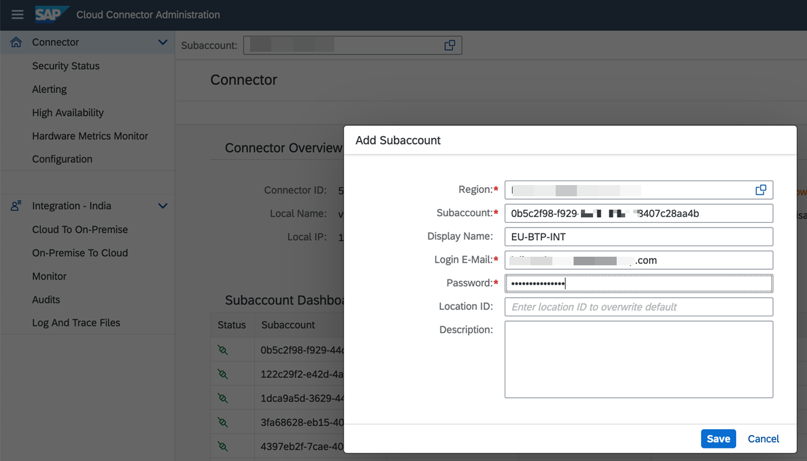

## Connect SAP BTP and SAP S/4HANA Using Cloud Connector

Follow these steps to set up the Cloud Connector and the SAP Connectivity service to establish secured communication between SAP BTP and SAP S/4HANA. 

>Note: If you have SAP BTP and SAP S/4HANA running on AWS private cloud, then you can skip this step and proceed to [next step](../Step3b-Setup-SAPPrivateLinkService/README.md) to setup connectivity between SAP BTP and SAP S/4HANA using Private Link.
Else, follow the below steps if you have SAP S/4HANA on-premise/private cloud and want to establish communication between SAP BTP and SAP S/4HANA using Cloud Connector.
>
### 1. Download and Install the Cloud Connector

1. Download the Cloud Connector from [SAP Development Tools](https://tools.hana.ondemand.com/#cloud) for your operating system. If you don't have Java installed on the server, download and install it.

    

    You need an administrator access to install the Cloud Connector.

2. Run the installation package and follow the on-screen installation guide. If the installation is successful, the  Cloud Connector will be started automatically.

### 2. Configure the Cloud Connector

1. To configure the Cloud Connector, open https://hostname:port, replace **hostname** with the hostname of the machine on which the Cloud Connector is installed, and the **port** with the port number mentioned during the installation. The default port number is 8443.

    

    Enter below credentials (case sensitive) and choose Login.

    Username: **Administrator**
    Password: **manage**

    **Note**: The first time you log in, you must change the password and choose Master as the installation type. Click **Save**.

2. Log in to SAP BTP cockpit, navigate to your subaccount and choose **Overview**. In the **General** tab, copy the value of **Subaccount ID**.

    

3. Log in to Cloud Connector Administration cockpit and choose **Add Subaccount**.

    

    a. In the **Region** field, select your subaccount region.

    b. In the **Subaccount** field, enter the value of the subaccount ID you copied in Step2.

    c. In the **Display Name** field, enter a unique name of your choice.

    d. In the **Login E-Mail** and **Password** fields, enter the Global Account Administrator's email ID and password.

    Your configuration should look like this:

    

    e. Choose **Save**.

### 3. Create a Cloud to On-Premise Connection

To make the SAP S/4HANA system available to the services and application in SAP BTP, you need to create a mapping between the Cloud Connector and the SAP S/4HANA system.

1. Log in to the Cloud Connector Administration cockpit and choose the name of your subaccount in SAP BTP in the **Subaccount** field.

2. Choose **Cloud To On-Premise**. In the **ACCESS CONTROL** tab, in the **Mapping Virtual To Internal System** section, choose the **Add** icon to add a virtual host entry.

    1. In the **Back-end Type** dropdown menu, select **ABAP System**. Choose **Next**.

    2. In the **Protocol** dropdown menu, select **HTTPS**. Choose **Next**.

    3. In the **Internal Host** and **Internal Port** fields, enter the hostname or IP address of the SAP S/4HANA system and the corresponding ICM port. Choose **Next**.

    4. In the **Virtual Host** and **Virtual Port** fields, enter a hostname of your choice and the **443** port. The value for virtual port can be updated if required. Choose **Next**.

    5. In the **Principal Type** dropdown menu, select **X.509 Certificate (Strict Usage)**. Choose **Next**.

    6. In the **Host In Request Header** dropdown menu, select **Use Virtual Host**. Choose **Next**.

    7. Select the **Check Internal Host** checkbox and choose **Finish**.

3. Select the virtual host created in the previous step and in the **Resources** section, choose the **Add** icon.

    1. In the **URL Path** field, enter **/**.

    2. Select the **Active** field.

    3. In the **Access Policy** field, select the **Path and All Sub-Paths** radio button.

    4. Choose **Save**.

4. Your configuration should look like this:

    

5. In SAP BTP cockpit, navigate to your subaccount. Choose **Connectivity** > **Cloud Connectors**. The state of the Cloud Connector configurations should be **Connected**.

    
