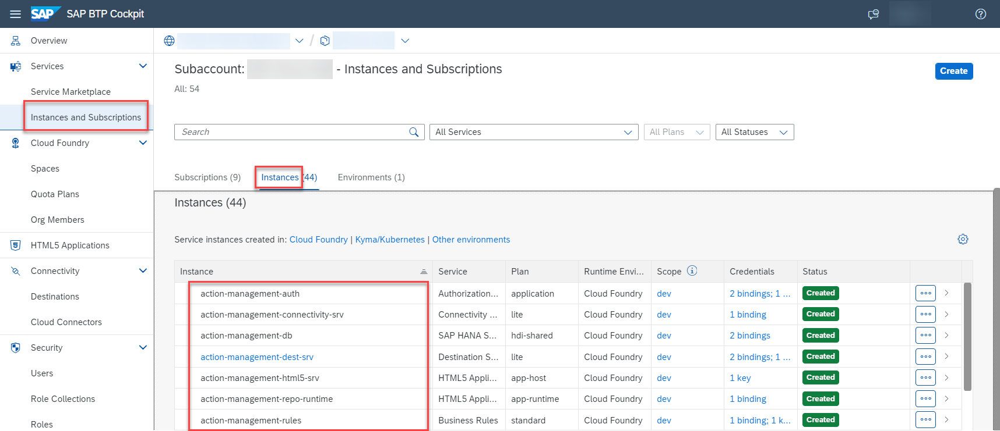

## Build and Deploy the Extension Application

In this section, you will clone the codebase and deploy the extension application in SAP BTP. 

### 1. Clone the GitHub Repository
    

Clone the [Event To Action Framework](https://github.com/SAP-samples/btp-events-to-business-actions-framework/tree/advanced-event-mesh) GitHub repository **advanced-event-mesh** branch. Use the following command to clone the Repo.

```
git clone -b advanced-event-mesh https://github.com/SAP-samples/btp-events-to-business-actions-framework.git
```

### 2. Check the Prerequisites for Deployment

Ensure you have added the required entitlements as described in section **Step1-Setup-SAPBTP-Subaccount** page before deployment.

### 3. Deploy the Extension Application

Build and deploy the application. Run the following commands:

**Note**: Ensure you have Cloud MBT Build Tool. Refer [The Cloud MTA Build Tool (MBT)](https://help.sap.com/docs/HANA_CLOUD_DATABASE/c2b99f19e9264c4d9ae9221b22f6f589/1412120094534a23b1a894bc498c2767.html) for more details.

1. Open the Cloud Foundry command line interface (cf CLI).

2. Navigate to **action-management** directory.

    ```
    cd action-management
    ```
3. Fetch the dependencies.

    ```
    npm install
    ```
4. Build action-management modules.

    ```
    npm run build
    ```
5. Log in to your subaccount in SAP BTP to deploy the extension application.
    Check your region and copy the API endpoint accordingly. For example, "https://api.cf.region.hana.ondemand.com"

    ```
    cf login -a `<CF API endpoint>`
    ```
6. Push the application to your subaccount.

    ```
    npm run deploy
    ```
7. You can also check the status of your applications in the SAP BTP cockpit. Copy the value of the extension application URL.

    

8. In the SAP BTP cockpit, navigate to your subaccount and choose **Services** > **Instances and Subscriptions**. Check if you have all of the instances created post deployment as shown below. Make sure the status of all of the instances are **Created**.

    

### 4. Add roles for accessing Business Rules

1. In subaccount, choose **Security** > **Role Collections** and then choose **Create New Role Collection** icon.

    

2. Enter a value of your choice for the **Name** and **Description** field and choose **Create**.

    

3. Choose **Edit** to add roles and user to the created role collection.

    


4. Select **RoleName** value help and then select the **RuleRepositorySuperUser** and **RuleRuntimeSuperUser** roles from the list.

    

5. Choose **Add**.

    

6. In the **Users** tab, enter your email id in **ID** and **E-Mail** input field and choose **Save**.

7. Your configuration should look like below:

    

