## Build and Deploy the Extension Application

In this section, you will clone the codebase and deploy the extension application in SAP BTP. 

### 1. Clone the GitHub Repository
    

Access the [Event To Action Framework](https://github.com/SAP-samples/btp-events-to-business-actions-framework) GitHub repository to download the project.

### 2. Check the Prerequisites for Deployment

Ensure you have added the required entitlements as described in section **Step1-Setup-SAPBTP-Subaccount** page before deployment.

### 3. Deploy the Extension Application

Build and deploy the application. Run the following commands:

**Note**: Ensure you have Cloud MBT Build Tool. Refer [The Cloud MTA Build Tool (MBT)](https://help.sap.com/docs/HANA_CLOUD_DATABASE/c2b99f19e9264c4d9ae9221b22f6f589/1412120094534a23b1a894bc498c2767.html) for more details.

1. Open the Cloud Foundry command line interface (cf CLI).

2. Navigate to **action-management** directory.

    ```
    cd action-management
    ```
3. Fetch the dependencies.

    ```
    npm install
    ```
4. Build action-management modules.

    ```
    npm run build
    ```
5. Log in to your subaccount in SAP BTP to deploy the extension application.
    Check your region and copy the API endpoint accordingly. For example, "https://api.cf.region.hana.ondemand.com"

    ```
    cf login -a `<CF API endpoint>`
    ```
6. Push the application to your subaccount.

    ```
    npm run deploy
    ```
7. You can also check the status of your applications in the SAP BTP cockpit. Copy the value of the extension application URL.

    

8. In the SAP BTP cockpit, navigate to your subaccount and choose **Services** > **Instances and Subscriptions**. Check if you have all of the instances created post deployment as shown below. Make sure the status of all of the instances are **Created**.

    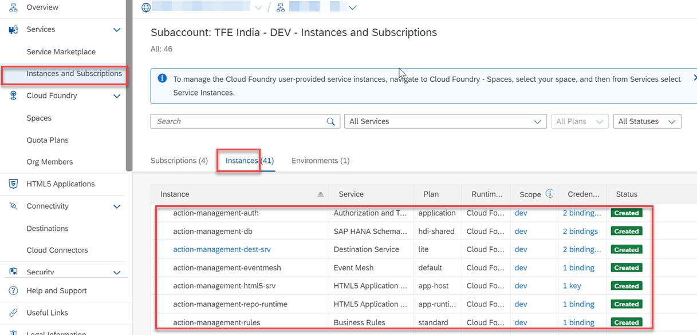

9. Verify SAP Event Mesh Subscription and Instance creation.

    - In SAP BTP Enterprise account, you should be able to see the below details in Subcriptions and Instances.

        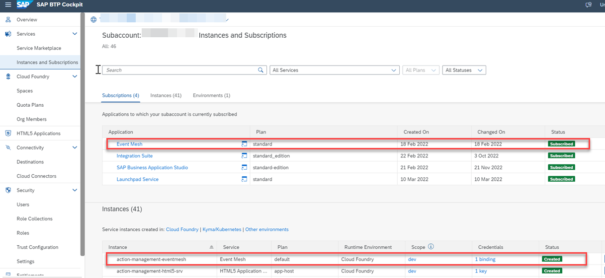

10. Open the SAP Event Mesh application.

    - If you are using SAP BTP Enterprise account, go to the Subscriptions tab and choose Event Mesh to open the application.

    - If you are using SAP BTP Trial account, go to Instances tab, select the instance for SAP Event Mesh and choose View Dashboard.

11. Choose **Message Clients** and then choose **Queues**. You will see the below message client and queue created in your SAP Event Mesh service instance.

    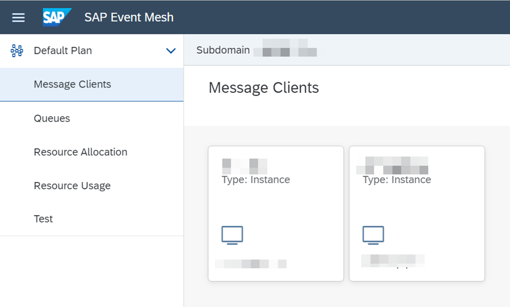

    


12. In subaccount, choose **Security** > **Role Collections** and then choose **Create New Role Collection** icon.

    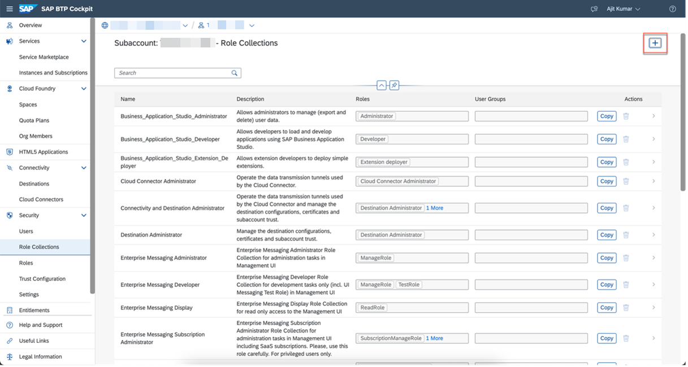

13. Enter a value of your choice for the **Name** and **Description** field and choose **Create**.

    

14. Choose **Edit** to add roles and user to the created role collection.

    


15. Select **RoleName** value help and then select the **RuleRepositorySuperUser** and **RuleRuntimeSuperUser** roles from the list.

    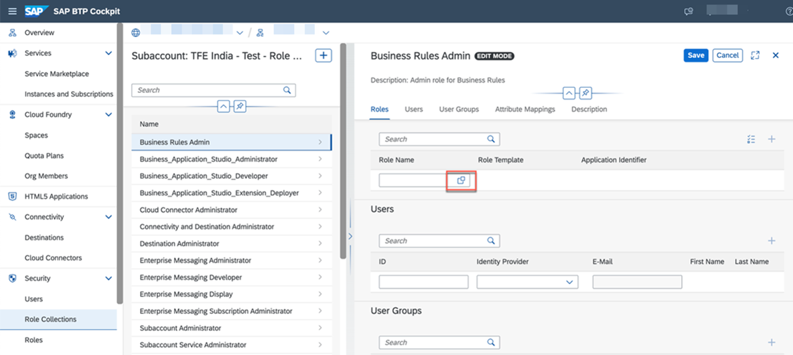

16. Choose **Add**.

    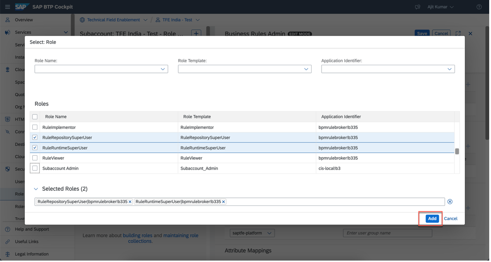

17. In the **Users** tab, enter your email id in **ID** and **E-Mail** input field and choose **Save**.

18. Your configuration should look like below:

    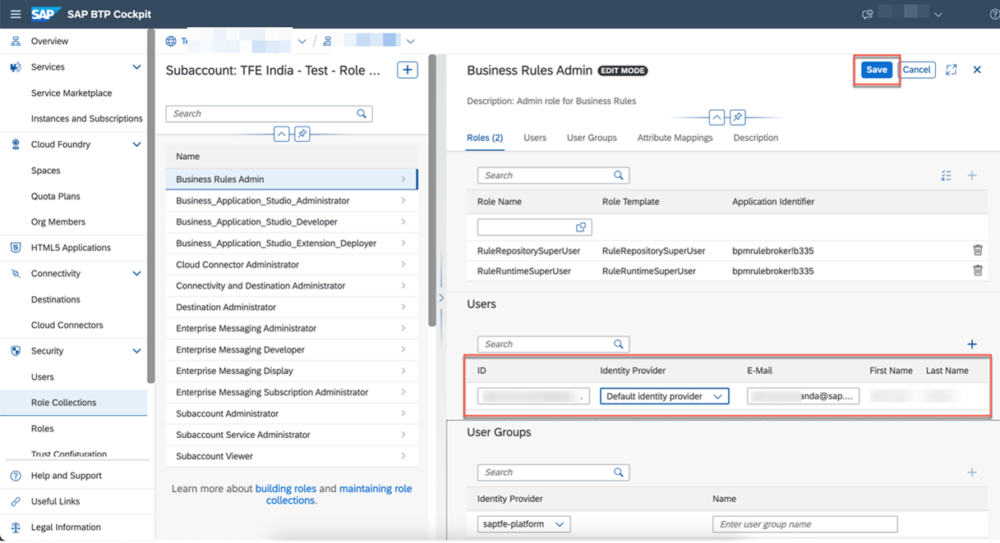

### 4. Configure API destination in AWS EventBridge to send events to SAP Event Mesh

1. In the SAP BTP cockpit, navigate to your subaccount and choose **Instances and Subscriptions** and then choose **Instances**.

    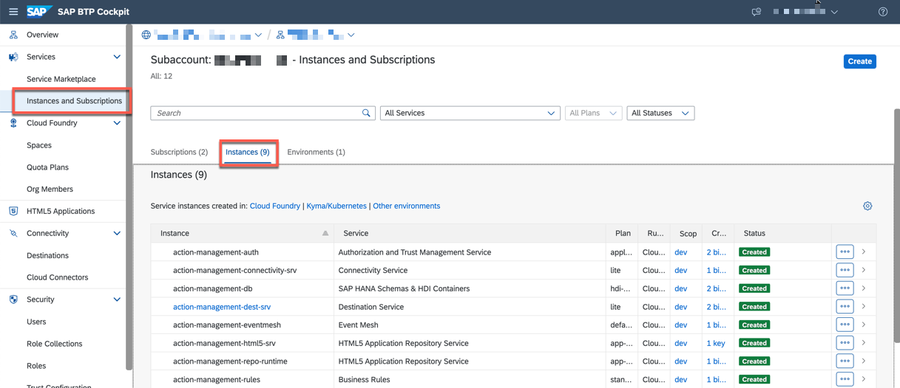

2. Choose **action-management-eventmesh** and then choose the three dots next to **action-management-eventmesh-key** and then choose **View** to open the service key. 

    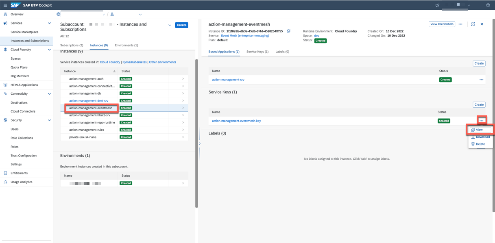

3. Copy the values of **clientid**, **clientsecret** and **tokenendpoint** corresponding to **httprest** protocol.

    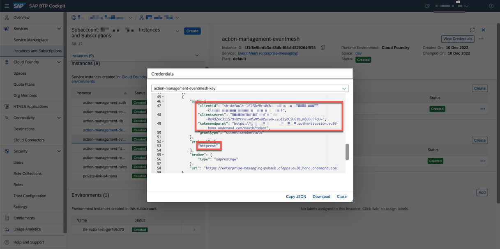

    Scroll down and copy the value of **uri**.

    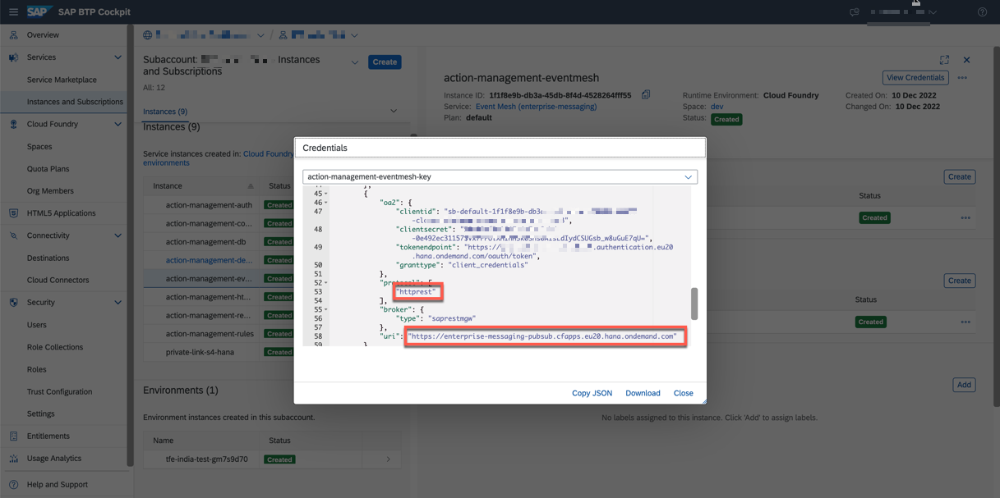

4. Open the SAP Event Mesh application.

    - If you are using SAP BTP Enterprise account, go to the Subscriptions tab and choose Event Mesh to open the application.

    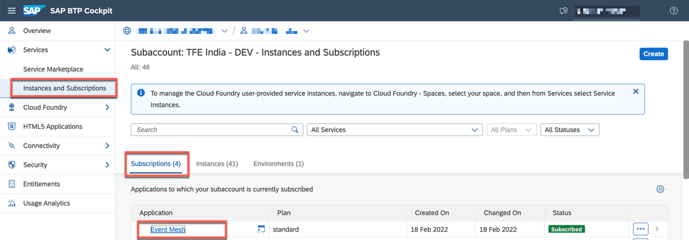

5. Choose **Message Clients** and choose message client which is created post deployment.

    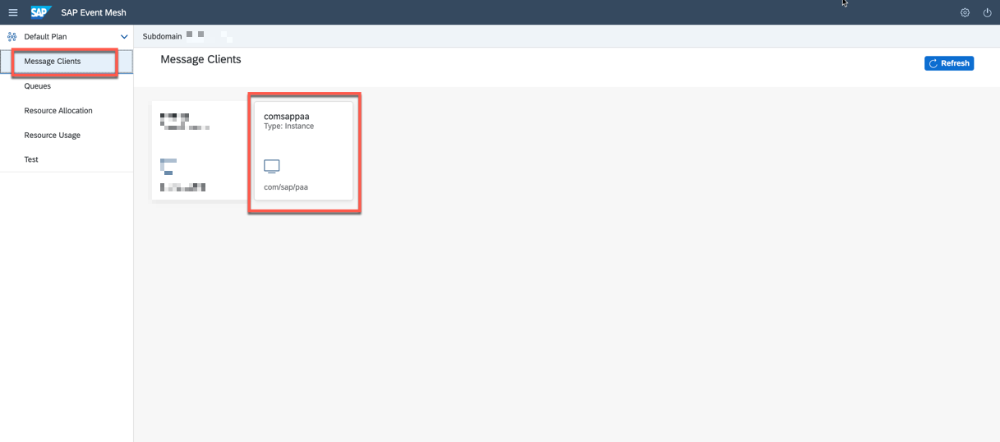

6. Choose **Queues** and Select **Queue Subscriptions** in the Action button corresponding the queue name that is created by the "action-management" CAP application.

    

7. Copy the value of **Subscribed Topic Name**

    

8. Encode the **Subscribed Topic Name** value and notedown as **encoded subscribed topic name**.

    Note: For example, if the Subscribed Topic Name is "orgname/industry/event/raised", then the encoded subscribed topic name will be "orgname%2Findustry%2Fevent%2Fraised".

9. Go to Amazon AWS Portal. In the AWS portal, search for **event bridge** and choose **Amazon EventBridge**.

    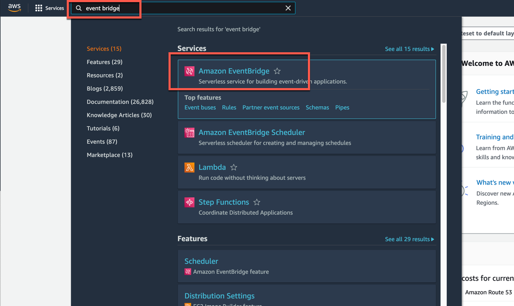

10. In **Amazon EventBridge**, under **Integration** section, choose **API destinations**.

    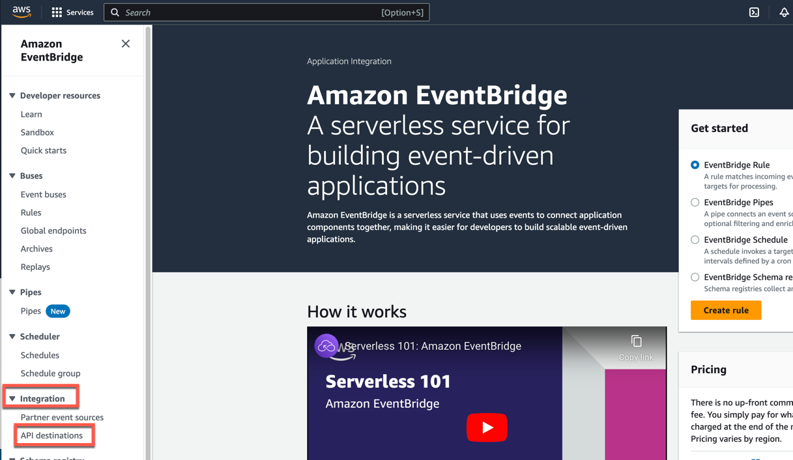

11. Choose **Create API destination**

    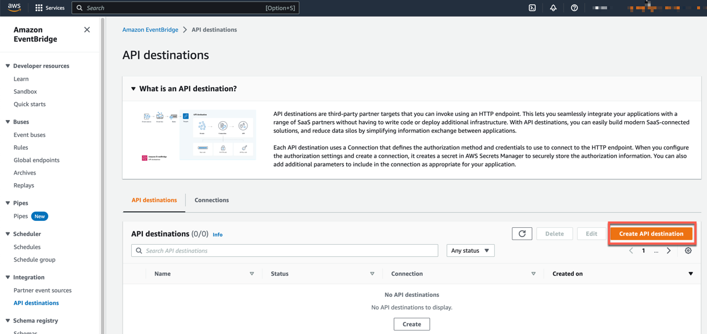

12. In **API destination detail** section, enter the following details

    | Field | Value |
    | --------|---------|
    | **Name** | sap-eventmesh-destination |
    | **Description** | Send events to SAP Event Mesh |
    | **API destination endpoint** | This URL is formed by concatenating the **uri** from Step 3, constant rest endpoint path (/messagingrest/v1/topics/) and **encoded subscribed topic name** from Step 8  and (/messages).
    Note: URL format -  **uri**/messagingrest/v1/topics/**encoded subscribed topic name**/messages
    For example,if uri is "https://enterprise-messaging-pubsub.cfapps.eu10.hana.ondemand.com" and encoded subscribed topic name is "orgname%2Findustry%2Fevent%2Fraised", then the callback URL is "https://enterprise-messaging-pubsub.cfapps.eu10.hana.ondemand.com/messagingrest/v1/topics/orgname%2Findustry%2Fevent%2Fraised/messages" |
    | **HTTP Method** | POST |

    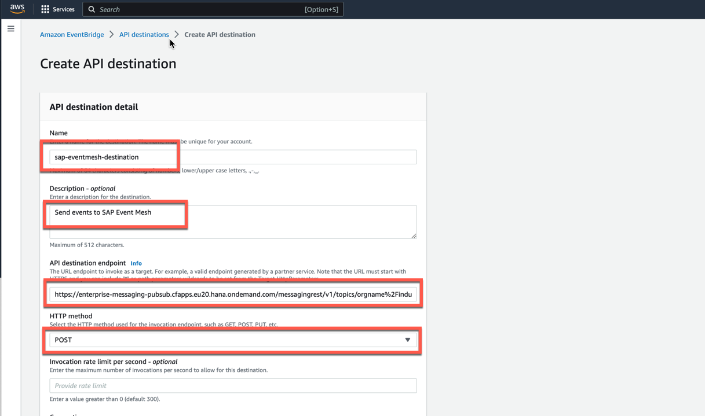

13. In the Connection section, choose **Create a new connection** and then enter the **Connection name** as "sap-event-mesh-connection". In the **Destination type** select "Other" and in the **Authorization type** select "OAuth Client Credentials"

    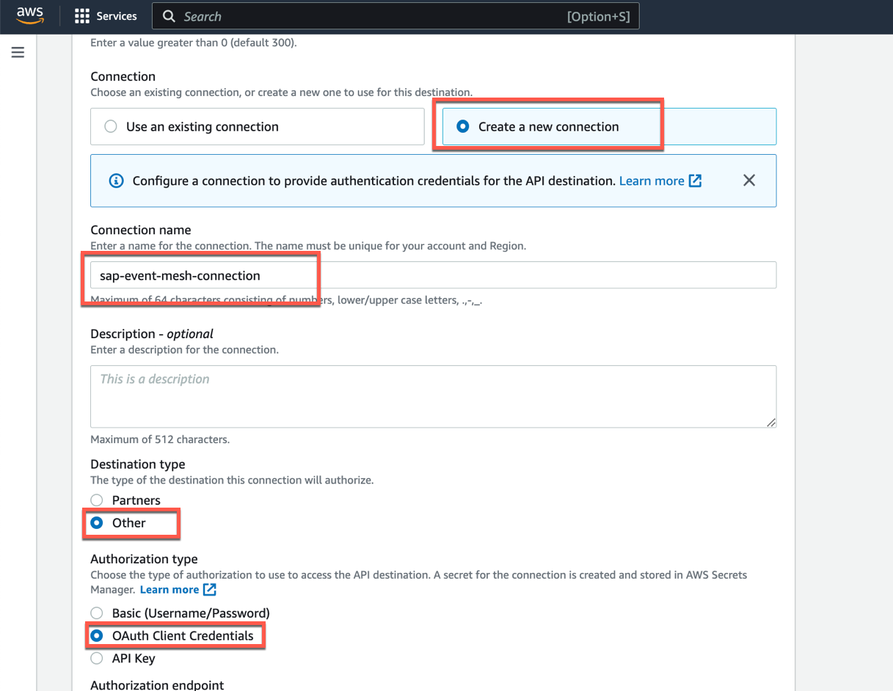

14. Enter/select the following values

    | Field | Value |
    | --------|---------|
    | **Authorization endpoint** | **tokenendpoint** from step 3 |
    | **HTTP method** | POST |
    | **HTTP method** | POST |
    | **Client ID** | **clientid** from step 3 |
    | **Client secret** | **client secret** from step 3 |

    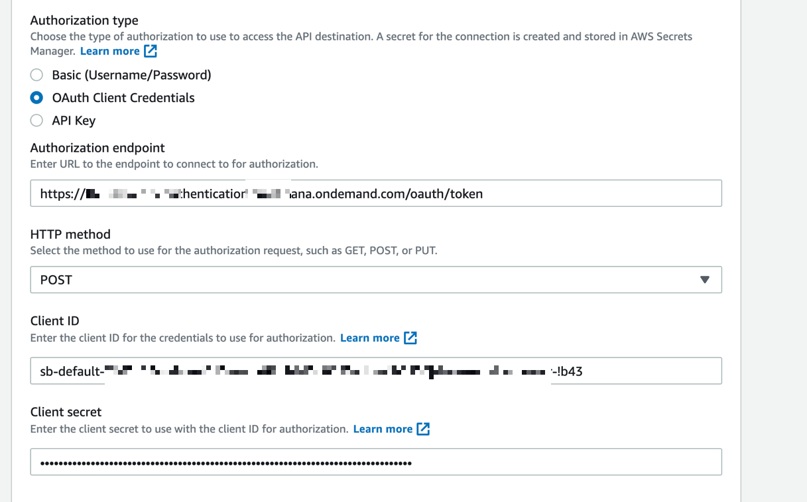

15. Under **OAuth Http Parameters**, choose **Add parameter**. In the **Parameter** dropdown, select "Query string", in the **Key** field, enter "grant_type" and in the **Value** field, enter "client_credentials". Under **Invocation Http Parameters**, choose **Add parameter**. In the **Parameter** dropdown, select "Header", in the **Key** field, enter "x-qos" and in the **Value** field, enter "1" and then choose **Create**.

    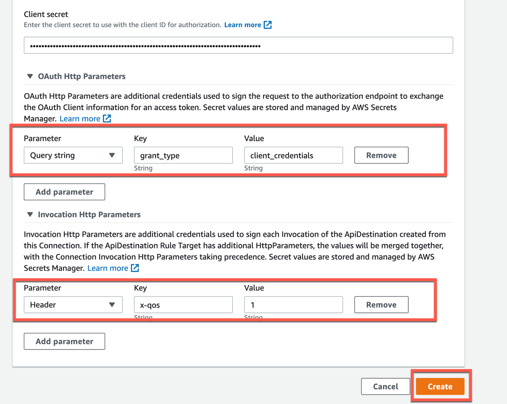

16. API destination is created successfully. Click on Refresh button. If the Status is shown as **Active**, then the connection to SAP event Mesh is configured correctly else you need to recheck the credentials.

### 5. Configure pipe AWS EventBridge to send events to SAP Event Mesh from Amazon SQS queue

1. In **Amazon EventBridge**, under **Pipes** section, choose **Pipes**.

    

2. Choose **Create pipe**

    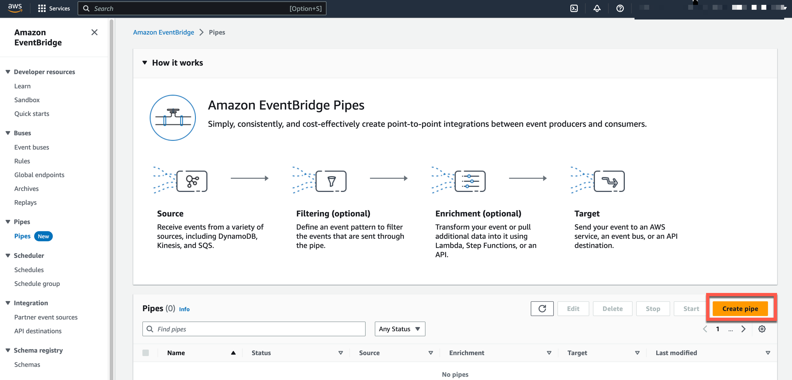

3. In the **Pipe name** field, enter the value as "sqs-sap-eventmesh-pipe"

    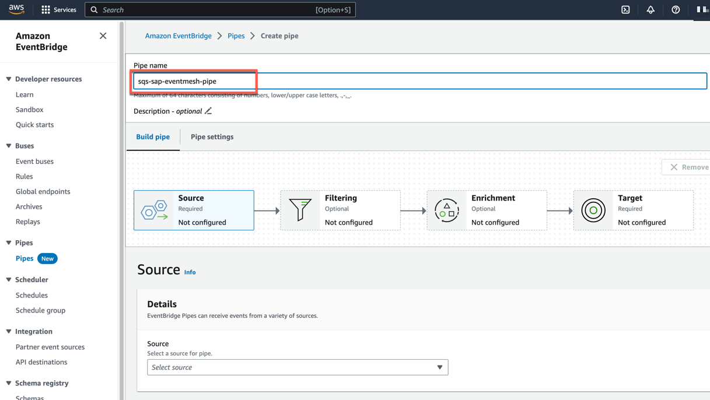

4. In the **Source** dropdown, select "SQS" and in the **SQS Queue** dropdown, select queue that we created earlier(iot-core-queue). Scroll down and choose **Next**

    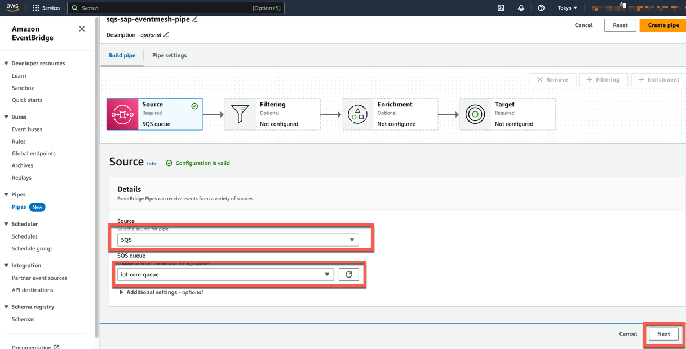

5. Skip the **Filtering** and **Enrichment** sections by choosing **Next**

6. In the **Target** section, in the **Target service** dropdown, select **API Destination** and in **API destination** dropdown, select 
the destination that is created in the above step(sap-eventmesh-destination) and then choose **Create pipe**.

    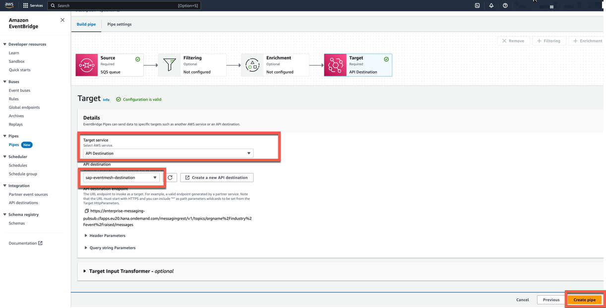

7. "Pipe sqs-sap-eventmesh-pipe was created Successfully" message is displayed and check that the status is **Running**.

    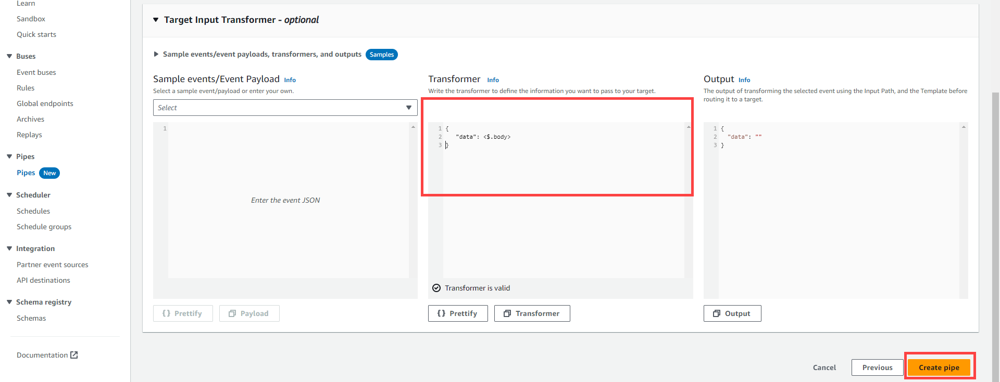
