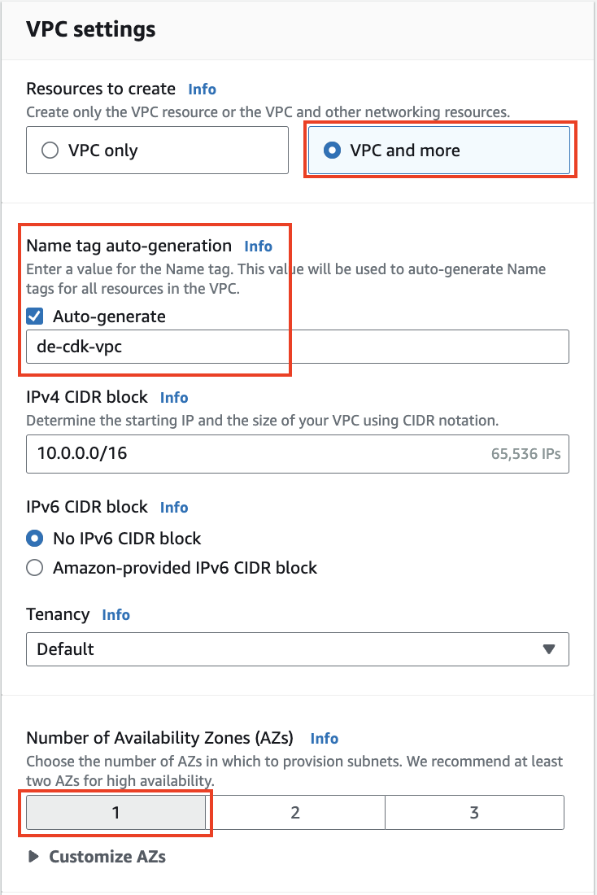
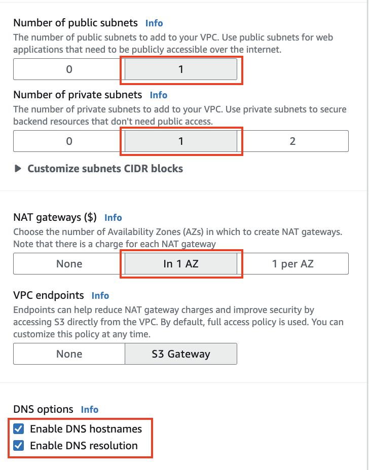
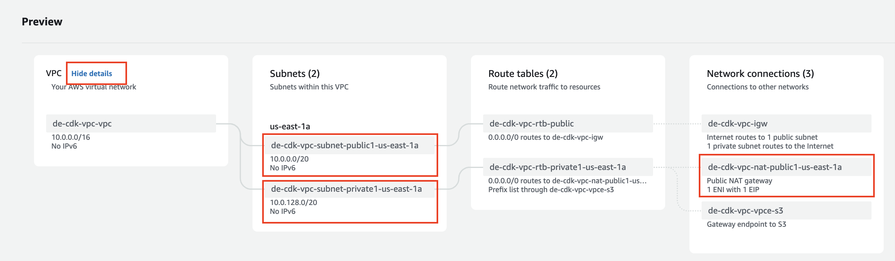
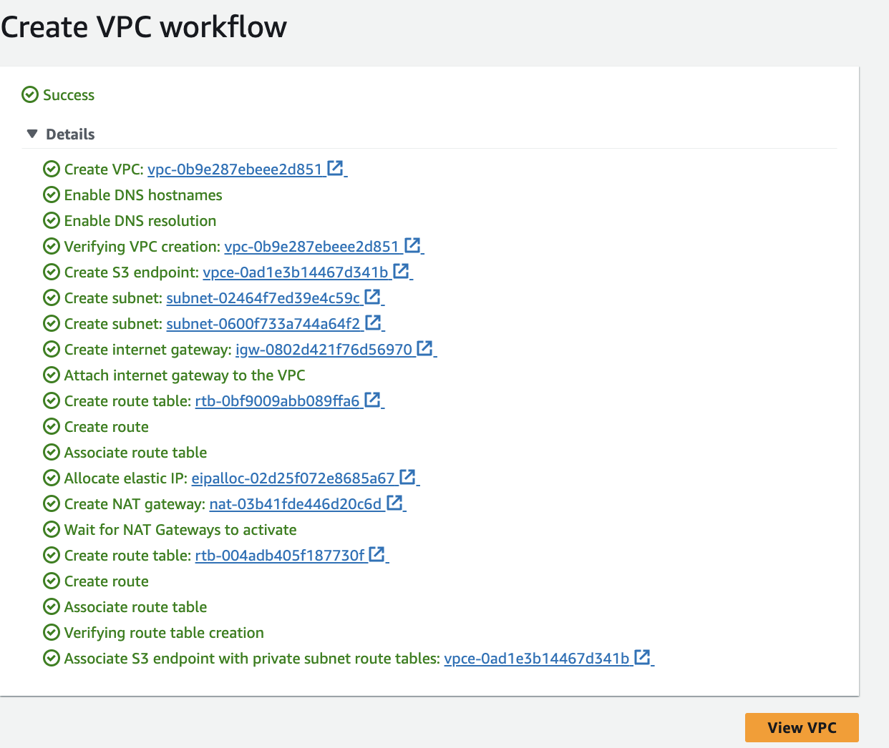

**Create a VPC using the wizard in AWS**

In this task, we want to create an Amazon Virtual Private Cloud (VPC), which is a logically isolated virtual network in your AWS account. This VPC will have 1 public subnet, 1 private subnet, and one Network Address Translation (NAT) Gateway, which will be used to deploy AWS CDK.

1. Access the AWS Management Console, select **Services**. at the top of the screen, and select the **VPC** service. **Or**, you can type **vpc** in the search box to the right of **Services**, then select VPC from the list that comes up.

2. Check to make sure you're still in the correct region for your labs, by checking the region name at the top right of the AWS Console, such as the North Virginia region, us-east-1.

3. Select **VPC Dashboard** at the top of the lefthand pane.

4. Click **Create VPC**.

5. Make sure that **VPC and more** is selected.

6. Under the Name tag auto-generation field enter your initials followed by -cdk. Because Auto-generate is checked, this will name your VPC something like de-cdk-vpc (assuming your initials are "de"), and all other related resources such as subnets, route tables, internet gateway, and public NAT gateway.

7. For **Number of Availability Zones** select 1 so that we will use 1 AZ for our VPC.
   
    
   
8. Confirm that both **Number of public subnets** and **Number of private subnets** is set to 1

9. For **NAT gateways**, select **In 1 AZ**. This will define one NAT gateway for your VPC, and all Internet-bound traffic from your private subnets will be routed through there. An Elastic IP is also created for the NAT gateway.

10. Under **DNS options** make sure the box next to **Enable DNS hostnames** is checked.
   
      

11. Scroll to the right and review the resources getting created by the VPC Wizard, in the Preview panel. You can see more information by clicking on **Show details** (which will change to Hide details), next to VPC.
    
     

12. Review the details in the table at the bottom of this page, which should be included in what the Preview panel shows, and take note of these for future steps in this workshop. Then, when ready to proceed, click on the **Create VPC** button.

13. Watch the **Create VPC workflow** page update. All items should have a green tick to the left of them when the creation of the VPC completes.

     

