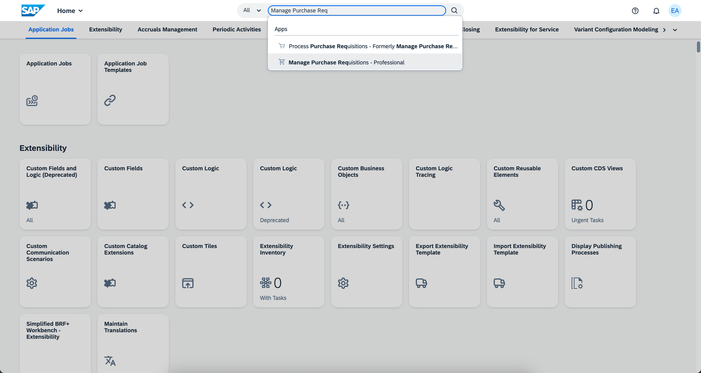
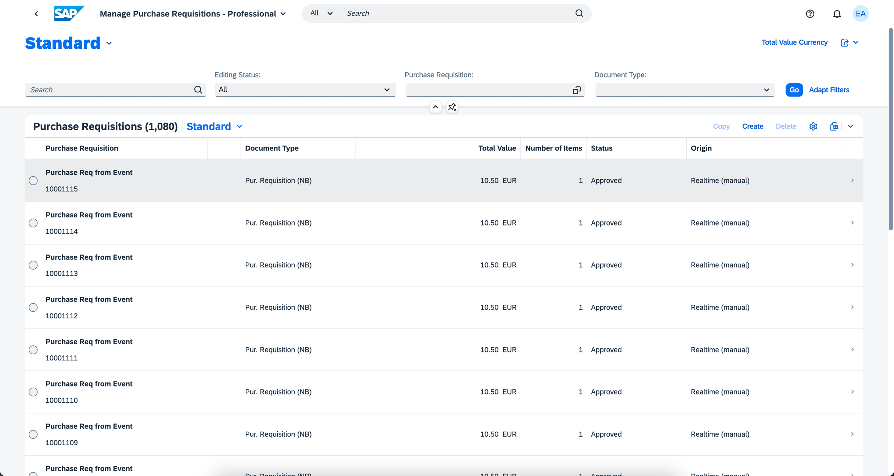
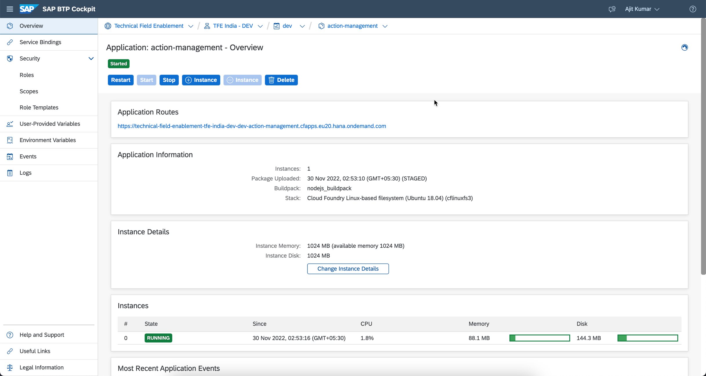
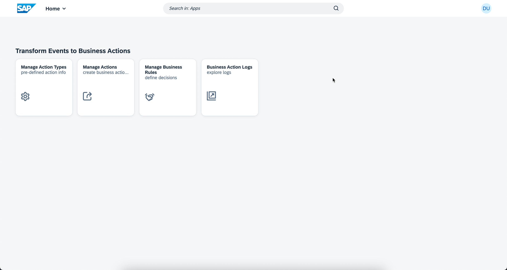
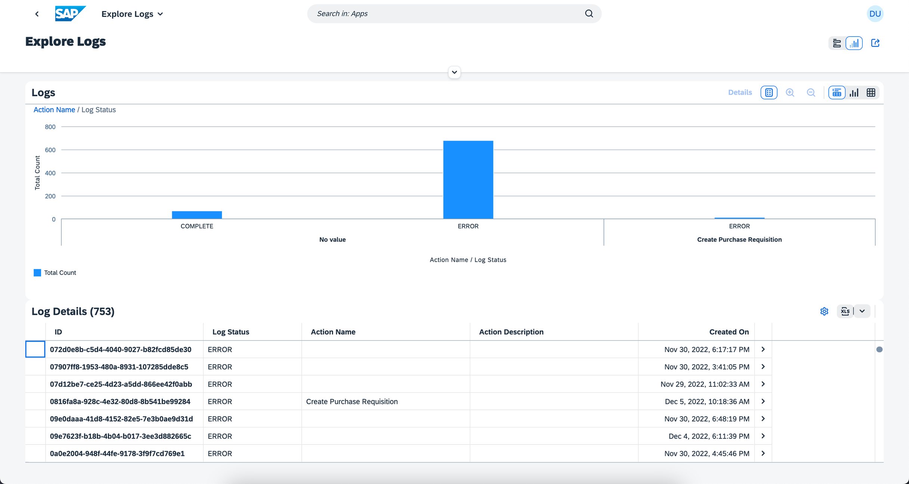

## Test the Extension Application and Execute the End-to-End Scenario

Now that you have successfully deployed the extension application in SAP BTP and completed the configurations in Amazon AWS, SAP BTP and SAP S/4HANA, follow these steps to test the application.

1. Send device telemetry data from device using aws-iot-device-sdk to the device that you have onboarded.

2. Once the filllevel is less than the threshold(20) configured in the AWS IoT Core rules, "Low-stock" event is triggered and sent to SAP Event Mesh and a Purchase Requisition for re-filling the material is created in SAP S/4 HANA.

3. Log into SAP S/4HANA System and Search for **Manage Purchase Requisition** app.

    

4. Choose **Go** and then choose the latest purchase requsition.

    

5. In the **Purchase Requisition Items** table, verify if **Item** column is updated with Fill Level information.

    

6. Open **action-management** application in your cloud foundry space using BTP Cockpit. Click on the url provided under Application Routes section.

    

7. Click on **Business Action Logs** tile.

    

8. View Logs information and you can filter by date and status. 

    

9. Choose any entry from analytical table in Log Details Section. Click on **Re-Process** button to re-process the failed events.

    

You have completed the end-to-end integration of events to business actions from Amazon AWS to SAP S/4HANA with SAP BTP.

