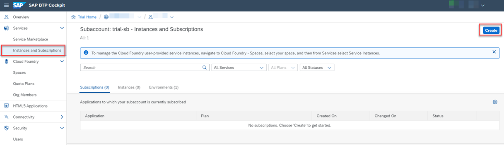
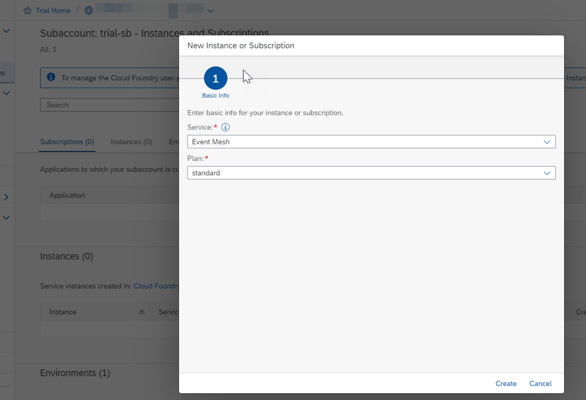
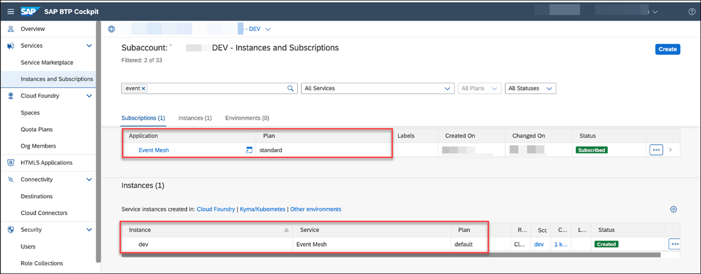
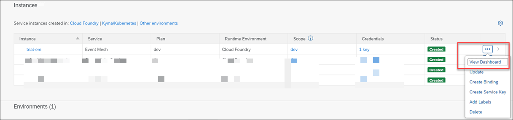
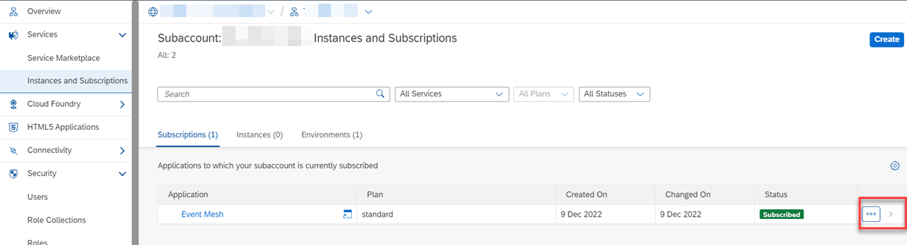
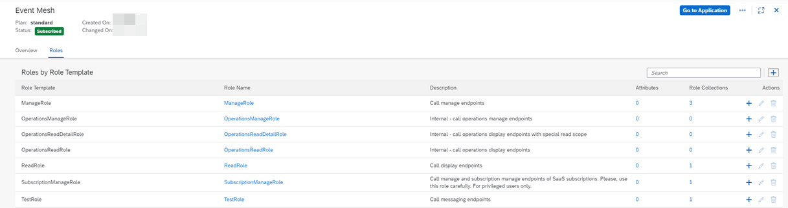
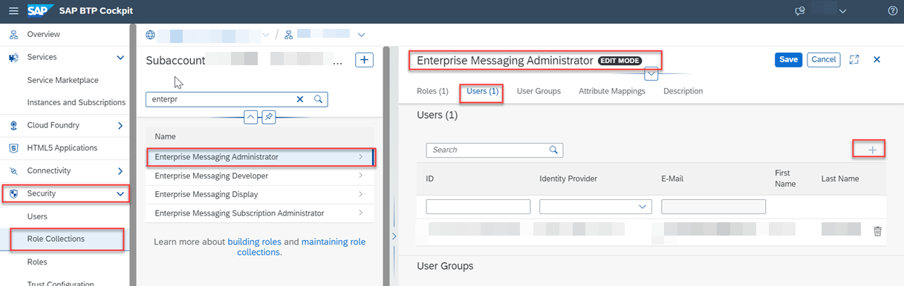

## Set Up the Subaccount in SAP BTP

### 1. Create or Use an Already Existing Subaccount in SAP BTP

You can use both trial and enterprise account in SAP BTP. To set up a trial account, see the [Get a Free Account on SAP BTP Trial](https://developers.sap.com/tutorials/hcp-create-trial-account.html) at SAP Tutorial Navigator.

You can use an existing subaccount or you can create a new one.

You need to have the Global Account Administrator role collection assigned to your user.

If you are new to SAP BTP, follow the [Get Ready to Develop on SAP BTP](https://developers.sap.com/group.scp-1-get-ready.html) tutorial at SAP Tutorial Navigator to get started with SAP BTP, create subaccounts. enable cloud foundry environment and assign entitlements.

1. Log in to SAP BTP cockpit, navigate to your global account and create a subaccount or use an existing one.
2. Choose **Cloud Foundry Environment** tab and then choose **Enable Cloud Foundry**.
3. Choose **Create Space** once the Cloud Foundry Environment is enabled.

4. Assign the following entitlements:

Service | Service Plan | Usage Scenario |
--- | --- | --- |
|[Authorization and Trust Management Service](https://discovery-center.cloud.sap/serviceCatalog/authorization-and-trust-management-service?region=all&tab=feature) | application | Manage application authorizations and connections to identity providers.|
|[Business Rules](https://help.sap.com/docs/BUSINESS_RULES) | standard | Digitize and automate decision making with business rules to increase flexibility and compliance.|
[Cloud Foundry Runtime](https://discovery-center.cloud.sap/serviceCatalog/cloud-foundry-runtime?region=all) | MEMORY | Create polyglot applications.The chosen quota defines the available amount of memory in GB.|
[SAP Connectivity Service](https://discovery-center.cloud.sap/serviceCatalog/connectivity-service?service_plan=lite&region=all&commercialModel=cloud) | lite | Establish connections between cloud applications and on-premise systems.|
[Destination Service](https://discovery-center.cloud.sap/serviceCatalog/destination?service_plan=lite&region=all&commercialModel=cloud) | lite | Destination service lets you find the destination information required to access a remote service or system from your extension application.|
[Event Mesh](https://discovery-center.cloud.sap/serviceCatalog/event-mesh?region=all) | dev   default   standard(Application) | fully managed cloud service that allows applications to communicate through asynchronous events.|
[SAP Private Link Service](https://discovery-center.cloud.sap/serviceCatalog/private-link-service?service_plan=standard&region=all&commercialModel=cloud) | standard | Available only in Enterprise account. Establishes a private connection between selected SAP BTP services and selected services in your own IaaS provider accounts.|
[SAP Business Application Studio](https://discovery-center.cloud.sap/serviceCatalog/business-application-studio?region=all) | trial   standard-edition(Application) | Available in Trial as well as Enterprise account.
[SAP HANA Cloud](https://discovery-center.cloud.sap/serviceCatalog/sap-hana-cloud?tab=customerreference&region=all)  | hana | Application database for CAP Application
[SAP HANA Schemas & HDI Containers](https://help.sap.com/docs/SAP_HANA_PLATFORM/3823b0f33420468ba5f1cf7f59bd6bd9/e28abca91a004683845805efc2bf967c.html?version=2.0.04&locale=en-US) | hd-shared | Application database for CAP Application

**Note:** Service instances for SAP Event Mesh, Business Rules, SAP HANA Schemas & HDI Containers, Connectivity service, Destination service and SAP Authorization and Trust Management Service will be created programmatically during deployment. 

### 2. Set Up SAP Event Mesh

To set up SAP Event Mesh for this scenario, follow these steps:

1. In the SAP BTP cockpit, navigate to your subaccount and choose **Services** > **Instances and Subscriptions** and then choose **Create**.

    

2. In the **Service** dropdown field, choose **Event Mesh** and in the **Plan** dropdown field, choose **standard** and then choose **Create**.

    

3. Open the SAP Event Mesh application:

    - If you are using SAP BTP Enterprise account, go to the **Subscriptions** tab and choose **Event Mesh** to open the application.

        
    
    - If you are using SAP BTP Trial account, go to **Instances** tab, select the instance for SAP Event Mesh and choose **View Dashboard**.

        

4. Select **Click to Select** icon to view the details of roles. 

    

    Ensure the below roles are available.

    

5. Choose **Security** > **Role Collections**. Choose **Enterprise Messaging Administrator** and choose **Edit** and then choose **Users** tab to add users.

    

### 3. Set Up SAP HANA Cloud Instance

Refer [Deploy SAP HANA Cloud](https://developers.sap.com/tutorials/hana-cloud-deploying.html) to create an instance of SAP HANA Cloud in SAP BTP. 

If you already have an existing HANA Instance, you can map it to this SAP BTP subaccount.

### 4. Set Up SAP Business Application Studio

Refer [Manage Authorizations and Roles](https://help.sap.com/docs/SAP%20Business%20Application%20Studio/9d1db9835307451daa8c930fbd9ab264/01e69c53003c4b0a8a64310a3f08867d.html) to assign permissions to users.