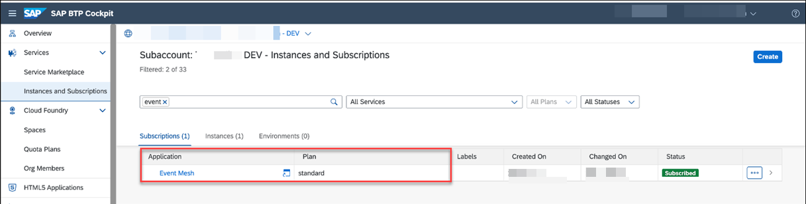

## Set Up the Subaccount in SAP BTP

### 1. Create or Use an Already Existing Subaccount in SAP BTP

You can use both trial and enterprise account in SAP BTP. To set up a trial account, see the [Get a Free Account on SAP BTP Trial](https://developers.sap.com/tutorials/hcp-create-trial-account.html) at SAP Tutorial Navigator.

You can use an existing subaccount or you can create a new one.

You need to have the Global Account Administrator role collection assigned to your user.

If you are new to SAP BTP, follow the [Get Ready to Develop on SAP BTP](https://developers.sap.com/group.scp-1-get-ready.html) tutorial at SAP Tutorial Navigator to get started with SAP BTP, create subaccounts. enable cloud foundry environment and assign entitlements.

1. Log in to SAP BTP cockpit, navigate to your global account and create a subaccount or use an existing one.
2. Choose **Cloud Foundry Environment** tab and then choose **Enable Cloud Foundry**.
3. Choose **Create Space** once the Cloud Foundry Environment is enabled.

4. Assign the following entitlements:

Service | Service Plan | Usage Scenario |
--- | --- | --- |
|[SAP Authorization and Trust Management Service](https://discovery-center.cloud.sap/serviceCatalog/authorization-and-trust-management-service?region=all&tab=feature) | Application | Required to authenticate access to the extension app's notification endpoint.|
|[Business Rule](https://help.sap.com/docs/BUSINESS_RULES) | Application | Required to authenticate access to the extension app's notification endpoint.|
[Cloud Foundry Runtime](https://discovery-center.cloud.sap/serviceCatalog/cloud-foundry-runtime?region=all) | MEMORY | Needed to run the application on SAP BTP, Cloud Foundry environment. The chosen quota defines the available amount of memory in GB. |
[Connectivity Service](https://discovery-center.cloud.sap/serviceCatalog/connectivity-service?service_plan=lite&region=all&commercialModel=cloud) | lite | Connectivity service allows you to connect extension application to an on-premise system through the Cloud Connector.|
[Destination Service](https://discovery-center.cloud.sap/serviceCatalog/destination?service_plan=lite&region=all&commercialModel=cloud) | lite | Destination service lets you find the destination information required to access a remote service or system from your extension application.|
[Event Mesh](https://discovery-center.cloud.sap/serviceCatalog/event-mesh?region=all) | dev   standard(Application) | Messaging bus for inter-app communication within the Cloud Foundry environment.|
[SAP Private Link Service](https://discovery-center.cloud.sap/serviceCatalog/private-link-service?service_plan=standard&region=all&commercialModel=cloud) | standard | Available only in Enterprise account. 
[SAP Business Application Studio](https://discovery-center.cloud.sap/serviceCatalog/business-application-studio?region=all) | trial or standard-edition(Application) |Available in Trial as well as Enterprise account.
[SAP HANA Cloud](https://discovery-center.cloud.sap/serviceCatalog/sap-hana-cloud?tab=customerreference&region=all)  | hana |
[SAP HANA Schemas & HDI Containers](https://help.sap.com/docs/SAP_HANA_PLATFORM/3823b0f33420468ba5f1cf7f59bd6bd9/e28abca91a004683845805efc2bf967c.html?version=2.0.04&locale=en-US) | hd-shared |

**Note:** Service instances for Connectivity service, Destination service and SAP Authorization and Trust Management Service will be created programmatically during deployment. 

### 2. Set Up SAP Event Mesh

To set up SAP Event Mesh for this scenario, follow these steps:

1. In the SAP BTP cockpit, navigate to your subaccount and choose **Services** > **Instances and Subscriptions** and then choose **Create**.

    

2. In the **Service** dropdown field, choose **Event Mesh** and in the **Plan** dropdown field, choose **standard** and then choose **Create**.

    

2. Open the SAP Event Mesh application:

    - If you are using SAP BTP Enterprise account, go to the **Subscriptions** tab and choose **Event Mesh** to open the application.

        
    
    - If you are using SAP BTP Trial account, go to **Instances** tab, select the instance for SAP Event Mesh and choose **View Dashboard**.

        

3. Ensure the below roles are added.

    

### 3. Set Up SAP HANA Cloud Instance

Refer [Deploy SAP HANA Cloud](https://developers.sap.com/tutorials/hana-cloud-deploying.html) to create an instance of SAP HANA Cloud in SAP BTP. If you already have an existing HANA Instance, you can map it to this SAP BTP subaccount.

---------------------------------

---------------------------
