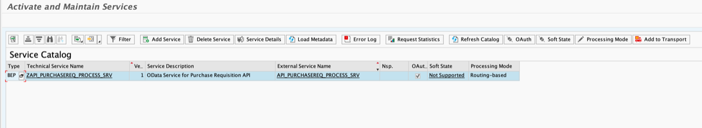

## Check SAP S/4HANA Readiness
In this section, you will activate the APIs related to purchase requisition scenario.

### Activate the API_PURCHASEREQ_PROCESS_SRV Service

1. In your SAP S/4HANA system, open the **/n/IWFND/MAINT_SERVICE** trasaction.

2. Activate the API_PURCHASEREQ_PROCESS_SRV service.

Optionally expose the respective APIs related to your business scenarios (like Plant maintainence workorder, PO Creation, Sales Order) etc..