## Build and Deploy the Extension Application

In this section, you will clone the codebase and deploy the extension application in SAP BTP. 

### 1. Clone the GitHub Repository
    

Access the [Event To Action Framework](https://github.com/SAP-samples/btp-events-to-business-actions-framework) GitHub repository to download the project.

### 2. Check the Prerequisites for Deployment

Ensure you have added the required entitlements as described in section **Step1-Setup-SAPBTP-Subaccount** page before deployment.

### 3. Deploy the Extension Application

Build and deploy the application. Run the following commands:

**Note**: Ensure you have Cloud MBT Build Tool. Refer [The Cloud MTA Build Tool (MBT)](https://help.sap.com/docs/HANA_CLOUD_DATABASE/c2b99f19e9264c4d9ae9221b22f6f589/1412120094534a23b1a894bc498c2767.html) for more details.

1. Open the Cloud Foundry command line interface (cf CLI).

2. Navigate to **action-management** directory.

    ```
    cd action-management
    ```
3. Fetch the dependencies.

    ```
    npm install
    ```
4. Build action-management modules.

    ```
    npm run build
    ```
5. Log in to your subaccount in SAP BTP to deploy the extension application.
    Check your region and copy the API endpoint accordingly. For example, "https://api.cf.region.hana.ondemand.com"

    ```
    cf login -a `<CF API endpoint>`
    ```
6. Push the application to your subaccount.

    ```
    npm run deploy
    ```
7. You can also check the status of your applications in the SAP BTP cockpit. Copy the value of the extension application URL.

    

8. In the SAP BTP cockpit, navigate to your subaccount and choose **Services** > **Instances and Subscriptions**. Check if you have all of the instances created post deployment as shown below. Make sure the status of all of the instances are **Created**.

    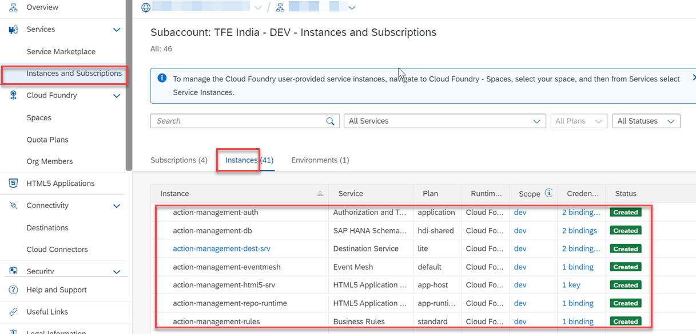

9. Verify SAP Event Mesh Subscription and Instance creation.

    - In SAP BTP Enterprise account, you should be able to see the below details in Subcriptions and Instances.

        

10. Open the SAP Event Mesh application.

    - If you are using SAP BTP Enterprise account, go to the Subscriptions tab and choose Event Mesh to open the application.

    - If you are using SAP BTP Trial account, go to Instances tab, select the instance for SAP Event Mesh and choose View Dashboard.

11. Choose **Message Clients** and then choose **Queues**. You will see the below message client and queue created in your SAP Event Mesh service instance.

    

    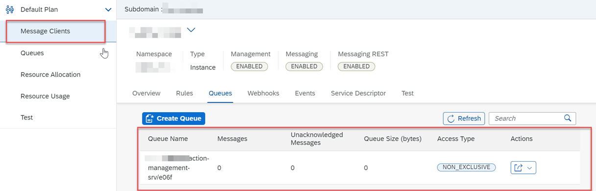


12. In subaccount, choose **Security** > **Role Collections** and then choose **Create New Role Collection** icon.

    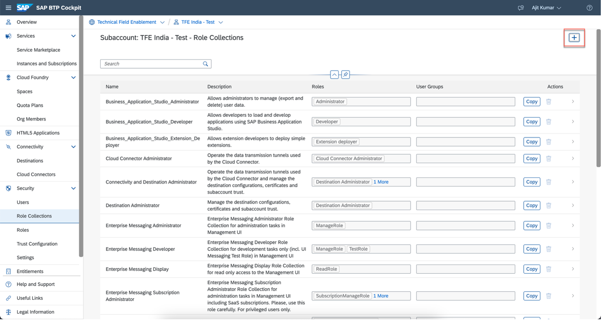

13. Enter a value of your choice for the **Name** and **Description** field and choose **Create**.

    

14. Choose **Edit** to add roles and user to the created role collection.

    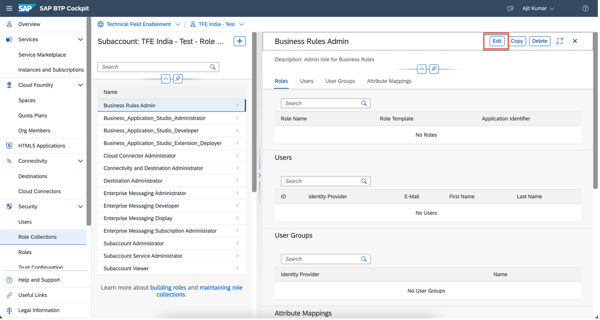


15. Select **RoleName** value help and then select the **RuleRepositorySuperUser** and **RuleRuntimeSuperUser** roles from the list.

    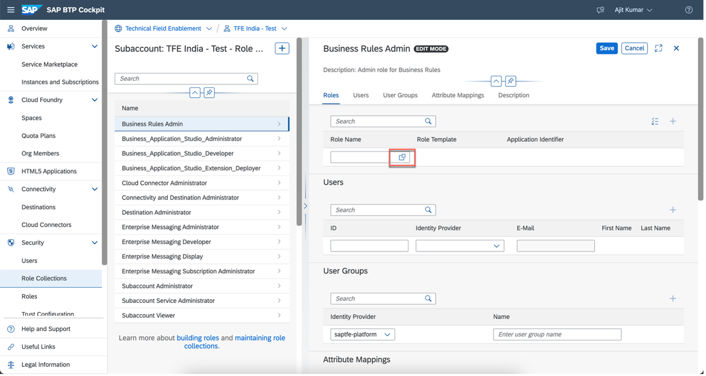

16. Choose **Add**.

    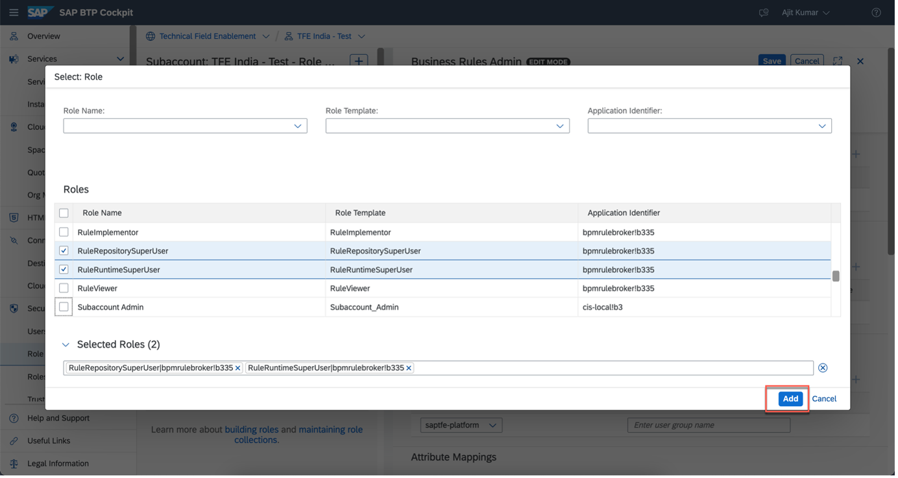

17. In the **Users** tab, enter your email id in **ID** and **E-Mail** input field and choose **Save**.

18. Your configuration should look like below:

    

### 4. Create destination in Microsoft Azure IoT Central application

1. In the SAP BTP cockpit, navigate to your subaccount and choose **Instances and Subscriptions** and then choose **Instances**.

    

2. Choose **action-management-eventmesh** and then choose the three dots next to **action-management-eventmesh-key** and then choose **View** to open the service key. 

    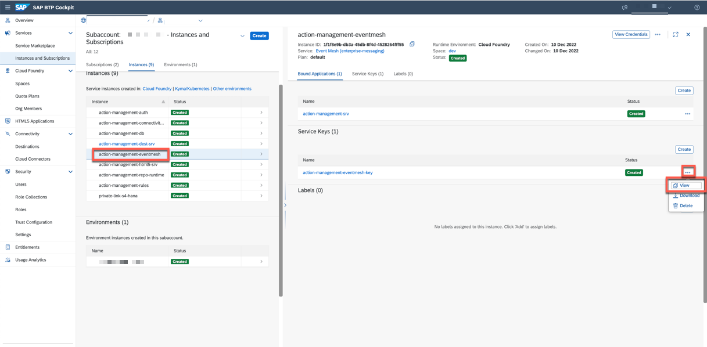

3. Copy the values of **clientid**, **clientsecret** and **tokenendpoint** corresponding to **httprest** protocol.

    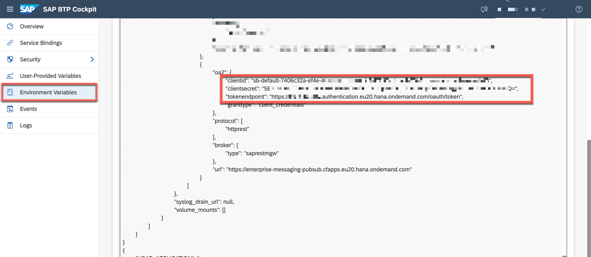

    Scroll down and copy the value of **uri**.

    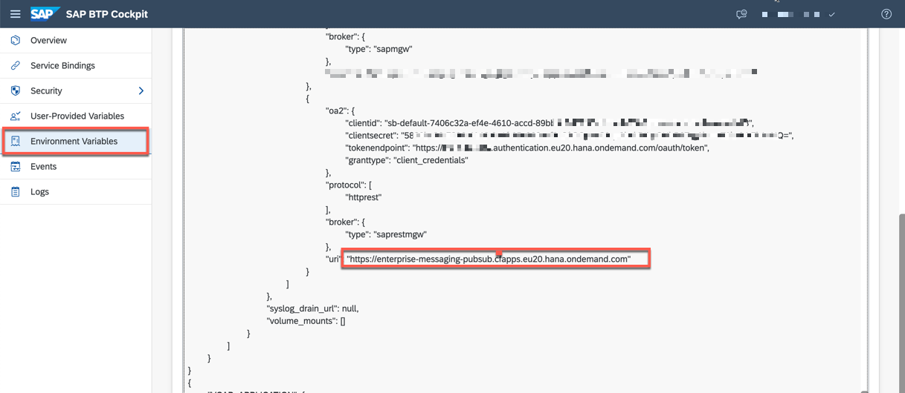

4. Open the SAP Event Mesh application.

    - If you are using SAP BTP Enterprise account, go to the Subscriptions tab and choose Event Mesh to open the application.

    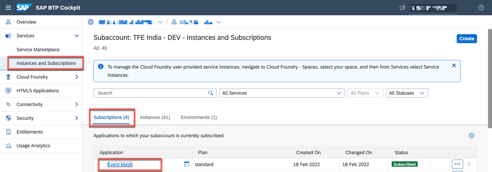

5. Choose **Message Clients** and choose message client which is created post deployment.

    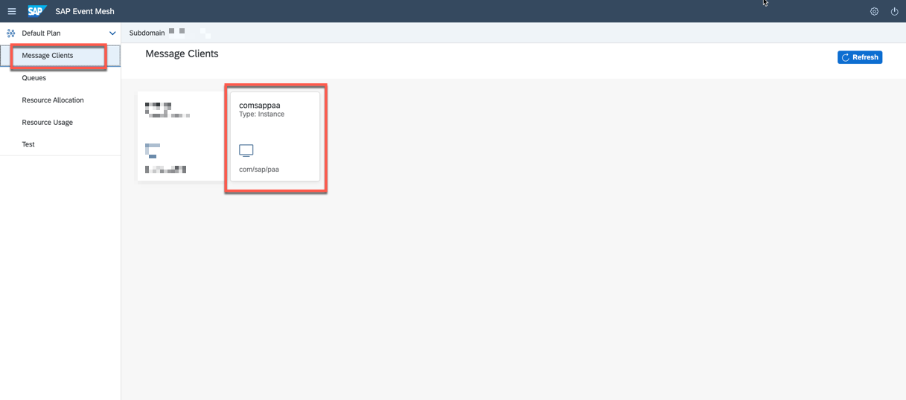

6. Choose **Queues** and Select **Queue Subscriptions** in the Action button corresponding the queue name that is created by the "action-management" CAP application.

    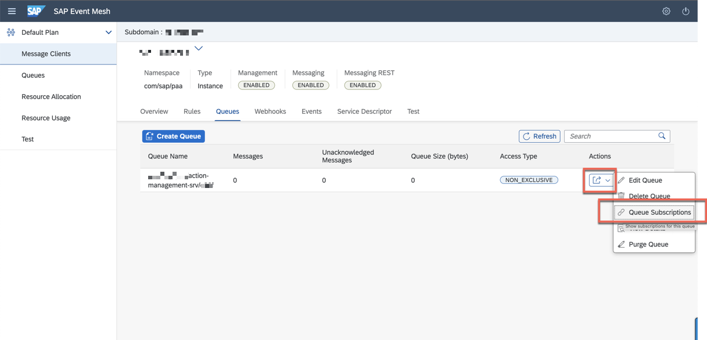

7. Copy the value of **Subscribed Topic Name**

    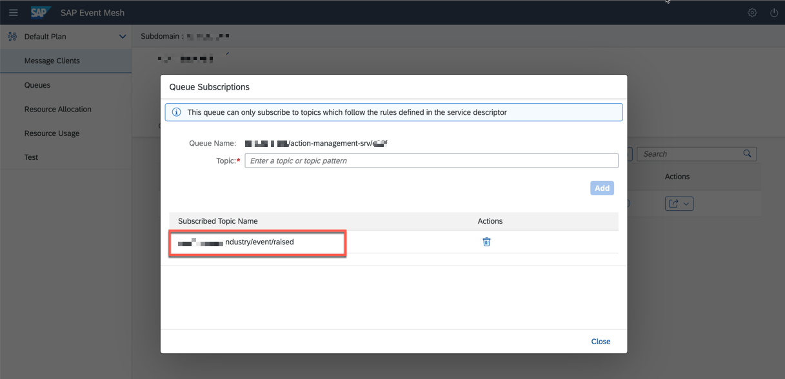

8. Encode the **Subscribed Topic Name** value and notedown as **encoded subscribed topic name**.

Note: For example, if the Subscribed Topic Name is "orgname/industry/event/raised", then the encoded subscribed topic name will be "orgname%2Findustry%2Fevent%2Fraised".

9. Go to Microsoft Azure Portal and choose **Resource Groups**. Select the resource group and then  choose the IoT Central Application you created. 

    Select the **IoT Central Application URL** to open the application. Choose **Data Export** and then choose **Destinations** tab to create new destination. Choose **Add a destination**.

    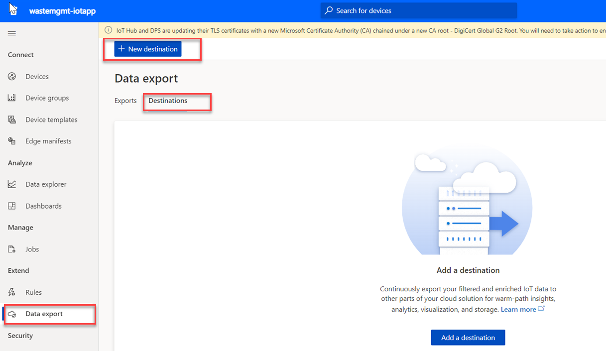

10. Enter **Send to SAP Event Mesh** as value for name of the destination.

11. In the **Destination Type** dropdown menu, select **Webhook**.

12. In the **Callback URL** field, enter the value of the url as below.
    The callback URL is formed by concatenating the **uri** from Step 3, constant rest endpoint path (/messagingrest/v1/topics/) and **encoded subscribed topic name** from Step 8  and (/messages).
    
    Note: URL format -  **uri**/messagingrest/v1/topics/**encoded subscribed topic name**/messages
    For example,if uri is "https://enterprise-messaging-pubsub.cfapps.eu20.hana.ondemand.com" and encoded subscribed topic name is "orgname%2Findustry%2Fevent%2Fraised", then the callback URL is "https://enterprise-messaging-pubsub.cfapps.eu20.hana.ondemand.com/messagingrest/v1/topics/orgname%2Findustry%2Fevent%2Fraised/messages"

13. From the **Authorization** dropdown menu, select **OAuth 2.0**.

14. In the **Token URL**, **Client ID** and **Client secret** field, enter the value of the tokenendpoint, clientid, and clientsecret field you copied in Step 3.

15. In the **Scope** field, enter **uaa.resource**.

16. In the **Token request content type​** dropdown menu, choose **Auto**.

17. In the **Headers** section, choose **+Header** and enter the below key-value pair.

    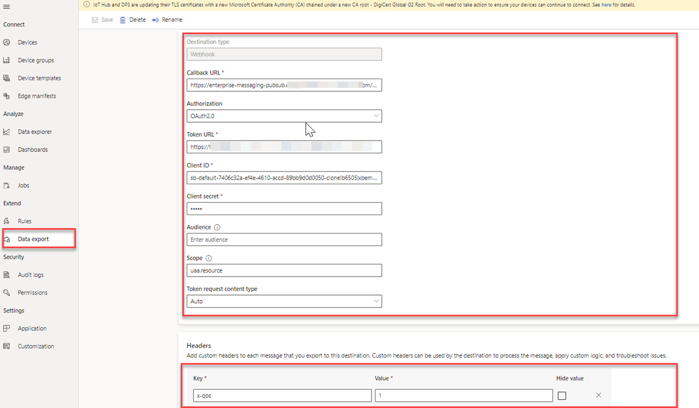

18. Choose **Save**.

19. Navigate back to **Data Exports**, and choose **Exports** tab and choose the Export configuration that you had created (**Waste Container Export**).

    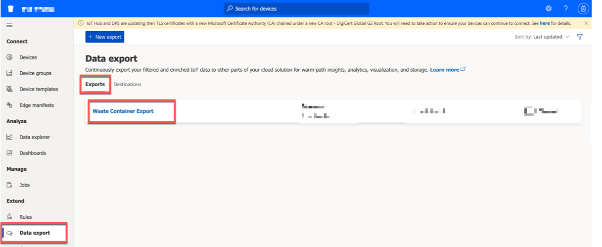

20. In the **Destination** dropdown, choose the destination that you have created in Step 9 and then choose **Save**.

    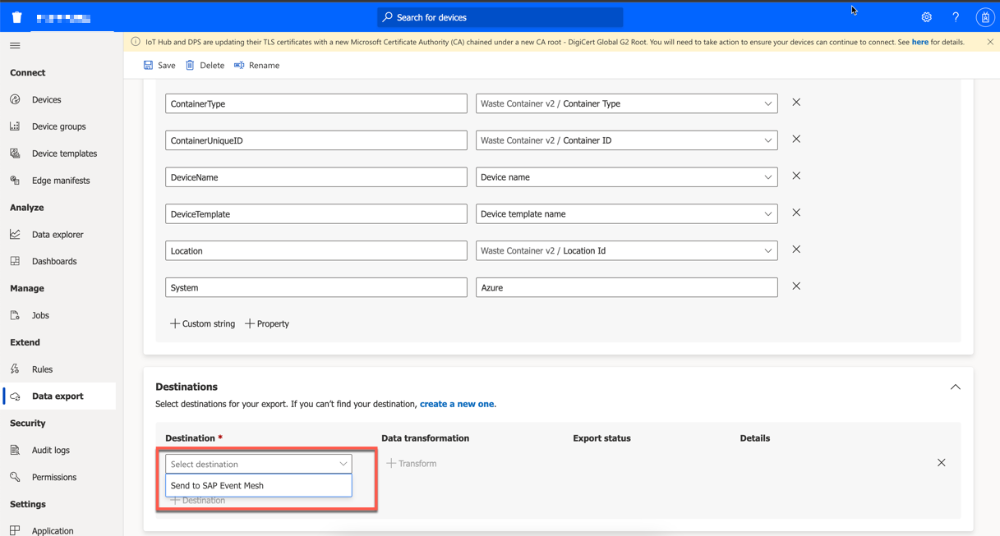

