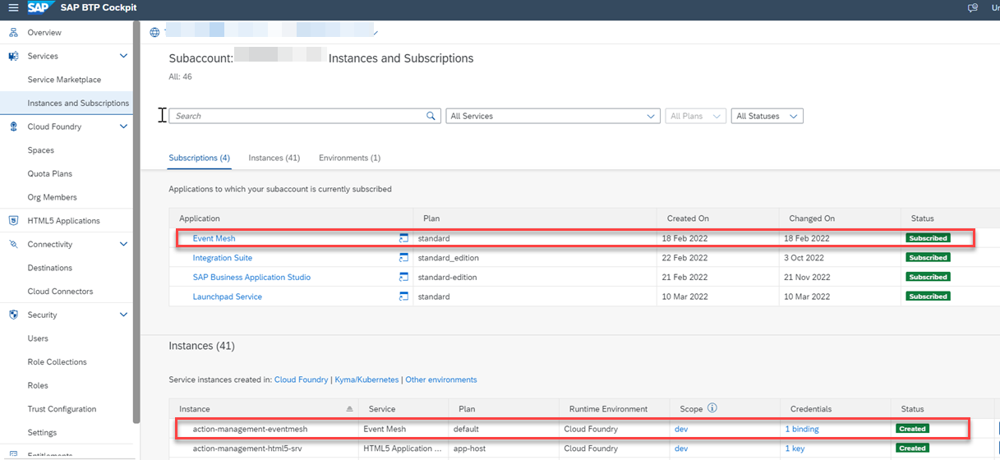
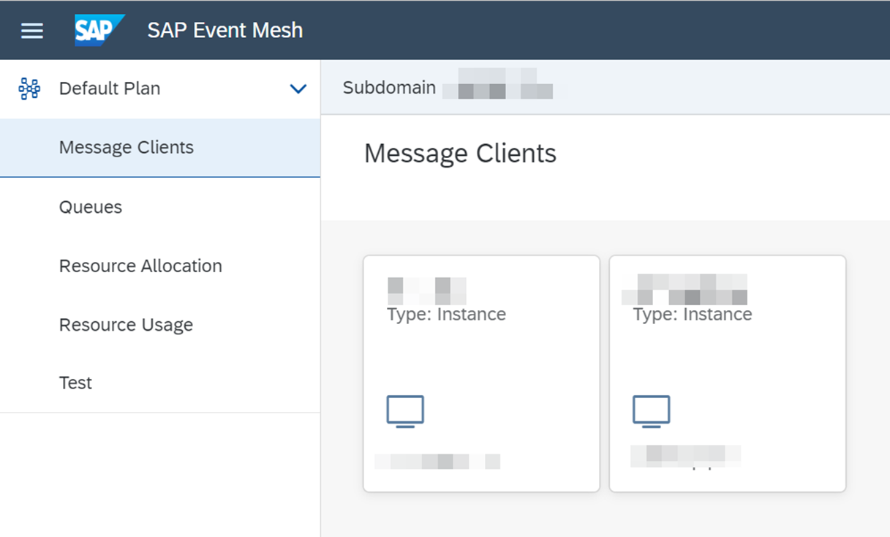
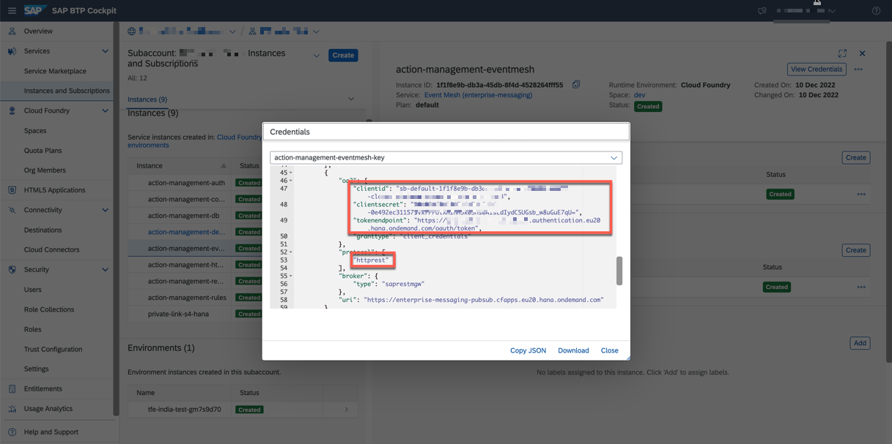
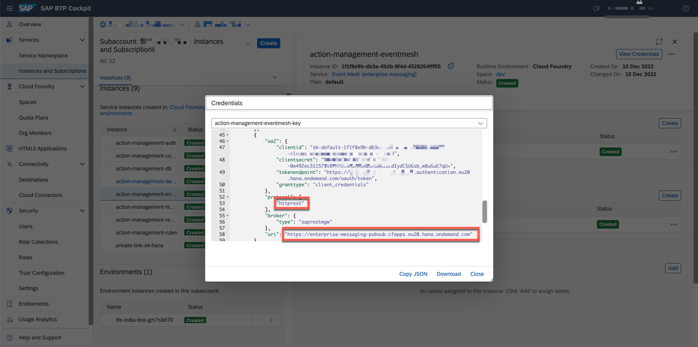

## Build and Deploy the Extension Application

In this section, you will clone the codebase and deploy the extension application in SAP BTP. 

### 1. Clone the GitHub Repository
    
Access the [Event To Action Framework](https://github.com/SAP-samples/btp-events-to-business-actions-framework) GitHub repository to download the project.

### 2. Check the Prerequisites for Deployment

Ensure you have added the required entitlements as described in section **Step1-Setup-SAPBTP-Subaccount** page before deployment.

### 3. Deploy the Extension Application

1. Build and deploy the application. Run the following commands:

    **Note**: Ensure you have Cloud MBT Build Tool. Refer [The Cloud MTA Build Tool (MBT)](https://help.sap.com/docs/HANA_CLOUD_DATABASE/c2b99f19e9264c4d9ae9221b22f6f589/1412120094534a23b1a894bc498c2767.html) for more details.

    1. Open the Cloud Foundry command line interface (cf CLI).

    2. Navigate to **action-management** directory.

            ```
            cd action-management
            ```
    3. Fetch the dependencies.

            ```
            npm install
            ```
    4. Build action-management modules.

            ```
            npm run build
            ```
    5. Log in to your subaccount in SAP BTP to deploy the extension application.
      Check your region and copy the API endpoint accordingly. For example, "https://api.cf.region.hana.ondemand.com"

            ```
            cf login -a `<CF API endpoint>`
            ```
    6. Push the application to your subaccount.

            ```
            npm run deploy
            ```
    7. You can also check the status of your applications in the SAP BTP cockpit. Copy the value of the extension application URL.

        

    8. In the SAP BTP cockpit, navigate to your subaccount and choose **Services** > **Instances and Subscriptions**. Check if you have all of the instances created post deployment as shown below. Make sure the status of all of the instances are **Created**.

        

    9. Verify SAP Event Mesh Subscription and Instance creation.
    
        - In SAP BTP Enterprise account, you should be able to see the below details in Subcriptions and Instances.

            

        - In SAP BTP trial account, you will see the below details in Subscription and Instances.

            

    10. Open the SAP Event Mesh application.

        - If you are using SAP BTP Enterprise account, go to the Subscriptions tab and choose Event Mesh to open the application.

        - If you are using SAP BTP Trial account, go to Instances tab, select the instance for SAP Event Mesh and choose View Dashboard.

    10. Choose **Message Clients** and then choose **Queues**. You will see the below message client and queue created in your SAP Event Mesh service instance.

        

        


    11. In subaccount, choose **Security** > **Role Collections**.
      
    


### 4. Update destination configuration in Microsoft Azure.

1. In the SAP BTP cockpit, navigate to your subaccount and choose **Cloud Foundry** > **Spaces** and then choose your space.

    

2. Select the extension application which is deployed in SAP BTP. Ensure it is in **Started** in **Requested State**.

    

3. Choose **Environment Variables**. Search for your appname and copy the values of **clientid**, **clientsecret** and **tokenendpoint**.

    

    Scroll down and copy the value of **uri**.

    


6. Write instructions.Copy the value of <AJIT>**dfds**.

    

7. Go to [Step 4 - Create Destinations in Configure Microsoft Azure IoT Central Application Destination](../Step2-Configure-Azure/README.md)

