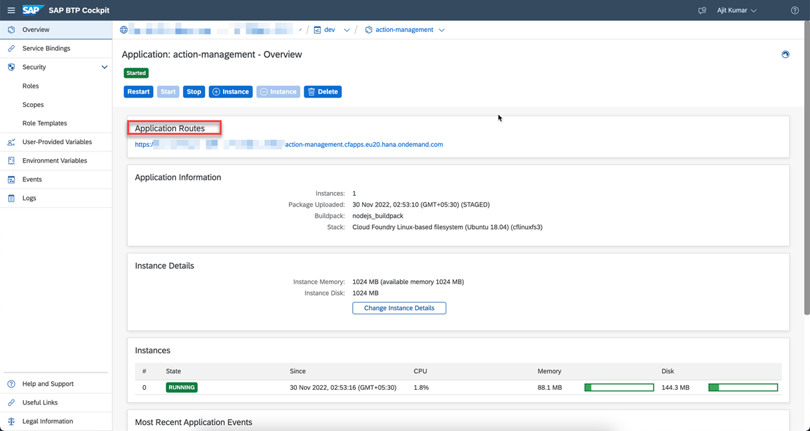
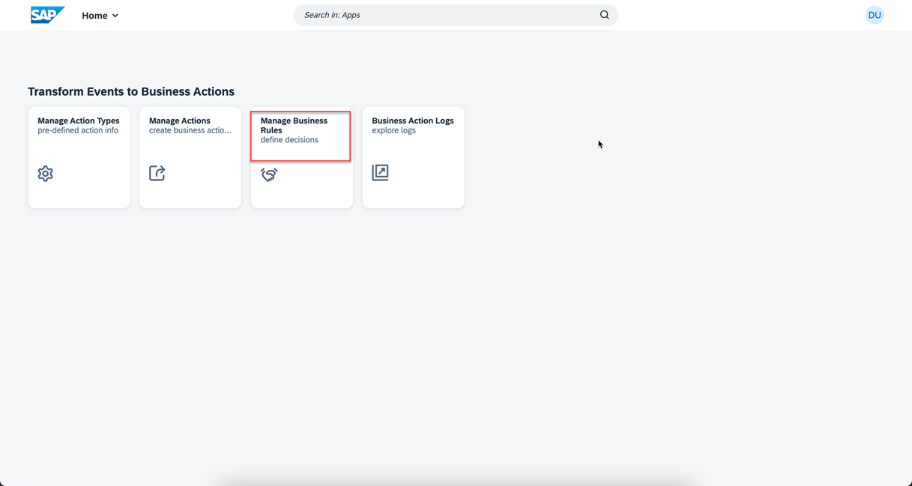
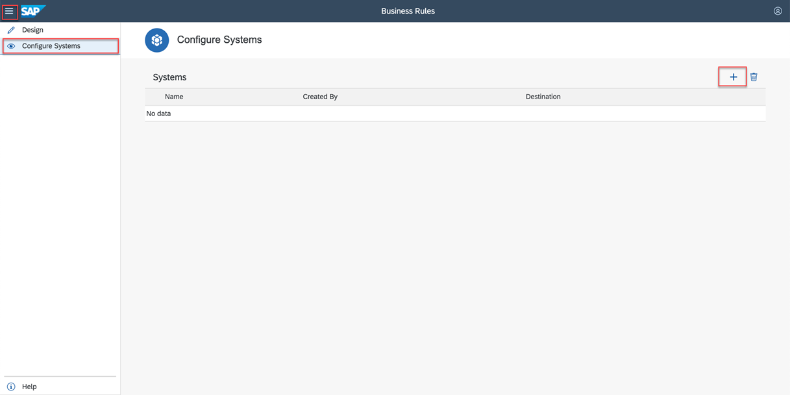
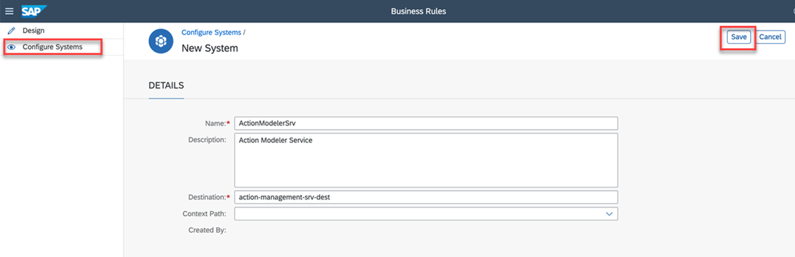
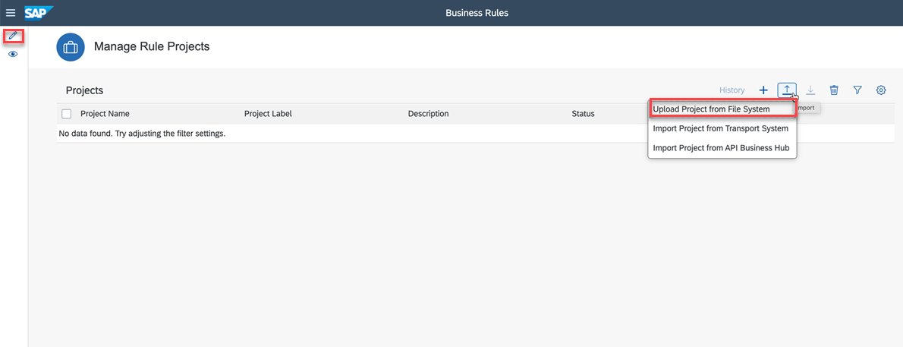
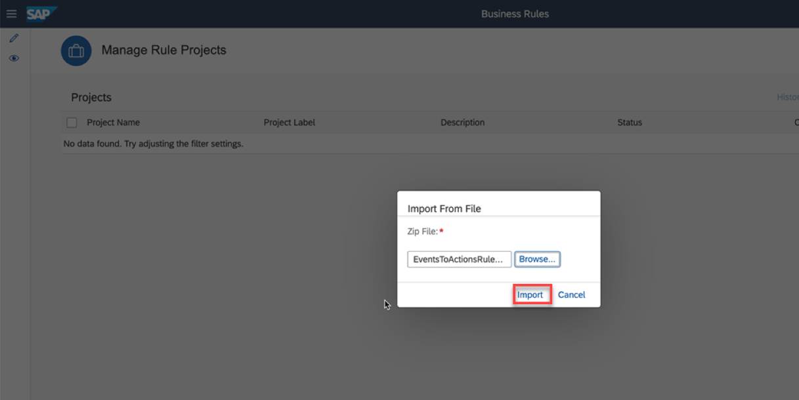
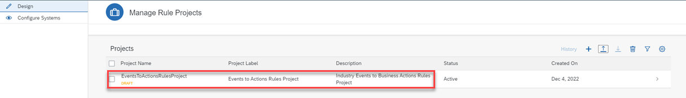
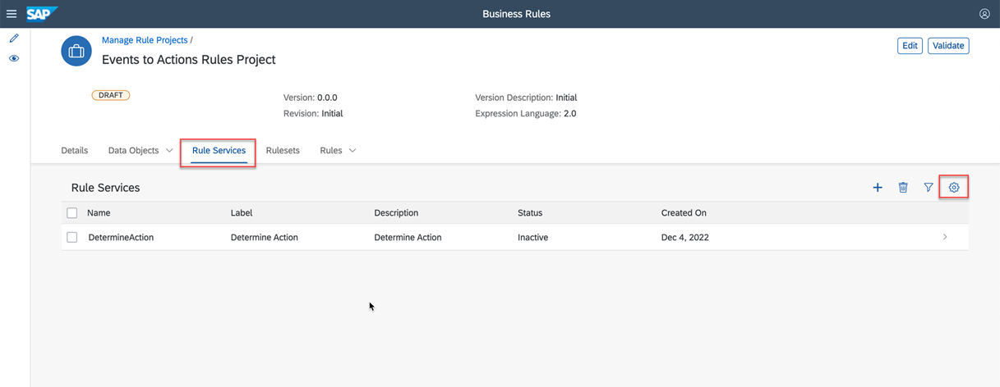
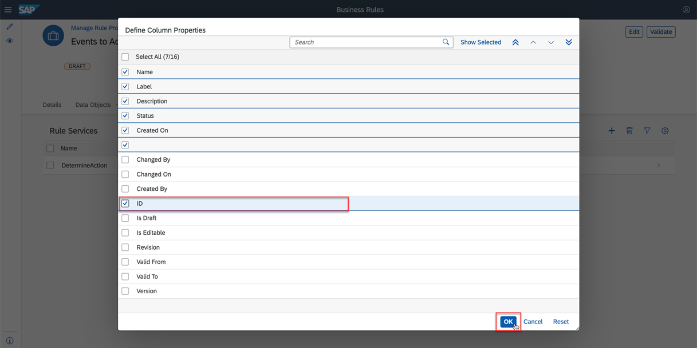
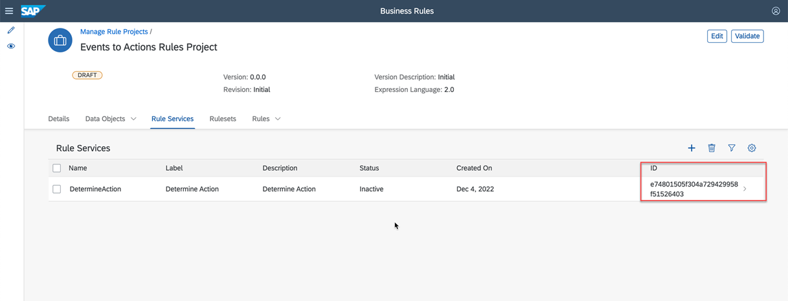

## Create SAP Business Rules Project
In this section, you will configure SAP Business Rule project which will be used to determine which business action should be executed for an event. Additionally, based on your scenario you can create decision tables and business rules.

### 1. Configure Systems

1. In the SAP BTP cockpit, navigate to your subaccount and choose **Cloud Foundry** > **Spaces**.  Choose your space and then choose **action-management** application. Choose the url provided under **Application Routes** section.

    

2. Choose **Manage Business Rules** tile.

    

3. Choose **Configure Systems** and then choose **Add** to add a new system.

    

4. In the **DETAILS** tab, 

    - Choose a name and description of your choice for **Name** and **Description** field. 
    - In the **Destination** field, enter **action-management-srv-dest**.
    
    

### 2. Create Business Rules Project

1. Download the [**EventsToActionsRulesProject.zip**](./EventsToActionsRulesProject.zip) file which contains the SAP Business Rules project.

2. Choose **Design** to create new or import new rule projects.

3. Choose **Import** icon and then choose **Upload Project from File System**.

    

4. Browse for **EventsToActionsRulesProject.zip** file and choose **Import**.

    

5. You will see the imported project as shown in the screeshot, choose the  **EventsToActionRulesProject** to view the details of the project.

       

6. In the **Rule Services** tab, choose the **Settings** icon and then select **ID** from the **Define Column Properties** list.

    

    

7. Copy the value of **ID** column from **DetermineAction** rule service.

    

