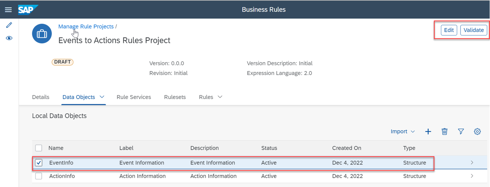

## Update and Activate SAP Business Rule Project
In this section, you will update decision table and activate business rule project.

### 1. Activate all objects in SAP Business Rule Project

1. In the SAP BTP cockpit, navigate to your subaccount and choose **Cloud Foundry** > **Spaces**.  Choose your space and then choose **action-management** application. Choose the url provided under **Application Routes** section.

    

2. Choose **Manage Business Rules** tile.

    

3. Select **Events to Actions Rules Project** project and choose **Edit** and **Activate**.

    

4. Choose **Data Objects** tab. Select **EventInfo** and then choose **Edit** and **Validate**.

    

    Choose **Activate**.

    

5. Repeat above step for **ActionInfo** data object.

6. Choose **Rule Services** tab and select **DetermineAction** and then choose **Edit** and **Activate**..

    

7. Choose **Rules** tab and select **DecideAction** and then choose **Edit**.

    

8. In the **Decision Table** section, go to **Action Id** column and select **Fixed Value** node.

    

9. Select **Create Purchase Requisition** entry in the value help pop up.

    

10. Choose **Activate**.

    

11. Choose **Rulesets** tab and select **DetermineActionRuleSet** and then choose **Edit** and **Activate**.

    

12. Choose **Rule Services** tab and choose **Deploy**.

    

13. Choose **Cloud Runtime** from the **Select a system to Deploy** list.

    

You will see a message **Your rule service is deployed successfully.**
