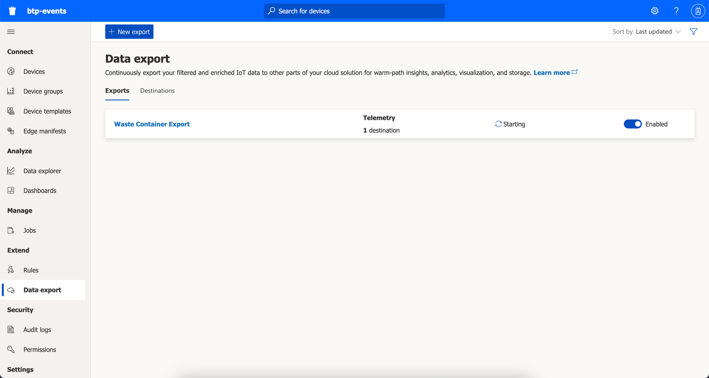
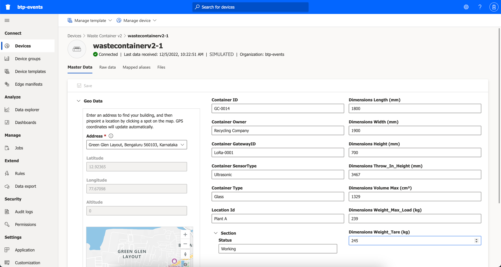
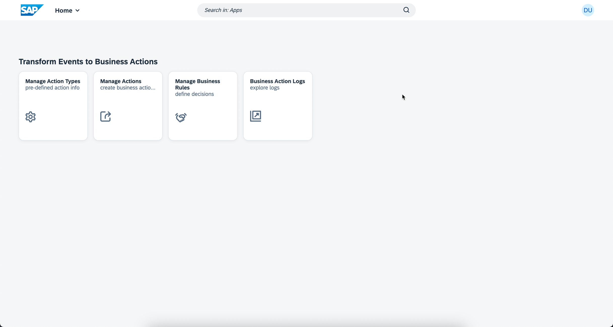
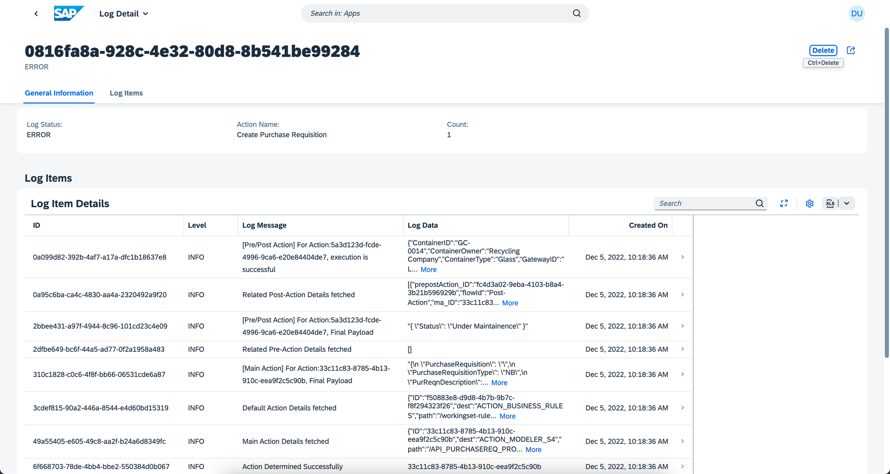

## Test the Extension Application and Execute the End-to-End Scenario

Now that you have successfully deployed the extension application in SAP BTP and completed the configurations in Microsoft Azure, SAP BTP and SAP S/4HANA, follow these steps to test the application.

1. Log in to Microsoft Azure Portal and navigate to **Resource Group** and choose your Azure IOT Central Application. Choose **Data Export**. Select to enable data export and wait till status becomes healthy.

    

2. Choose **Devices** and find your device and check the status. It should be in **Connected** state.

    

3. Log into SAP S/4HANA System and Search for **Manage Purchase Requisition** app.

    

4. Choose **Go** and then choose the latest purchase requsition.

    

5. In the **Purchase Requisition Items** table, verify if **Item** column is updated with Fill Level information.

    

6. Go to Microsoft Azure IOT Central Application and choose **Devices** to verify if the status is **Under Maintenance**.

    

7. Open **action-management** application in your cloud foundry space using BTP Cockpit. Click on the url provided under Application Routes section.

    

8. Click on **Business Action Logs** tile.

    

9. View Logs information and you can filter by date and status. 

    

10. Choose any entry from analytical table in Log Details Section. Click on **Re-Process** button to re-process the failed events.

    

You have completed the end-to-end integration of events to business actions from Microsoft Azure to SAP S/4HANA with SAP BTP.

