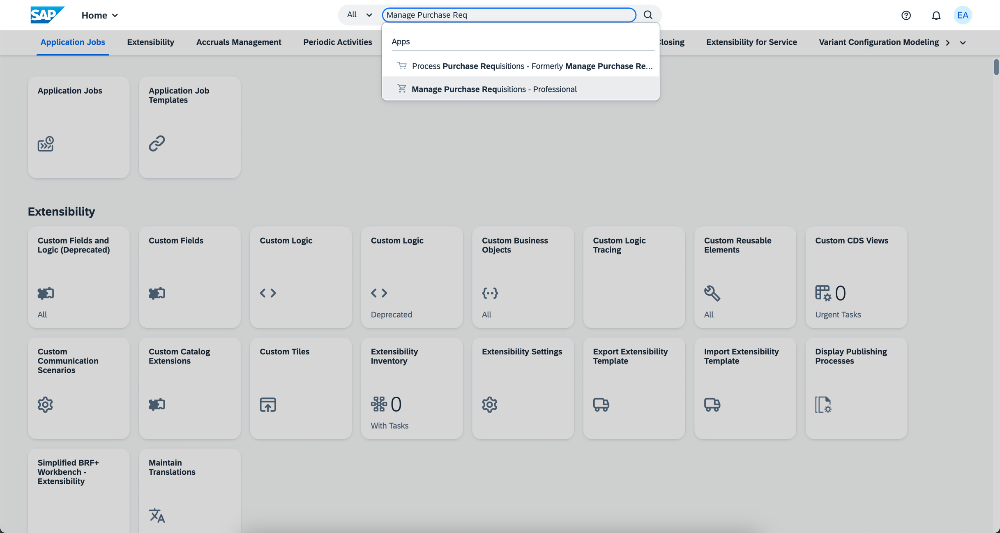
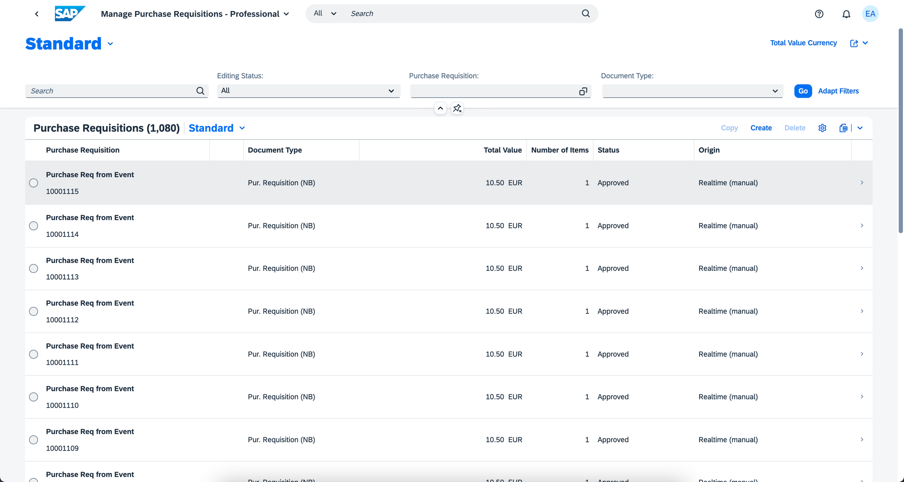
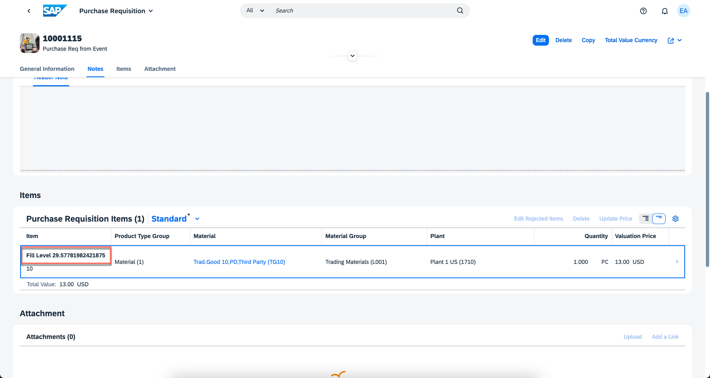
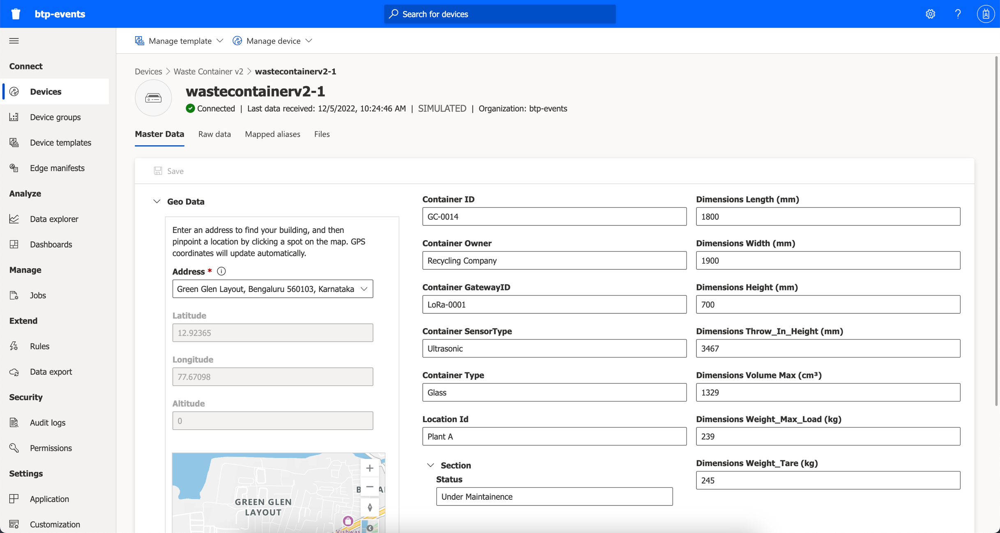
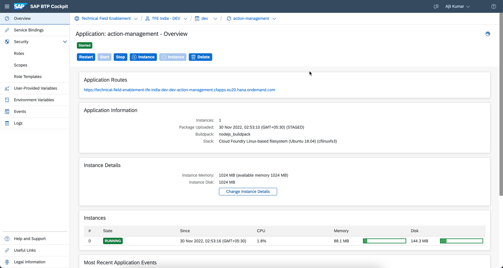
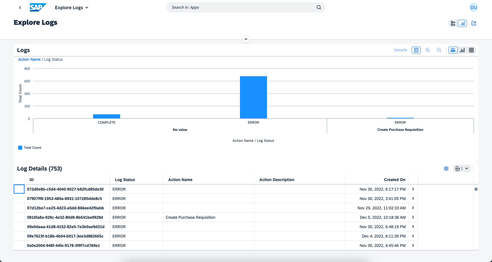
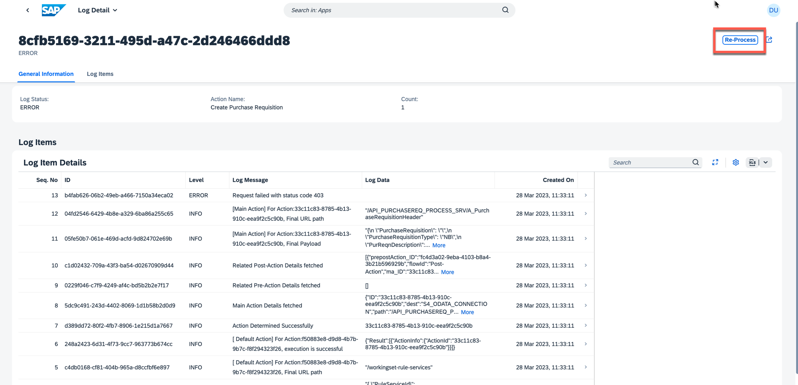

## Test the Extension Application and Execute the End to End Scenario

Now that you have configured all required set up, follow these steps to test the application.
1. Log in to Azure IOT Cetntral and Choose **Data Export**. Then enable data export and wait till status becomes healthy.
    

2. Choose **Devices** and Find your device and Check the status.
    

3. Log into S4 HANA Cloud System and Search for **Manage Purchase Requisition** app.
    

4. Choose **Go** and Then Choose the latest purchase requsition.
    

5. Verify if item is updated with Fill Level information
    

6. Go to Azure IOT Central Application and Choose Devices, then open your device to verify if the status is _Under Maintenance_
    

7. Open **action-management** application in your cloud foundry space using BTP Cockpit. Click on the url provided under Application Routes section.
    

8. Click on **Business Action Logs** tile.
    

9. View Logs information and you can filter by date and status. 
    

10. Choose any entry from analytical table in Log Details Section.
    

You have completed the end-to-end set up.

### Troubleshooting

