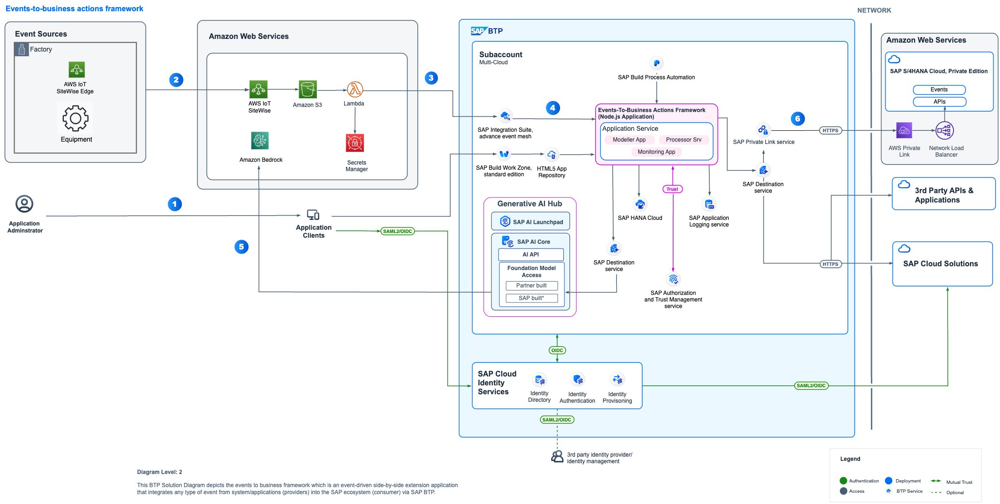

# Integrate Events from AWS IoT SiteWise with SAP S/4HANA using SAP BTP and Gen AI Hub

This repository contains code samples and instructions for developing an extension application in SAP BTP. The sample application has been developed in a partner collaboration to help customers integrate any type of events from systems into SAP ecosystem via SAP BTP. This application helps to configure actions that needs to be taken in SAP LoB systems based on the events that is received in SAP Integration Suite, Advanced Event Mesh. This application leverages Amazon Bedrock LLM Model via Gen AI hub to generate summary of the event which is then used for creating Business Actions in SAP system. The application scenario you will develop in this tutorial leverages Event-To-Business actions framework (extension application).

This framework can be used in combination with any hyperscalar/telco IoT.

In this tutorial, the **events** are received from **AWS IoT SiteWise** and the **actions** for these events are taken in **SAP S/4HANA System**. You can use this application to further customize it for other systems as well.

 ## Table of Contents

[Scenario](#scenario)\
[Solution Architecture](#solution-architecture)\
[Requirements](#requirements)\
[Implementation: Configuration and Development](#configuration-and-development)\
[Additional Resources](#additional-resources)\
[Known Issues](#known-issues)\
[Reference](#reference)\
[Disclaimer](#disclaimer)\
[How to Obtain Support](#how-to-obtain-support)\
[Code of Conduct](#codeofconduct)\
[Contributing](#contributing)\
[License](#license)

## Scenario

**AWS IoT SiteWise** is a managed service with which you can collect, store, organize and monitor data from industrial equipment at scale to help you make better, data-driven decisions. You can use AWS IoT SiteWise to monitor operations across facilities, quickly compute common industrial performance metrics, and create applications that analyze industrial equipment data to prevent costly equipment issues and reduce gaps in production.

However, the events only provides valuable results if any business action is taken on them. To reduce the burden of change management and ensure action is taken on the AWS IoT SiteWise events, this sample project has demonstrated how to automatically record the AWS IoT SiteWise inferences in SAP Plant maintenance/asset management.

## Solution Architecture

The key services used from **Amazon Web Services** are AWS IoT SiteWise, Amazon S3, Amazon Lambda Function, AWS Secrets Manager. The services used from **SAP BTP** are the Cloud Foundry Runtime, SAP Integration Suite Advanced Event Mesh, SAP Connectivity service, SAP Private Link service, SAP Build Process Automation- Decisions, SAP HANA Cloud , SAP Business Application Studio and SAP Destination service, SAP AI Core, SAP AI Launchpad.

SAP Private Link service is used for connectivity between SAP BTP and SAP S/4HANA when both the systems are running on Amazon AWS Infrastructure, in this tutorial you will find implementation steps for SAP BTP Private Link service and AWS Private Link service. Alternatively you can use SAP Connectivity service and Cloud Connector for integration of SAP BTP and SAP S/4HANA as well.

 **Figure-1: High-level architecture (with SAP S/4HANA on AWS)**

The following steps depicts the information flow across systems:

(1) Event is triggered from AWS IoT SiteWise.

(2) and (3) The sensor data from AWS IoT SiteWise is dumped into the Amazon S3 bucket.

(4a) AWS Lambda is a serverless function, which will orchestrate the process of detecting a stream contains any alerts related to failure or warnings, and then the inference result is passed to SAP Integration Suite, Advanced Event Mesh.

(4b) AWS secrets manager is used to store credentials, these are used by the lambda function to provide payload to SAP Integration Suite, Advanced Event Mesh.

(5), (6) Event-to-Business-Action framework(extension app) processor module's endpoint is subscribed to SAP Integration Suite, Advanced Event Mesh, hence receives this event.

(7) Event-to-Business-Action framework(extension app) processor module leverages the Business Rules capability of SAP Build Process Automation to derive business action (for example, In this scenario, Plant Maintenance Notification creation in SAP S/4HANA system) based on certain characteristics of incoming event.

(8a), (8b) Event-to-Business-Action framework(extension app) calls Amazon Bedrock LLM model using Gen AI hub to generate summary of the event.

(9), (10), (11) Event-to-Business-Action framework (extension app) processor module triggers the defined action in the SAP S/4HANA system by using the SAP Destination Service and SAP Private Link Service.

For more information, see Set Up Connectivity Between SAP BTP and SAP S/4HANA Using SAP Private Link Service page.

## Requirements

These are the technical prerequistics for an integration between AWS IoT Core, SAP BTP and SAP S/4HANA. 

**Services in SAP BTP**

- **Cloud Foundry Runtime** - Foundation for running the CAP extension application for translating events to business actions.
- **Memory/Runtime quota** - Required for deploying and running the extension application in SAP BTP
- **Authorization & Trust Management Service** - Required for securing the extension application in SAP BTP
- **SAP Integration Suite,Advanced Event Mesh** - Required to receive events from AWS IoT SiteWise
- **SAP HANA Cloud** - Required to store action configuration and logs for CAP application
- **SAP HANA Schemas & HDI Containers** - Application database for CAP Application
-**SAP Build Process Automation, Decision capability** - Decision service to configure business decisions that needs to be taken based on the type of event received from AWS IoT SiteWise.
- **SAP S/4HANA System** - To execute the business action associated with the event received. 
- **SAP Connectivity Service** - To establish connections between cloud applications and on-premise systems.
- **SAP Destination Service** - To find the destination information required to access a remote service or system from your extension application.
- **SAP Private Link Service** - To establishe a private connection between selected SAP BTP services and selected services in your own IaaS provider accounts.
- **SAP Business Application Studio** - A powerful and modern development environment, tailored for efficient development of business applications for the Intelligent Enterprise.
- **SAP AI Core** - SAP AI Core supports full lifecycle management of AI scenarios and also provides access to generative AI capabilities of LLM Models like Amazon Bedrock via the generative AI hub.
- **SAP AI Launchpad** - SAP AI Launchpad is a multitenant software as a service (SaaS) application in SAP Business Technology Platform that provides generative AI capabilities via the Generative AI Hub. Customers and partners can use SAP AI Launchpad to manage AI use cases (scenarios) across multiple instances of AI runtimes (such as SAP AI Core).

**Amazon Web Services**

- A valid AWS subscription
- **AWS IoT SiteWise** - Required for receiving and sending the events whenever an abnormality is detected in the equipment.
- **Amazon S3** - Required to store the received streaming event data.
- **AWS Secrets Manager** - Required to store the SAP Integration, Advanced Event Mesh credentials that are accessed by the Amazon Lambda Function.
- **Amazon Lambda Function** - Required to orchestrate the process of detecting a stream contains any alerts related to failure or warnings, and then the inference result is passed to SAP Integration Suite Advanced Event Mesh.

## Configuration and Development

This scenario talks about the steps needed for translating events from AWS IoT to business actions in SAP business systems.

These are the steps to configure SAP S/4HANA, SAP BTP and Amazon AWS.

[Step 1: Set Up the Subaccount in SAP BTP](./documentation/Step1-Setup-SAPBTP-Subaccount/README.md)

[Step 2: Check SAP S/4HANA Readiness](./documentation/Step2-SAPS4HANA-Readiness/README.md)

Step 3: Connect SAP BTP and SAP S/4HANA

   - [(Option 1) Using SAP BTP Connectivity Service](./documentation/Step3a-SetupCloudConnector/README.md)

   - [(Option 2) Using SAP Private Link Service](./documentation/Step3b-Setup-SAPPrivateLinkService/README.md)

[Step 4a: Build and Deploy the Extension Application](./documentation/Step4a-Build-Deploy-ExtensionApplication/README.md)

[Step 4b: SAP Integration Suite, Advanced Event Mesh Configuration](./documentation/Step4b-Advanced-Event-Mesh-Configuration/README.md)

[Step 5: Setup AWS Account](./documentation/Step5-Setup-AWS/README.md)

[Step 6: Create SAP Build Process Automation - Decision Project](./documentation/Step6-Configure-Decisions-Part1/README.md)

[Step 7: Configure SAP S/4HANA Business Actions in the extension application](./documentation/Step7-Configure-BusinessActions/README.md)

[Step 8: Update and Deploy SAP Build Process Automation - Decision Project](./documentation/Step8-Configure-Decisions-Part2/README.md)

[Step 9: Test the Extension Application](./documentation/Step9-Test-ExtensionApplication/README.md)

## Additional Resources

This project has been implemented based on the following SAP CAP sample repository.

- [Cloud-cap-samples](https://github.com/SAP-samples/cloud-cap-samples/)

Related projects :

- [Events-to-Business-Actions-Framework](https://github.com/SAP-samples/btp-events-to-business-actions-framework/tree/main)

## Known Issues

No known issues.

## Reference

[AWS IoT SiteWise](https://docs.aws.amazon.com/iot-sitewise/latest/userguide/what-is-sitewise.html)

## Disclaimer

This project has been a proof of concept, including several limitations and prerequisites. The objective was to build a extension application for receiving and automating the actions in SAP S/4HANA. For this reason, the coding should not be seen as any recommendation for productive implementation. It fulfils the purpose and requirements of a proof of concept and is not intended for productive usage. It has been declared as pure proof of concept only to give the development teams ideas for solving potential challenges when integrating events from other platforms like AWS IoT SiteWise and SAP S/4HANA using SAP BTP. This can be extended to integrate with any other SAP LoB system as well.

## How to Obtain Support

[Create an issue](https://github.com/SAP-samples/<repository-name>/issues) in this repository if you find a bug or have questions about the content.
For additional support, [ask a question in the SAP Community](https://answers.sap.com/questions/ask.html).

## Contributing

If you wish to contribute code, offer fixes or improvements,  send a pull request. Due to legal reasons, contributors will be asked to accept a DCO when they create the first pull request to this project. This happens in an automated fashion during the submission process. SAP uses [the standard DCO text of the Linux Foundation](https://developercertificate.org/).

Refer to the [CONTRIBUTING](CONTRIBUTING.md) file for guidelines to contributions from external parties.

For additional support, [ask a question in the SAP Community](https://answers.sap.com/questions/ask.html).

## Code of Conduct

Refer to the [CODE OF CONDUCT](CODE_OF_CONDUCT.md) file.

## License

Copyright (c) 2022 SAP SE or an SAP affiliate company. All rights reserved. This project is licensed under the Apache Software License, version 2.0, except as noted otherwise in the [LICENSE](LICENSE) file.

