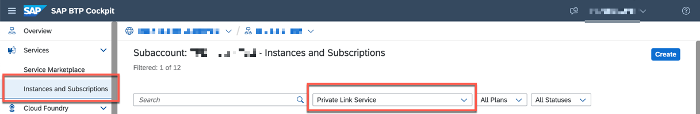
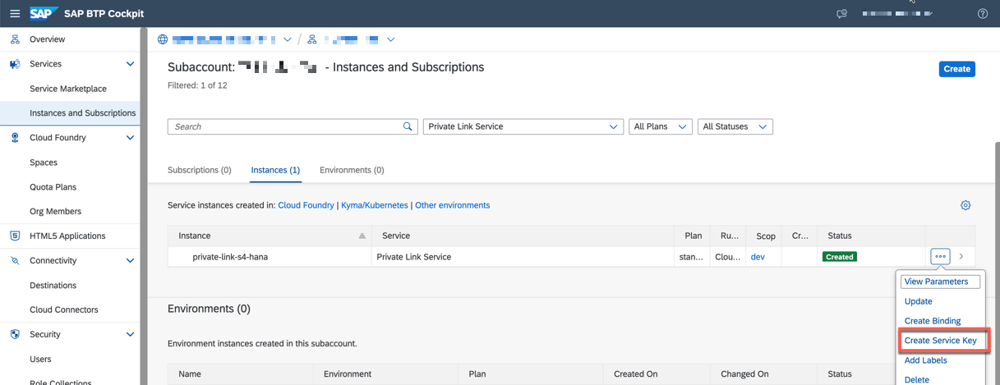
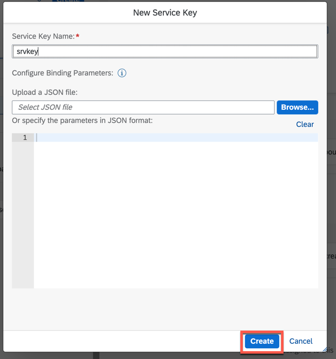
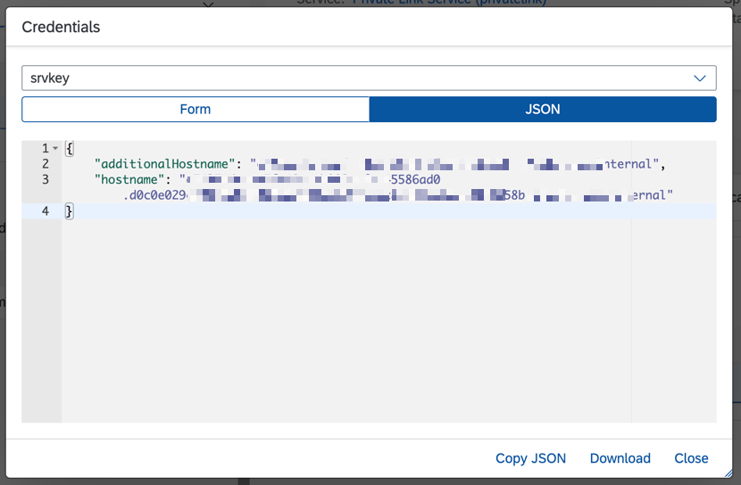

## Set Up Connectivity Between SAP BTP and SAP S/4HANA Using SAP Private Link Service

>Note: Choose this configuration if you have SAP BTP subaccount and SAP S/4HANA running on AWS. If you have already established the connectivity between SAP BTP and SAP S/4HANA using Cloud Connector then you can skip this step.

### Prerequisites
These are the prerequisities that you need to consider if you have SAP BTP and SAP S/4HANA on Amazon Web Services. 

- SAP S/4HANA system running on Amazon Web Services

- SAP Private Link service
    - Required to connect SAP BTP and Amazon Web Services.

>Note: The SAP BTP Private Link service is currently available only for enterprise accounts in SAP BTP.

- AWS Private Link service
    - Required to connect Amazon Web Services and SAP S/4HANA.

### 1. Set Up the SAP Private Link Service and Amazon Web Services Private Link Service 

To configure these services for the SAP S/4HANA system, follow the 
 [Enhance core ERP business processes with resilient applications on SAP BTP - SAP Private Link Service](https://github.com/SAP-samples/btp-build-resilient-apps/tree/extension-privatelink/tutorials/05-PrivateLink) tutorial and complete the steps until the **Prepare Extension Application** section.

### 2. Create Service Key for SAP Private Link Service Instance in Your Subaccount in SAP BTP

In this step, you will create a service key for the SAP Private Link Service Instance. This service key holds the private hostname that needs to be used to configure destination to connect to SAP S/4HANA system using Private Link.

1. Go to the SAP BTP cockpit, navigate to your subaccount and choose **Services** > **Instances and Subscriptions** and in the dropdown for **All Services**, select **Private Link Service**.

    

2. In the **Private Link** service instance line, choose the three dots and then choose **Create Service Key**..

    

3. Provide a name and choose **Create**.

    

4. Once the Service Key is created, choose the three dots and then choose **View** to open the service key.

    

5. Copy the values of the **hostname** and use this while creating the destination **ACTION_MODELER_S4** in [Step7-Configure-BusinessActions](../Step7-Configure-BusinessActions/README.md).

