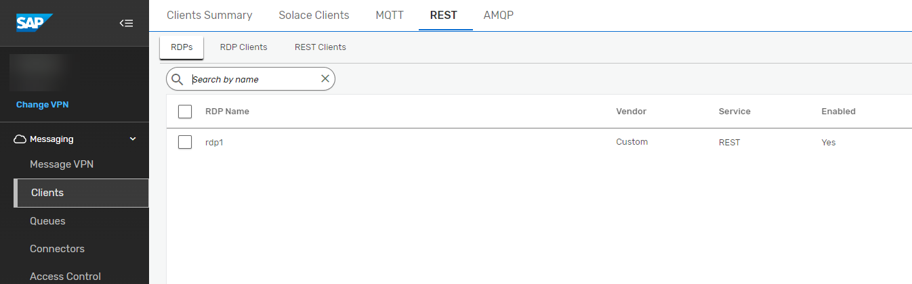

## SAP Integration Suite, Advanced Event Mesh Configuration

1. To access the SAP Integration Suite, Advanced Event Mesh, navigate to **Services** > and choose **Instances and Subscriptions**.
    Choose the row for the advanced event mesh subscription and choose **Go to Application**

    

2. Choose **Cluster Manager** in the SAP Integration Suite, Advanced Event Mesh Application. 

    

3. Click on **Create Service**.

    
    
    Fill the **Service Name** as **IoTSitewise** and select **Service Type** as **Standard**. Select **Amazon Web Services** from the drop down menu for **Cloud**, Choose **Frankfurt** as **Region** from the Map, leave the prepopulated version for **Broker Version** , for this tutorial.

    Click on **Create Service**

    

4. Click on the created service **IoTSitewise**
    
    

    Click on the **connect** tab and expand the **REST** tile to get the messaging connectivity information.

    

5. Configuring a **REST Delivery Point**
     Next, you must configure a queue and a REST delivery point on Message VPN.

     **a.** Click on **Open Broker Manager**.

     

     **b.** The **Broker Manager** application loads. The next step is to create a queue, on the left pane click on **Queues**
    
     

     **c.** Create a Queue by name **Q/rdp1/input**
    
     

     Enable both incoming and outgoing configuration and then click on **Apply** button.
    
         

     Queue successfully created
    
         

     **d.** Add a **Topic Subscription** to the queue.

     Click on the queue created and then click on the **Subscriptions** Tab.

     Then click on **+ Subscription** to add a topic.
    
     

     In the **Create Subscription** screen, type in the topic name as **IoTSitewise/messages** and click **Create**
    
         

     Topic Subscription successfully created.
    
     

     **e.** Create a **REST Delivery Point** object

     On the left pane click on **Clients** and then Navigate to **REST** tab.
    
     

     Click on ** + REST Delivery Point** and Fill the **RDP Name** as **rdp1**
    
     

     Configure the REST Delivery Point
    
       

     REST Delivery Point successfully created
    
       

     **f.**  Create a Queue Binding object

     Create a queue binding to the queue you created previously. This will tell the RDP where to fetch messages from. **Note:** that REST Delivery Points (RDPs) can be bound to multiple queues.

     Click on the **rdp1** created in the previous step. Click on **Queue Bindings** Tab.

     

     Create a queue binding - **Q/rdp1/input**

     

     Set the POST target where the requests would be sent - **/api/events**

     

     **Note:** that the RDP is down - it will automatically start up when a REST consumer makes a connection to the RDP.

     

     **g.** Create a **REST Consumer** object.

     Navigate to **REST Consumers** Tab and click on **+ REST Conusmer**

     

     Fill in the **REST Consumer Name** as **rc1** 

     

     Enable the **REST Consumer** and set HOST:PORT details of the message HTTP listener. 

     To Fill the **Host** , Navigate to the Cloud Foundary Space where the application is deployed and Click on **action-management-srv**.

     

     Copy the link under **Application Routes**,. **Note:** Strip the **https://** before pasting the value in the **Host** field

     

     Fill in the Value of **Port** as **443**

     Select **POST** as the **HTTP Method**.

     Enable the TLS.

     Keep **Outgoing Connection Count** value as **1**.

     Fill the **Max Response Wait Time (sec)** as **30**

     Populate **Connection Retry Delay (sec)** field with **300**

     From the drop down menu, choose **OAuth 2.0 Client Credentials** as the **Authentication Scheme**.

     Next, Go to your **BTP subaccount** ,Navigate to **Services** > **Instances and Subscriptions** and under the **Instances** select **action-management-auth**.

     

     Under the **Service Keys** the key named **action-management-auth-key** is already created. Click on the **View** Option to get the **OAuth 2.0 Client Credentials**.  

     

     Copy the **clientid**, **clientsecret** and **url**. Navigate back to the **REST Consumer** configuration and paste the values for **Client ID** and **Client Secret**. Paste the **url** copied earlier in the **Token Endpoint URL** and appened **/oauth/token** at the end of the **url**. 
     Effective **Token Endpoint URL** is **url/oauth/token**.

     Fill the remaining fields as shown in the screenshot below.

       

     REST Consumer successfully created

       

     A final, configured **RDP settings** would look like this.

     
