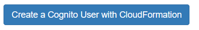
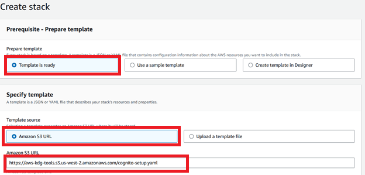
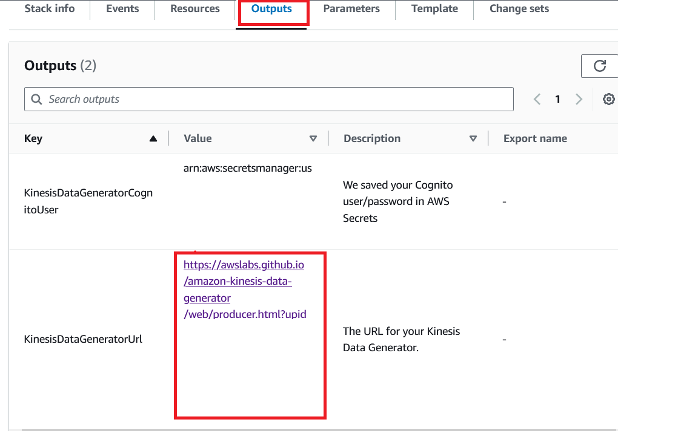
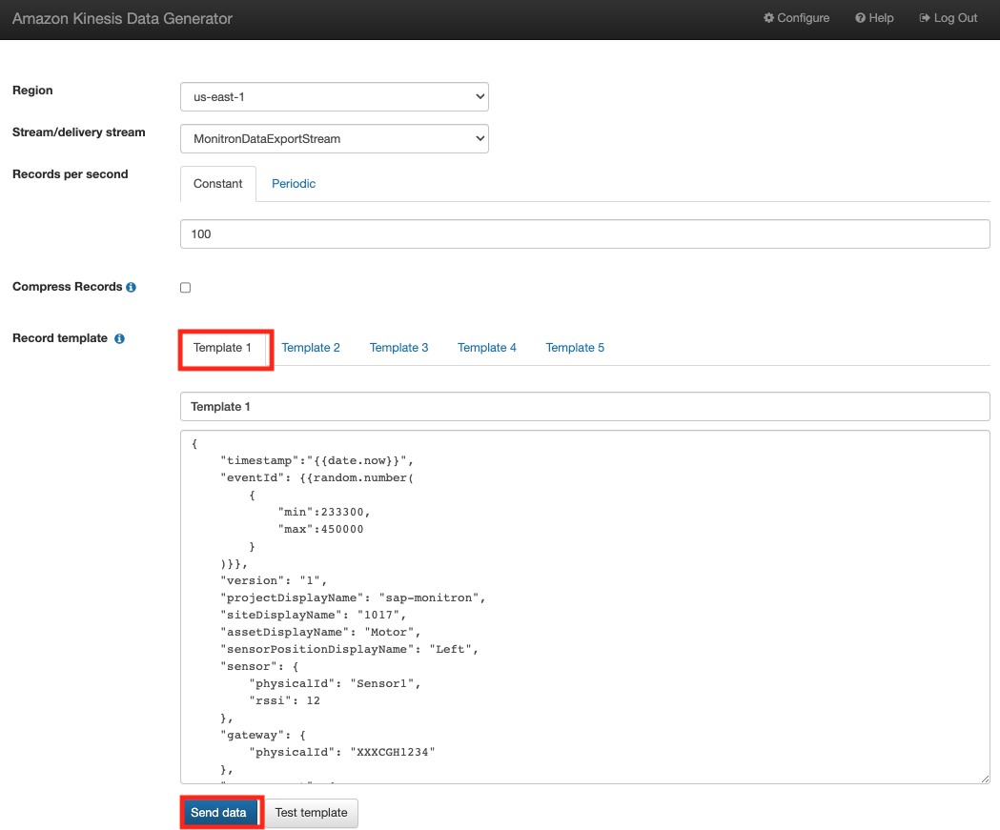

## (Optional)Kinesis Data Generator ( Monitron Simulator)
This step is optional if you intend not to use the payload file as a sample to integrate into SAP.
Before generating data, please complete the following steps
1) **Create a kinesis data generator**
Getting started with the Kinesis Data Generator requires only three steps:
**Step 1: Create an Amazon Cognito user in your AWS account (first-time only). 
**Step 2: Login to Kinesis Data Generator. 
**Step 3: Create a record template for your data.

**Step 1: Create an Amazon Cognito user in your AWS account**

* Click [link](https://awslabs.github.io/amazon-kinesis-data-generator/web/help.html#configAccount) which will provide details on Amazon Lambda function and Amazon CloudFormation template to create the user and assign permissions to use the Kinesis Data Generator.In the link provided above, Navigate to **create a Cognito user with CloudFormation**
  
  
  
* Use default selections as below
  
   

  Ensure the region in the top right corner is set to the same region as your Cloud9 environment. Click **Next**
* Provide Username and Password and click **Next**

   

* Leave the selections as default and Click **Next** 
* Check the box indicating acknowledgement on the IAM resources: **“I acknowledge that AWS CloudFormation might create IAM resources.”Click **Submit**.
* Once the CloudFormation stack is in **CREATE_COMPLETE**, you can validate the resources created in the **“Resources”** tab. Navigate to the **“Outputs”** tab and copy the URL specified in 
  **KinesisDataGeneratorUrl**. This is your URL to login to Kinesis Data Generator in **Step 2** after the CDK is deployed.

  

Follow below steps after you have deployed the CDK as above. 

**Step 2: log in to Kinesis Data Generator**.
Use the credentials created in **Step 1** along with the URL specified in outputs tab to login to Kinesis Data Generator. 
Note: If the access URL is not used from the CloudFormation stack, the KDG login will return errors asking for user pool and other information. 
Once you provide the credentials, as specified, you will reach the landing page:

 

**Step 3**:**Create a record template for your data**.
Generate data using the following steps:
** Launch [Kinesis Data Generator](https://awslabs.github.io/amazon-kinesis-data-generator/web/producer.html), Enter **Username** > **Password** and click **Sign In**

 

 **Select **‘Region’** , Select Kinesis Stream created for streaming Amazon Monitron data **‘MonitronDataExportStream’**, 
   Enter the [template file](https://github.com/pra1veenk/aws-monitron-sap-integration/blob/main/Code/AWS/kinesisdatatemplate.json) in section **‘Record template→ Template 1’**  to generate the streaming data and Click **Send Data**.

 

 **Click **Stop Sending Data to Kinesis** 

  

 ** **Data Validation** 
 
 Validate the data streaming to Amazon S3 using the steps below:
    ** Goto **AWS Console** Select **Amazon S3**Select **Amazon S3 bucket** and Click **Objects** to view the streaming data files

   

 Validate if the AWS Lambda Function is invoked using the following steps , 
     ** Goto **AWS Console** Select **AWS Lambda** - **Click on AWS Lambda Function created for anomaly detection** - ** Click **Monitor** tab to view the invocation.
  
  
