## Configuration required to deploy the CDK Project on AWS

This project is set up like a standard Python project.  For an integrated development environment (IDE), use `SAP Business Application Studio` to create python virtual environment for the project with required dependencies.  

1. To access the SAP Business Application Studio, go to your subaccount, navigate to **Services** > and choose **Instances and Subscriptions**.
   Choose the row for the SAP Business Application Studio subscription and choose **Go to Application**

   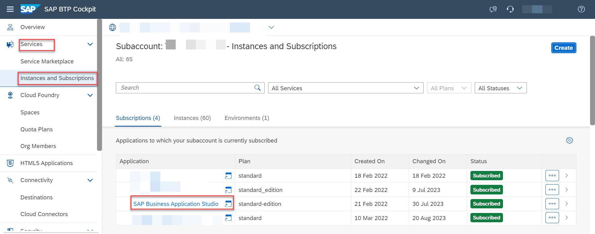

   Click on Create Dev Space

   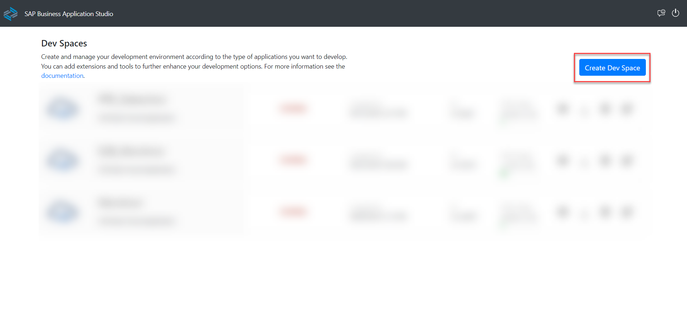

   Create a Full Stack Cloud Application

   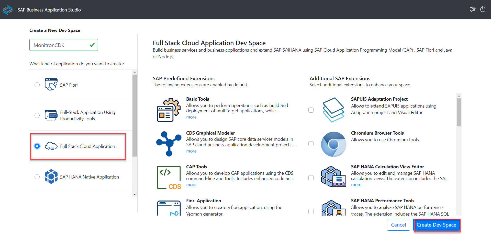


2.  Clone the github repository and navigate to the directory.

   ```
   git clone https://github.com/SAP-samples/btp-aws-monitron
   ```

   ```
   cd Code/AWS
   ```

The `appConfig.json` file takes the input paramters for the stack. Maintain the following parameters in the `appConfig.json`.
## AWS environment details

* `account` Enter AWS account id of your AWS cloud environment
  Goto [AWS Console](https://us-east-1.console.aws.amazon.com/cloud9control/home?region=us-east-1#/product) and on the top right click on dropdown button as shown, Copy the Account ID as highlighted.
  
   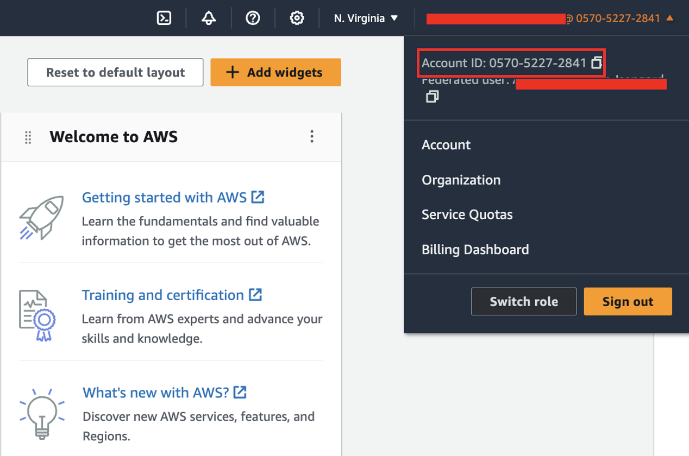
  
* `region`  Enter Region information where the stack resources needs to be created
  Goto [AWS Console](https://us-east-1.console.aws.amazon.com/cloud9control/home?region=us-east-1#/product) and on the top right click on dropdown as highlighted which shows the region, copy the region associated to your AWS Account(Example - us-east-1)
  
     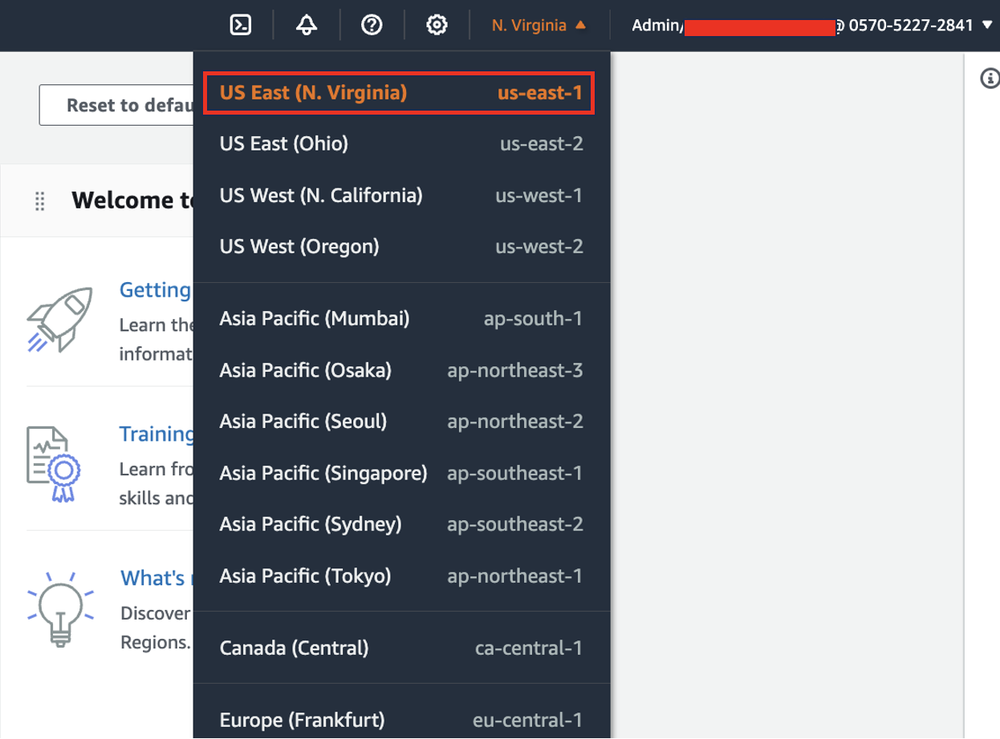
  
* `vpcId`   Enter the VPC for Lambda execution
  Goto [AWS Console](https://us-east-1.console.aws.amazon.com/cloud9control/home?region=us-east-1#/product) and type in "VPC" in the search tab->Click on VPC, you will see the list of all VPC's created in your AWS environment, select the VPC created as part of pre-requisite steps, Copy the vpcID as highlighted.
  
   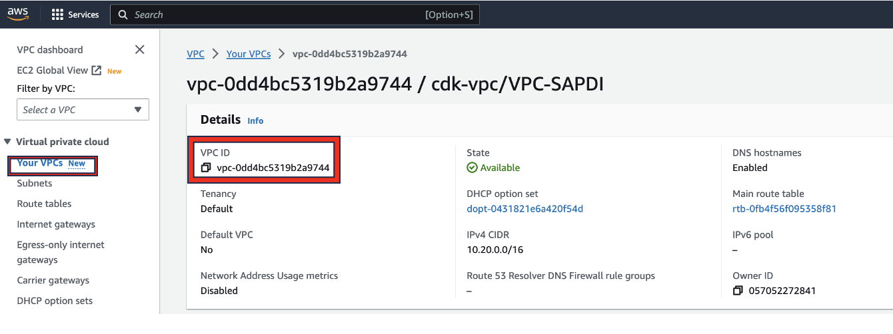
  
* `subnet`  Enter the subnet ID for Lambda exection
  Goto [AWS Console](https://us-east-1.console.aws.amazon.com/cloud9control/home?region=us-east-1#/product)and type in "Subnet" in the search tab->Click on Subnet, you will see the list of Subnet's created in your AWS environment, select the Private Subnet created as part of pre-requisite steps, Copy the SubnetID as highlighted below
*  Note: Please provide a private subnet for the lambda execution.
  
   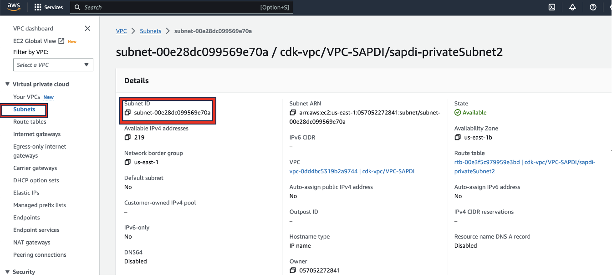

   
## Resource Identifiers

* `stackname` Enter an Identifier/Name of your choice for the CDK stack
  
## Bucket Structure

* `bucketname` Enter the name of the bucket where the inferences are sent.
   To Create a S3 Bucket, Follow steps as below:
   1. Goto [AWS Console](https://us-east-1.console.aws.amazon.com/cloud9control/home?region=us-east-1#/product)and type in "S3" in the search tab->Click on 'S3'

      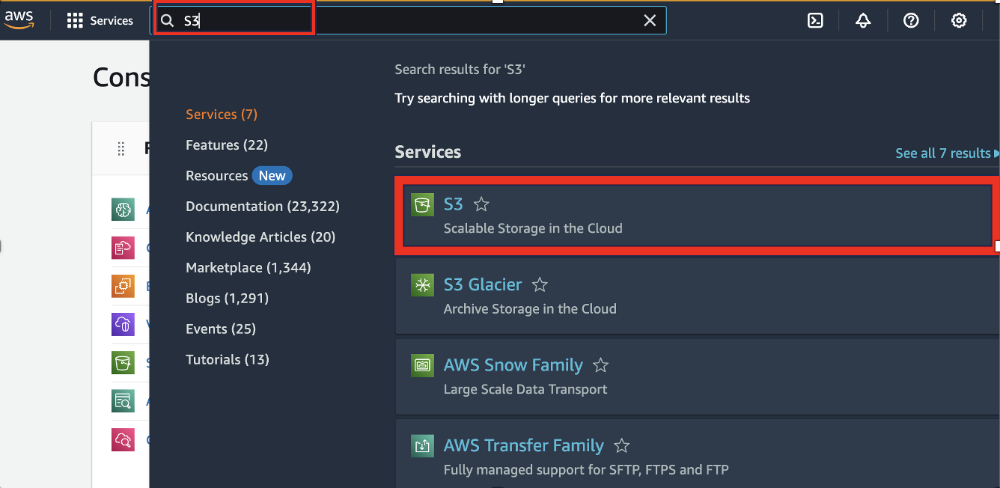
      
   2. Click the 'Create' Bucket button.You will be taken to the "Create bucket" page to begin setting up your bucket.

      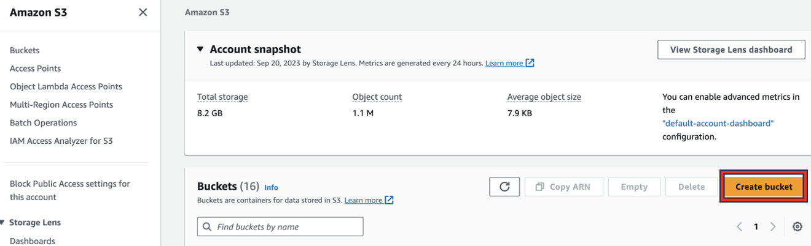
      
   3. Enter a name in the "Bucket name" field. The bucket name you choose must be unique across all existing bucket names in Amazon S3

      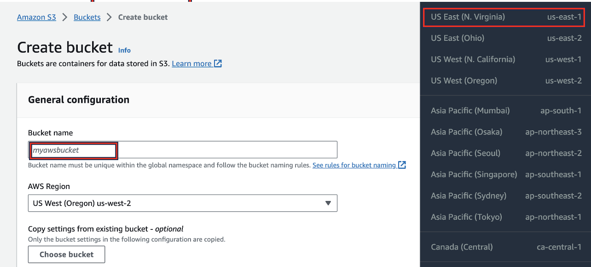
      
   4. In the AWS region select the region for your S3 bucket. **Please note that your bucket must be created in the same region as your VPC subnet**
      
   5. Leave remaining options as default, scroll down and click 'Create bucket' button.

      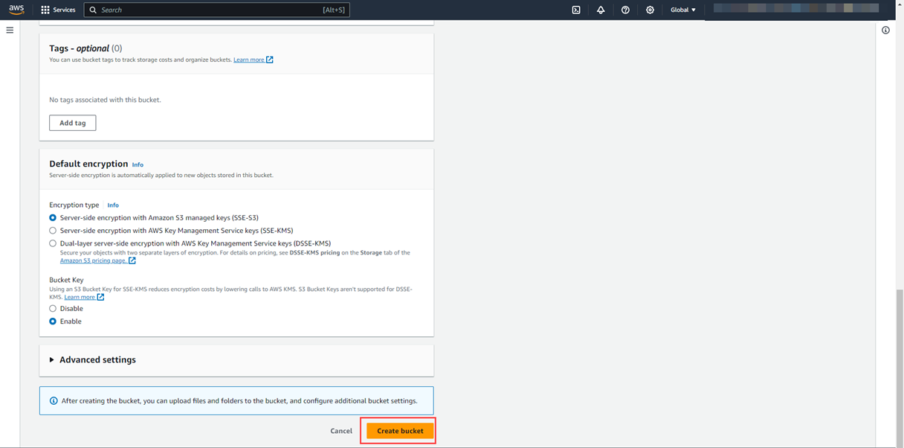
   
   6. Click on the bucket that you have just created in the above step and then click on **Create folder** button

      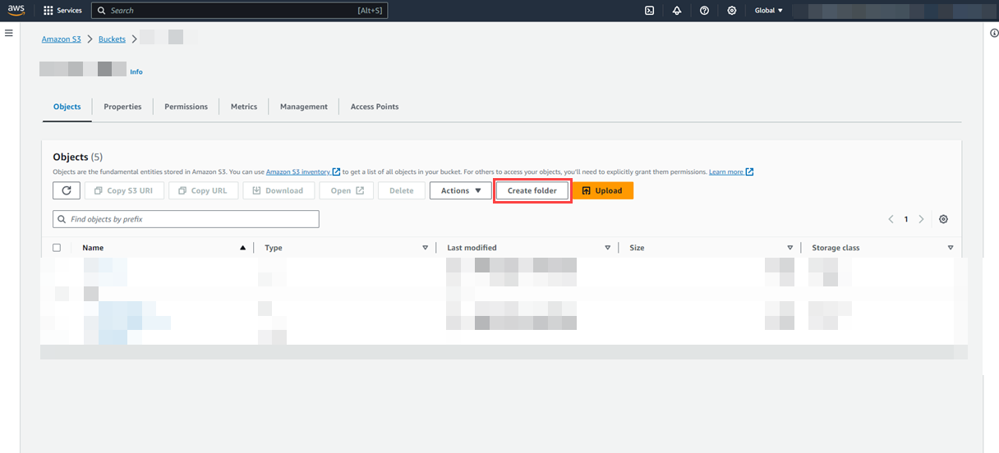
   
   7. Enter the Folder name as **sitewise** and then click on **Create folder** button to create the folder.

      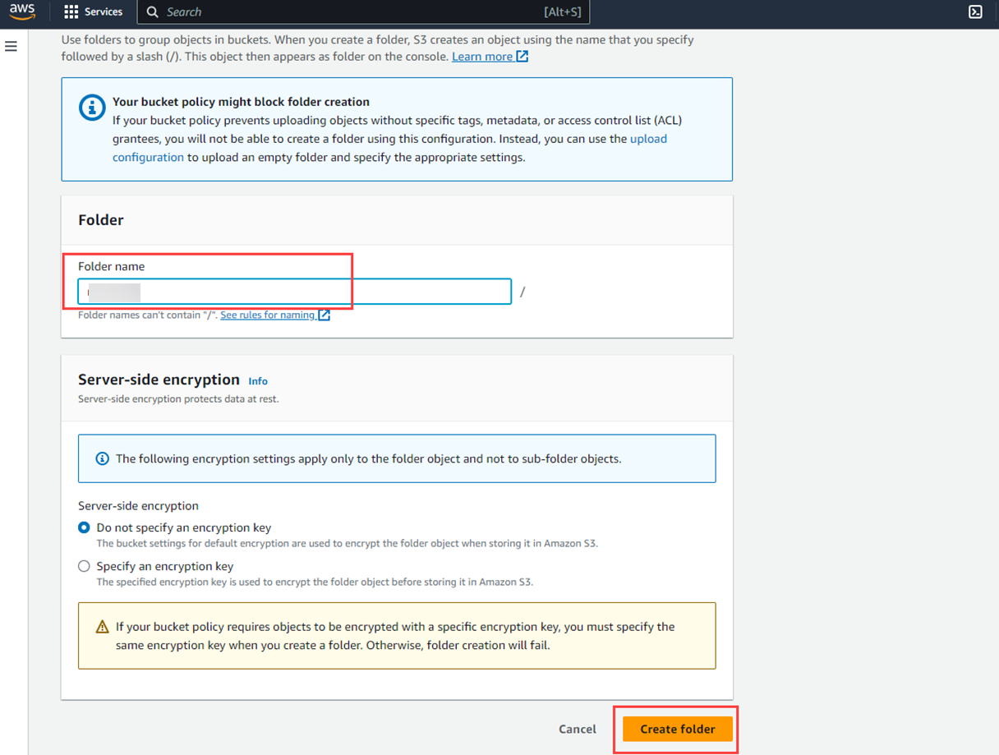

      
* `inferencefolder` Enter the name of the folder(prefix)where the inferences/data are sent (path to folder in your S3 bucket, for example, **your_s3_bucket/sitewise** is the path and **sitewise** is **inferencefolder**). Leave blank if no folder

## SAP Environnment details

The following are the two SAP Environment variables: 
* `SAP_AEM_CREDENTIALS` (example: arn:aws:secretsmanager://region/account/secret:sapemauth-pnyaRN)
* `SAP_AEM_REST_URL` (example: https://mr-connection-giuyy7qx0z1.messaging.solace.cloud:9443/topic)

### For SAP_AEM_CREDENTIALS, follow the steps below.

1. The values for these variables needs to be stored in the **AWS Secrets Manager**. Go to your **AWS account** and search for **secret**, choose **Secrets Manager**

 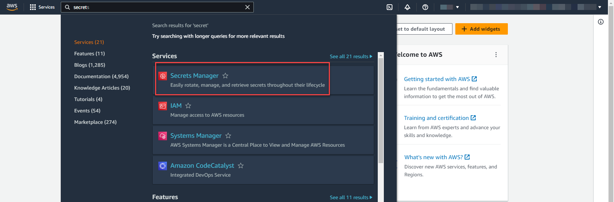

2. For Storing **SAP_AEM_CREDENTIALS** we need the Advanced Event Mesh Username and Password. Open the Advanced Event Mesh Application from the BTP Cockpit. 

 

3. In the Application, Navigate to the Cluster Service **IoTSitewise** created in **Step1** and Click on **Connect** Tab. 

 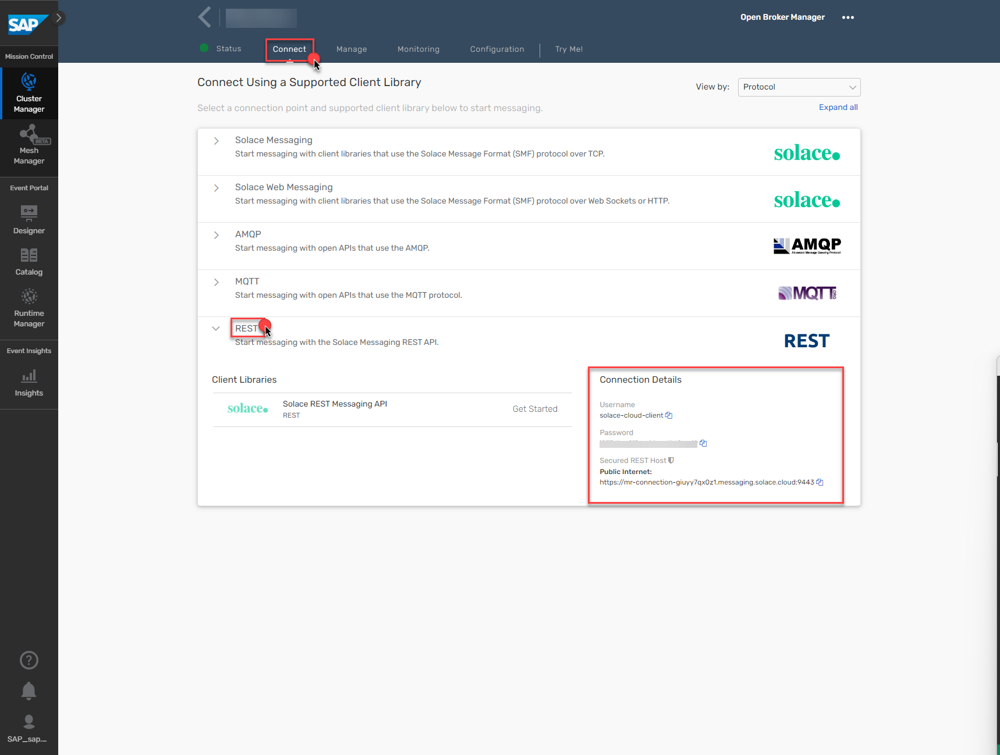

4. Copy the **Username** and **Password**.  

 

5. Click on **Store a new secret**


6. Choose **Other type of secret** option under **Secret type**. Add two key-value pairs as `username` and `password` and Paste the values copied from **Advanced Event Mesh Application**. Click on **Next**

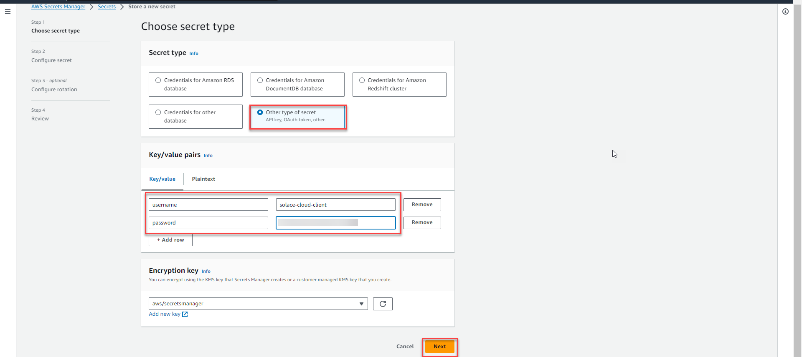

7. Fill the **Secret name** as **sapaem-credentials** and Click on **Next**, Click on **Next** and then click on **Store** to store the secret.

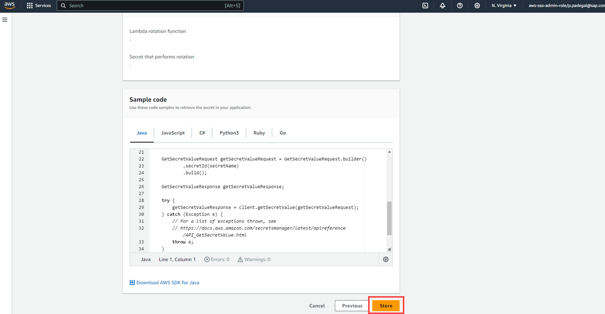

8. Click on the created secret and copy the Secret ARN value and use it in appConfig.json for **SAP_AEM_CREDENTIALS**.

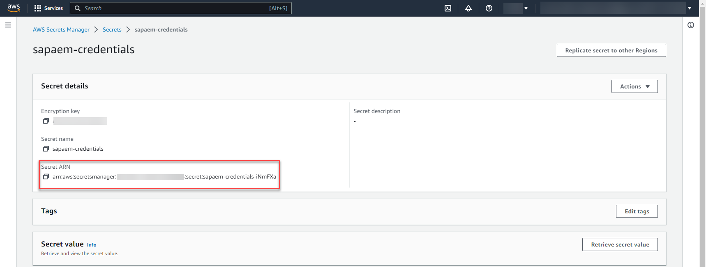

### For SAP_AEM_REST_URL, follow the steps below.

1. Go to your Advanced Event Mesh Application, and from the **Connect** Tab, copy the **Secured REST Host**

   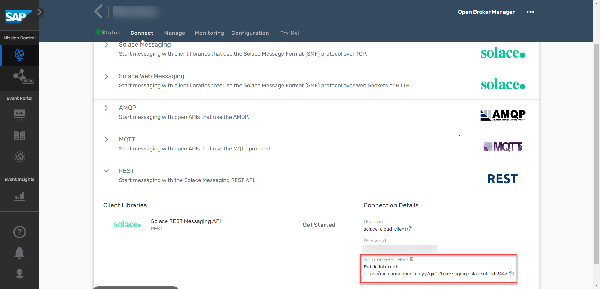

2. You have previously created a topic subscription named `IoTSitewise/messages`

   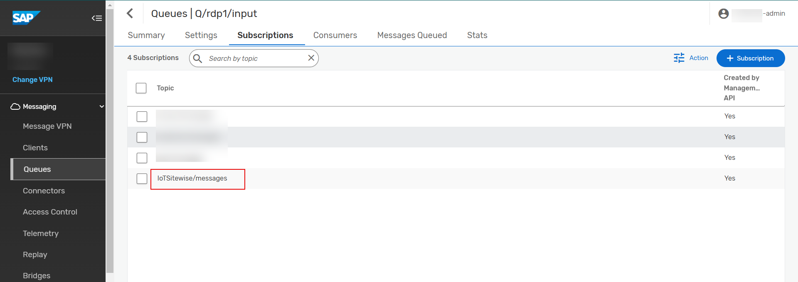

So, the **SAP_AEM_REST_URL** is `Secured_REST_Host`/IoTSitewise/messages


So your `appConfig.json` file looks as shown below: Fill all the details by following the steps mentioned above. 

   ```
   {
    "env": {
        "account": "<your_aws_account_id>",
        "region":"<your_aws_account_region>"
    },
    "vpcId": "<your_vpc_id>",
    "subnet": "<your_private_subnet>",
    "stackName": "iotsitewisesaptest",
    "sapenv": {
        "SAP_AEM_CREDENTIALS":"<your_secret_arn>",
        "SAP_AEM_REST_URL": "<your_aem_rest_url>"
    },
    "s3":{
        "bucketname": "<your_s3_bucket>",
        "inferencefolder":"iotsitewise"
       },
     "lambdaTimeout": 900
   }
   
   ```
## AWS Credentials to access AWS account from SAP Business Application Studio

1. Goto [AWS Console](https://us-east-1.console.aws.amazon.com) and search for **iam** and open the IAM console.

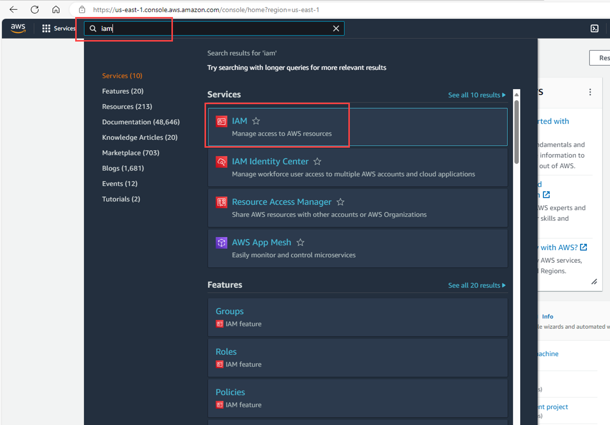

2. Click on **Users**

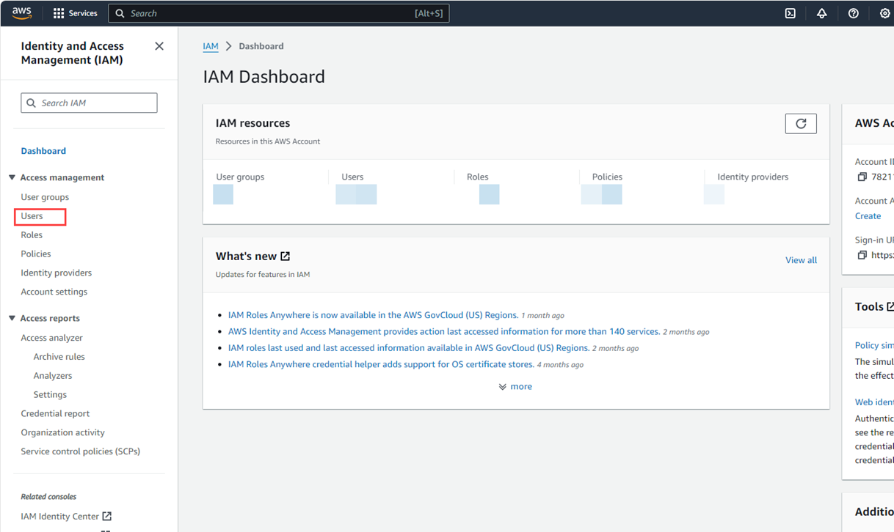

3. Click on your user, then click on **Security Credentials** tab and then click on **Create access key** button

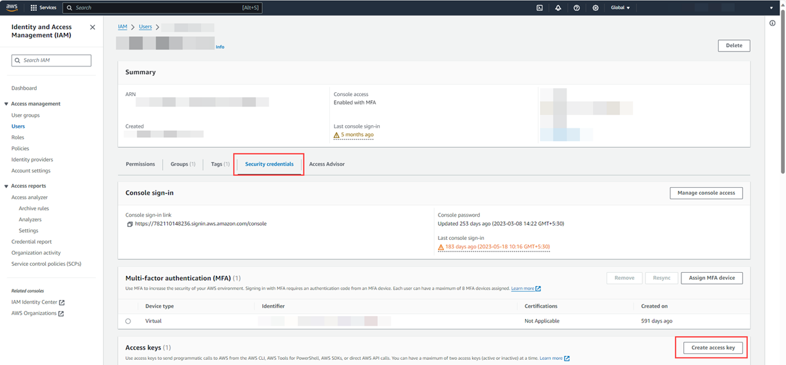

4. In the **Create access key** page, select **Application running outside AWS** option and then click on **Next**

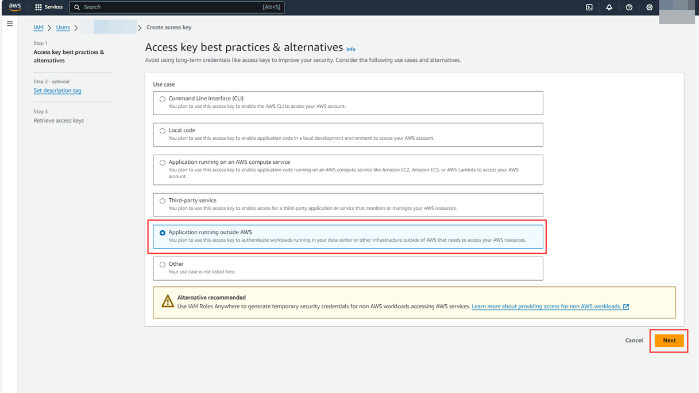

5. Click on **Create access key** button to create the access key

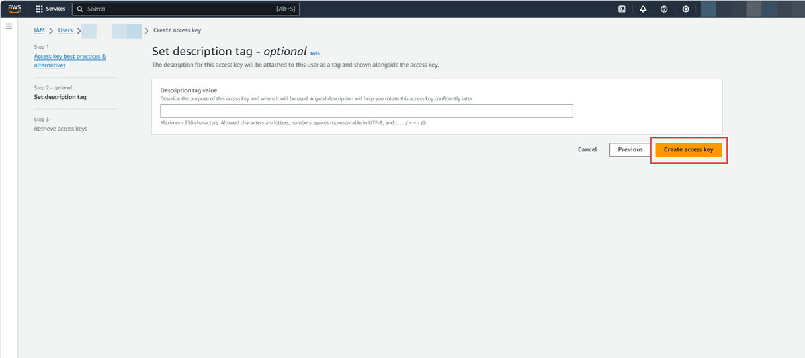

6. Note down the values of **Access key** and **Secret Access key** by clicking on the respective copy buttons.

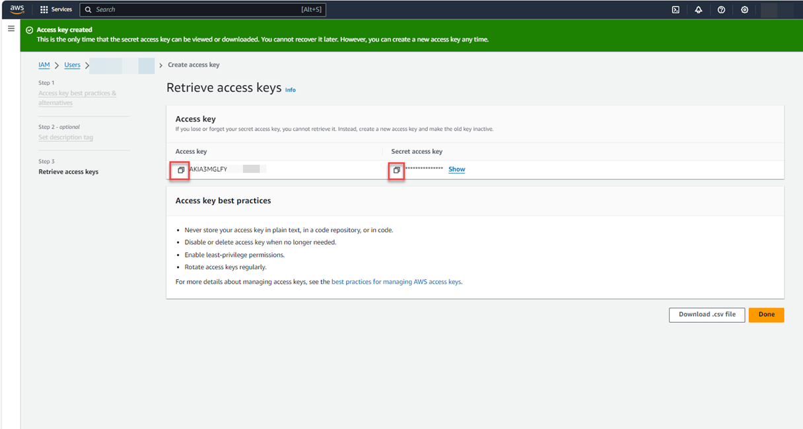

## Deploying the CDK Project

Now that we have cloned the repository and updated the `appConfig.json` file, we proceed with the steps related to deployment. Open the terminal.

Firstly globally install AWS-CDK
```
npm install -g aws-cdk@2.71.0

```
Then manually create a virtualenv 

```
python3 -m venv .env
```

After the init process completes and the virtualenv is created, you can use the following
step to activate your virtualenv.

```
source .env/bin/activate
```

Once the virtualenv is activated, you can install the required dependencies.

```
pip install -r requirements.txt
```

The `appConfig.json` file takes the input paramters for the stack. We have already maintained all the parameters in the `appConfig.json` in the previous step.

Add your AWS credentials configuration that you have created above (in the Step 6 of ## AWS Credentials to access AWS account from SAP Business Application Studio) as below to allow SAP Business Application Studio environment to access your AWS account by executing the below commands in the terminal.

```
export AWS_ACCESS_KEY_ID=<your_access_key_here>
```

```
export AWS_SECRET_ACCESS_KEY=<your_access_secret_here>
```

Bootstrap your AWS account for CDK. Please check [AWS CDK Tools - AWS Cloud Development](https://docs.aws.amazon.com/cdk/latest/guide/tools.html) for more details on bootstraping for CDK. Bootstraping deploys a CDK toolkit stack to your account and creates a S3 bucket for storing various artifacts. You incur any charges for what the AWS CDK stores in the bucket. Because the AWS CDK does not remove any objects from the bucket, the bucket can accumulate objects as you use the AWS CDK. You can get rid of the bucket by deleting the CDKToolkit stack from your account.

```
cdk bootstrap aws://<YOUR ACCOUNT ID>/<YOUR AWS REGION>
```

Deploy the stack to your account. Make sure your CLI is setup for account ID and region provided in the `appConfig.json` file.

```
cdk deploy
```
## Cleanup (Do this step only if you want to delete all resources that you created in AWS)

In order to delete all resources created by this CDK app, follow steps outlined in this [Steps-to-CleanUp](CleanupReadme.md)


## Useful commands

 * `cdk ls`          list all stacks in the app
 * `cdk synth`       emits the synthesized CloudFormation template
 * `cdk deploy`      deploy this stack to your default AWS account/region
 * `cdk diff`        compare deployed stack with current state
 * `cdk docs`        open CDK documentation
