## Configure SAP S/4HANA Business Actions in the extension application

In this section, you will define business action in the action-management extension application in SAP BTP.

### 1. Create Build Process Automation Instance

1. In the SAP BTP cockpit, navigate to your subaccount and choose **Instances and Subscriptions** and then choose **Create** to create a instance of **SAP Build Process Automation**.

    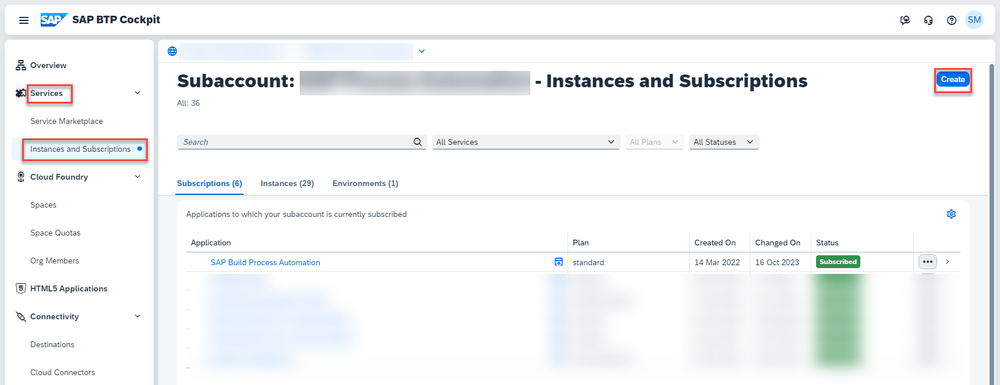 

2. Choose the **Service** as  **SAP Build Process Automation**, **Plan** as **standard- Instance** as shown below.


    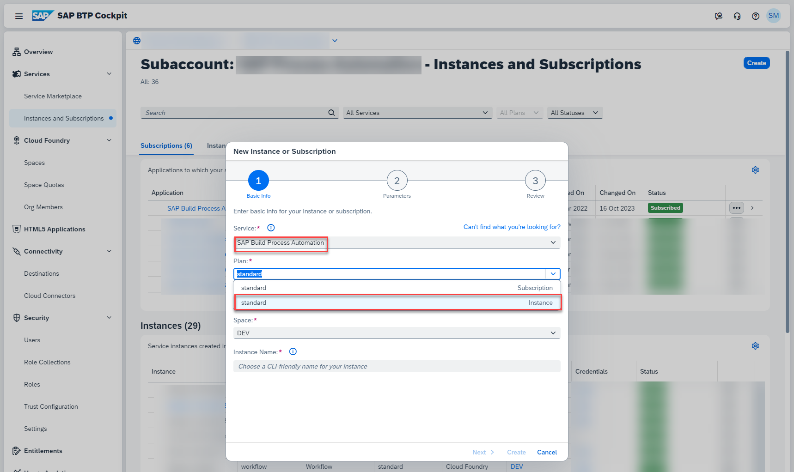

3. Fill the **Instance Name** as **BPA_Decision** , and Click **Create** button.


    

4. In a couple of seconds the instance will be created. **Click** on the instance as shown below.

    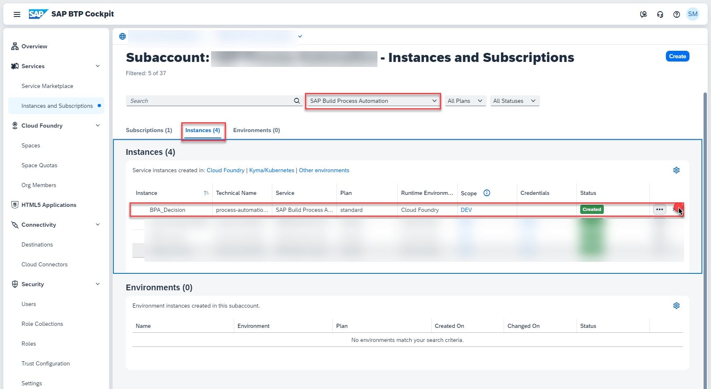

5. Under **Service Keys**, Click on **Create** button, to create a service key for the SAP Build Process Automation instance created.


    

6. Fill the **Service Key Name** as **default** and then click on **Create** button.


    

7. You will see that the service key is now created.

    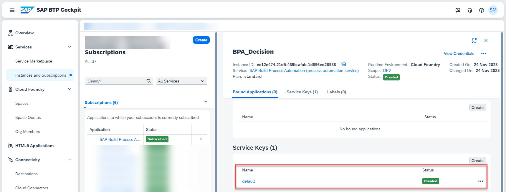

8. Now click on the three dots and choose **View** to view the service key details.

    

9. Click on **Form** Tab to get the structured display of values as shown below. Copy the values of **api**, **clientid**, **clientsecret**, **url** as you will use them while configuring the destination for SAP Build Process Automation.

    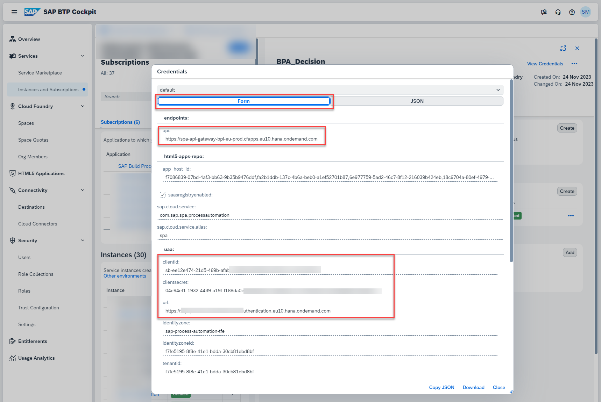


### 2. Create Destinations

1. In the SAP BTP cockpit, navigate to your subaccount and choose **Connectivity > Destinations**. Click on **New Destination**

    

5. Create a new destination with the name **ACTION_DECISIONS** and enter the following configuration values. This is used for calling SAP Build Process Automation Decision capability.

    - Paste the values of `api`, `clientid`, `clientsecret` and `url` which you have copied from previous step and update it for `URL`, `Client ID`, `Client Secret` and `Token Service URL` respectively as instructed below.

    ```
    Name: ACTION_DECISIONS
    Type: HTTP
    URL: `api`/public/rule/runtime/rest
    Proxy: Internet
    Authentication: OAuth2ClientCredentials
    Client ID: `clientid`
    Client Secret: `clientsercret``
    Token Service URL Type: Dedicated
    Token Service URL: `url`/oauth/token

    Additional Properties:
    HTML5.DynamicDestination: true
    ```

    Your destination configuration should look like this:

    

6. Create destination with the name **ACTION_MODELER_S4** and enter the following configuration values.

    Change host name in URL, User, Password as per your SAP S/4HANA system details.

    - In case of SAP S/4HANA system on AWS Private Cloud, choose **Proxy Type** as **PrivateLink** and the private link **hostname** copied from [Step3b-Setup-SAPPrivateLinkService](../Step3b-Setup-SAPPrivateLinkService/README.md) in the **hostname** field.

        ```
        Name: ACTION_MODELER_S4
        Type: HTTP
        URL: https://<hostname>/sap/opu/odata/sap
        Proxy Type: PrivateLink
        Authentication: BasicAuthentication
        User: <SAP S4HANA User>
        Password: <SAP S4HANA Password>

        Additional Properties:
        HTML5.DynamicDestination: true
        WebIDEEnabled: true
        WebIDEUsage: odata_abap
        TrustAll: true
        ```

        Your destination configuration should look like this:

        

    - In case of SAP S/4HANA On-Premise system, choose **Proxy Type** as **OnPremise** and use the **Virtual Host**:**Virtual Port** in the **hostname** placeholder below created at [Step3a-SetupCloudConnector](../Step3a-SetupCloudConnector/README.md) to connect using Cloud Connector.

        ```
        Name: ACTION_MODELER_S4
        Type: HTTP
        URL: https://<hostname>/sap/opu/odata/sap
        Proxy Type: OnPremise
        Authentication: BasicAuthentication
        User: <SAP S4HANA User>
        Password: <SAP S4HANA Password>

        Additional Properties:
        HTML5.DynamicDestination: true
        WebIDEEnabled: true
        WebIDEUsage: odata_abap
        ```

        Your destination configuration should look like this:

        

7. Create a new destination with the name **AWS_BEDROCK_MODEL** and enter the following configuration values. This is used for calling the deployed generative model via SAP GenAI Hub.

    **a.** Navigate to your **SAP BTP Subaccount**, **Services -> Instances and Subscriptions** , search for the AI core instance that you have created, and under the **Service Keys**, Click on the menu as shown to see the details of the key.

    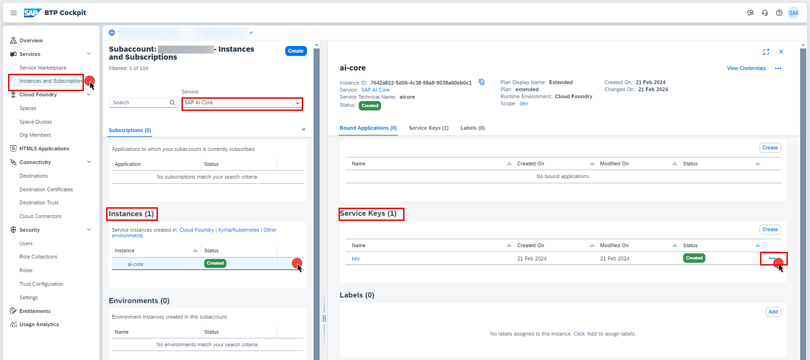

    **b.** Copy the values of `clientid`, `clientsecret` and `url` from the service key and use it to update `Client ID`, `Client Secret` and `Token Service URL` respectively as instructed below. Also the deployment url copied from [Step-1 - #Set Up for AI Core](../Step1-Setup-SAPBTP-Subaccount/README.md#3-set-up-sap-ai-core-and-ai--launchpad)

    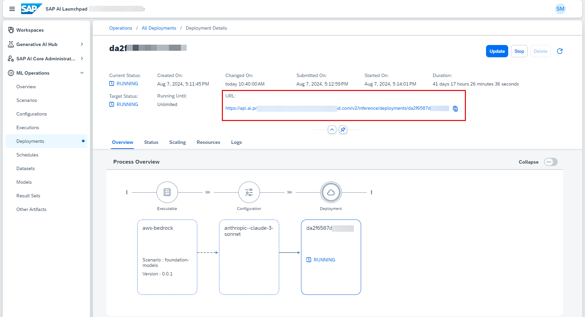

    ```
    Name: AWS_BEDROCK_MODEL
    Type: HTTP
    URL: `paste_your_deployment_url_here`
    Proxy: Internet
    Authentication: OAuth2ClientCredentials
    Client ID: `paste_your_clientid`
    Client Secret: `paste_your_clientsercret``
    Token Service URL Type: Dedicated
    Token Service URL: `paste_your_url`/oauth/token

    Additional Properties:
    HTML5.DynamicDestination: true
    URL.headers.AI-Resource-Group: default
    URL.headers.Content-Type: application/json
    ```

    Your destination configuration should look like this:

    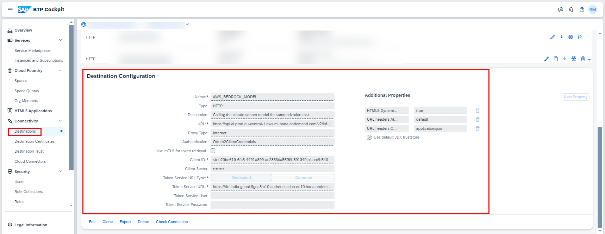

### 3. Configure Business Actions in  Manage Actions application

In this section, you will configure the different business actions that needs to be executed based on the event received.

1. In the SAP BTP cockpit, navigate to your subaccount and choose **Cloud Foundry** > **Spaces**.  Choose your space and then choose **action-management** application. Choose the url provided under **Application Routes** section.

    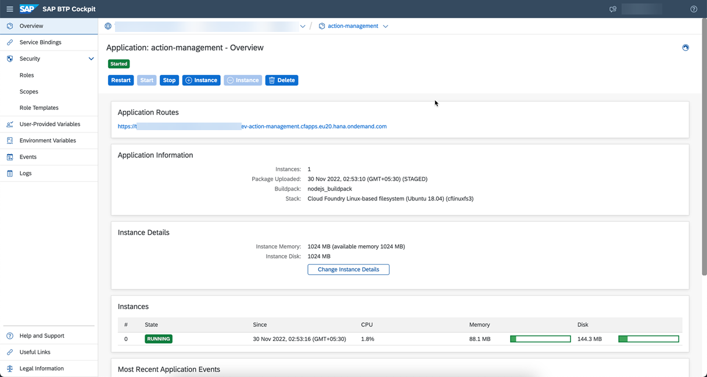

2. Choose **Manage Actions** tile.

    

3. Choose **Create** to create default action entry.

    

    You will see the follwoing screen.

    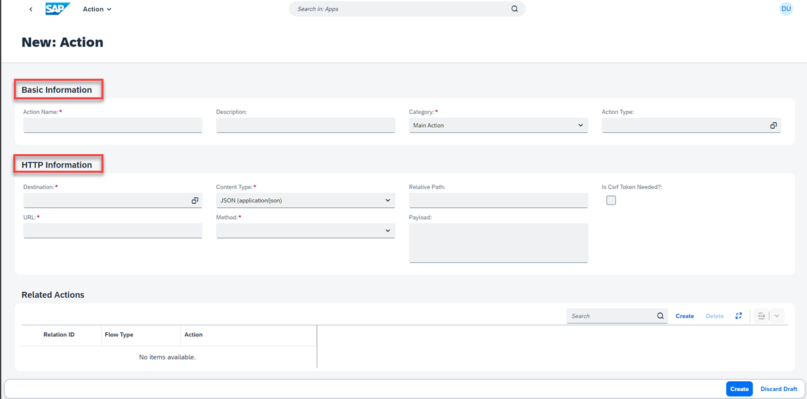

4. In the **Basic Information** section, enter the following configuration values.

    ```
    Action Name: Determine Action from Event Information
    Description: Determine Action from Event Information
    Category: Default Action
    Action Type: Service Integration
    ```

5. In the **HTTP Information** section, enter the following configuration values.

    **Note**: Replace **<E2BDecisionId>** with the value copied as **E2BDecisionId** from Create Decisions Project section of the [Step6-Configure-Decisions-Part1](../Step6-Configure-Decisions-Part1/README.md).

    ```
    Destination: ACTION_DECISIONS
    Content-Type: application/json
    Method: POST
    Relative Path: /v2/rule-services
    Payload: { "RuleServiceId": "<E2BDecisionId>","Vocabulary": [ { "EventInfo":{ "SourceSystem": "${{event.data.SourceSystem}}","DeviceLocation": "${{event.data.DeviceLocation}}","DeviceType": "${{event.data.DeviceType}}" } } ] }


    Action Id Path in Response: Result[0].ActionInfo.ActionId
    ```

    Your configuration should look like this:

    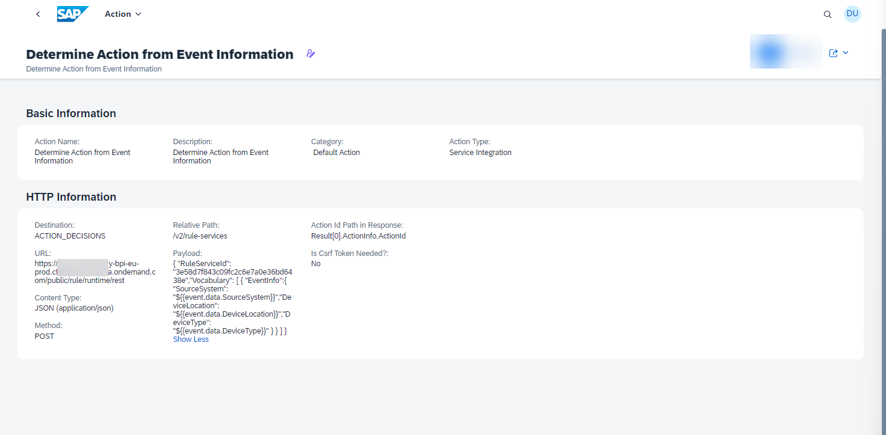

6. Click **Create** button.

7. Navigate back to **Manage Actions** and Click on **Create** button.

    

7. Create business action with name **FetchEquipmentDetails** and enter the following configuration values. 
**Note**: Replace **<Plant_Details_Id>** with the value copied as **Plant_Details_Id** from Create Decisions Project section of the [Step6-Configure-Decisions-Part1](../Step6-Configure-Decisions-Part1/README.md). 

```
    Basic Information:

    Action Name: FetchEquipmentDetails
    Description: FetchEquipmentDetails
    Category: Pre/Post Action
    Action Type: Service Integration
    
    HTTP Information:
    Destination: ACTION_DECISIONS
    Content-Type: application/json
    Method: POST
    Relative Path: /v2/rule-services
    Payload: { "RuleServiceId": "<Plant_Details_Id>", "Vocabulary": [ { "BucketInfo":{ "BucketName": "${{event.data.BUCKETId}}" } } ] }

    Is Csrf Token Needed?: false

```

Your configuration should look like this:


8. Create another business action with name **Get Summary from AWS BedRock Claude 3 Sonnet Model via SAP GenAI Hub**. In this pre-action we are sending a payload to the deployed Generative AI model, with propmt to summarize the received event. The Claude 3 sonnet model will then give us the summary of the event describing what caused the plant to undergo maintenance. This summary can then be used while creating the maintenance notification in the SAP S/4HANA System.

Enter the following configuration values:

```
    Basic Information:

    Action Name: Get Summary from AWS BedRock Claude 3 Sonnet Model via SAP GenAI Hub
    Description: Call the AWS BedRock's Claude 3 Sonnet Model via SAP GenAI Hub for summarization task
    Category: Pre/Post Action
    Action Type: Service Integration
    
    HTTP Information:
    Destination: AWS_BEDROCK_MODEL
    Content-Type: application/json
    Method: POST
    Relative Path: /invoke
    Payload: {"anthropic_version":"bedrock-2023-05-31","max_tokens":1000,"messages":[{"role":"user","content":"Given the following JSON data from AWS IoT SiteWise, generate a summary in 100 words in plain text without any new line character. Describe the root cause of the issue. Mention any relevant values or levels that may have contributed to or impacted the issue.Do not use any special characters in the summary. Use the data provided:${{stringify(event.data)}}"}]}

    Is Csrf Token Needed?: false

```

Your configuration should look like this:

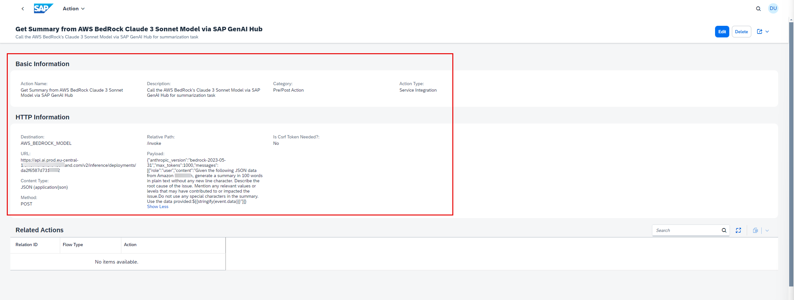

8. Create another business action with name as **Create PM Notification**. Under Related Actions, click on **Create** button, choose the **Flow Type** as Pre Action,
    and **Action** as **FetchEquipmentDetails**. Copy the corresponding **Relation_ID_1** and replace it in the below payload. 

    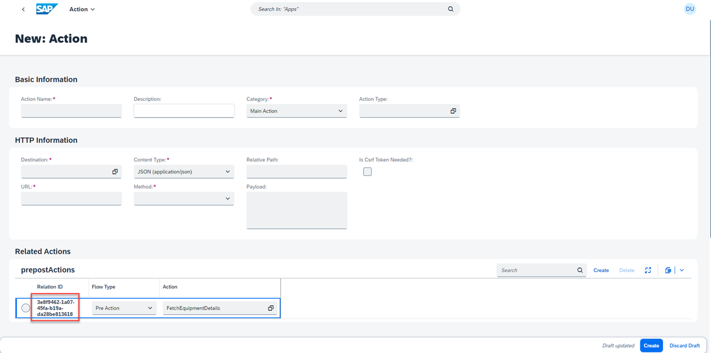

    Similarly, click on **Create** button, choose the **Flow Type** as Pre Action, and **Action** as **Get Summary from AWS BedRock Claude 3 Sonnet Model via SAP GenAI Hub**. Copy the corresponding **Relation_ID_2** and replace it at **MaintNotifLongTextForEdit** in the below payload

    


    Fill the other details as follows. Replace with the value of **Relation_ID_1** and **Relation_ID_2** at the correct places as mentioned in the payload below.

```
    Basic Information:

    Action Name: Create PM Notification
    Description: Create notification in SAP PM for IoT Sitewise
    Category: Main Action
    Action Type: Service Integration
    
    HTTP Information:
    Destination: ACTION_MODELER_S4
    Content-Type: application/json
    Method: POST
    Relative Path: /API_MAINTNOTIFICATION/MaintenanceNotification
    Payload: {
        
    "NotificationText":"Iot sitewise error ",
    "MaintNotifLongTextForEdit":"${{pre.<paste_Relation_ID_2_here>.content[0].text}}, IoT Sitewise location: ${{pre.<paste_Relation_ID_1_here>.Result[0].EquipmentDetails.Location}} and equipment: ${{pre.<paste_Relation_ID_1_here>.Result[0].EquipmentDetails.Equipment}}",
    "NotificationType": "M1","TechnicalObject": "${{pre.<paste_Relation_ID_1_here>.Result[0].EquipmentDetails.Equipment}}",
    "TechObjIsEquipOrFuncnlLoc": "EAMS_EQUI",
    "TechnicalObjectLabel": "${{pre.<paste_Relation_ID_1_here>.Result[0].EquipmentDetails.Equipment}}"

    }
    Is Csrf Token Needed?: true

    Under Related Actions: 
    Flow Type: Pre Action
    Action: FetchEquipmentDetails
```

Your configuration should look like this:


You have sucessfully configured the Business Action that needs to be executed whenever a event is recieved by the Events-to-Business Actions framework.

9. Now Navigate back to **Manage Actions**. Click on the **Settings** Icon as shown below.

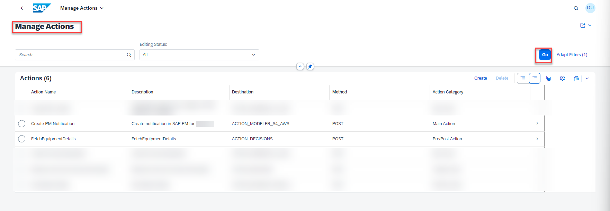

10. Unselect the **Action Name** as shown below.

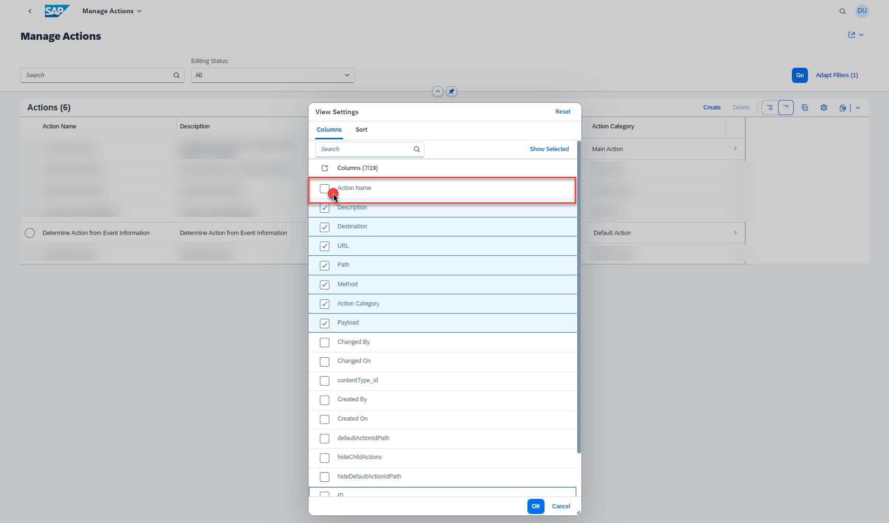

11. Select the **ID** column and also on the move-to-top icon, as shown below.

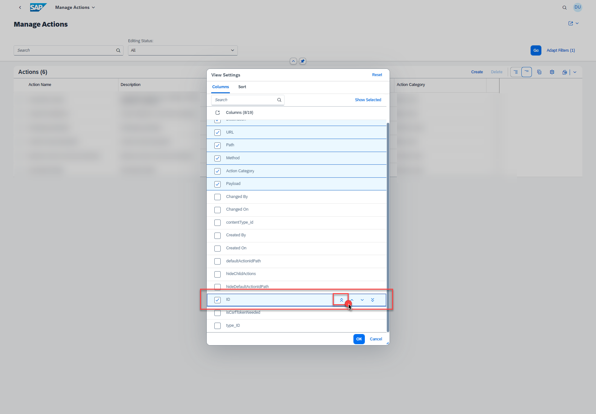

12. You should see the below screen after making the above changes. Now click on **OK** button.

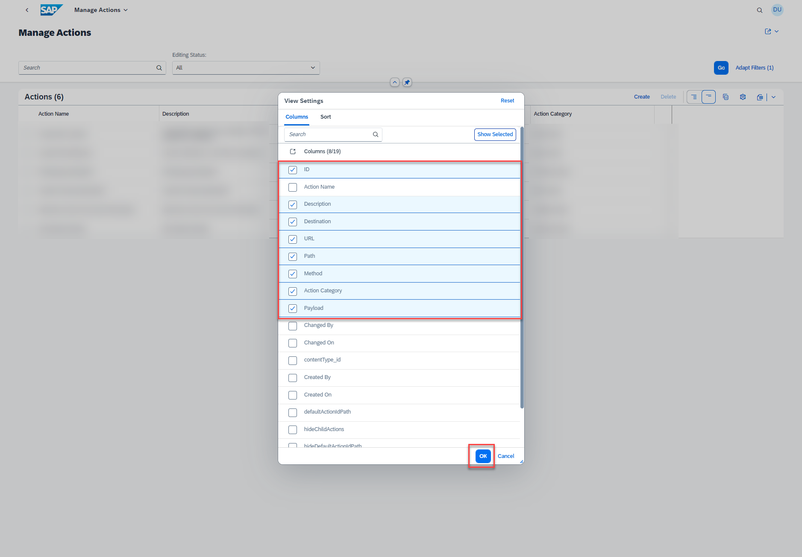

13. You will be able to see the action and it's action Id. Copy the **ActionId** of the main action **Create PM Notification**, this wil be used to update the **ActionId** in the decision table of the Decision Project in the next step. 

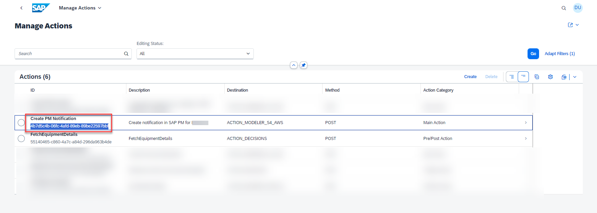