## Update and Deploy SAP Build Process Automation Decisions Project
In this section, you will update decision table and activate business rule project.

1. In the SAP BTP Cockpit, Navigate to your subaccount -> **Sevices** -> **Instances and Subscriptions** , Open the SAP Build Process Automation Application.

    

2. In the SAP Build Process Automation Application, In the **Lobby** Tab , Click on **Events-to-Business-Actions-Framework** project.

    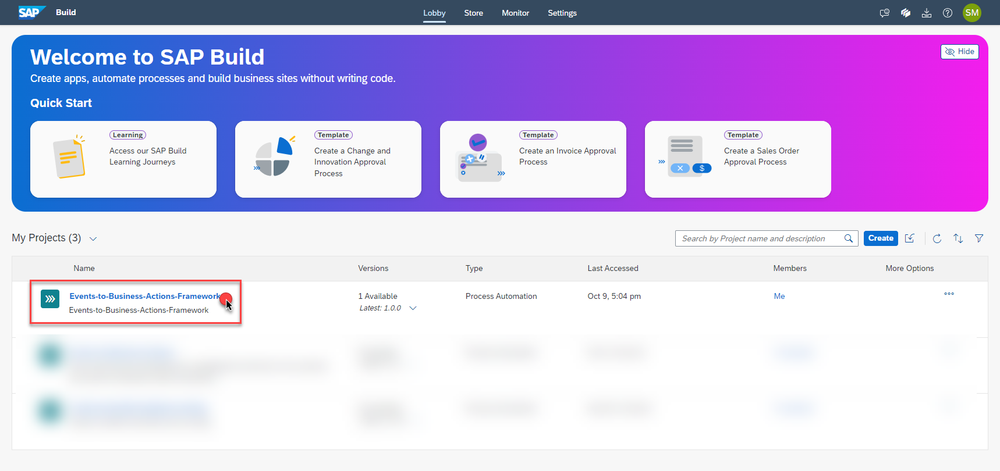

3. Choose the **E2BDecision** , On the **Rules** Tab, Click the **DecideAction** Decision table.

    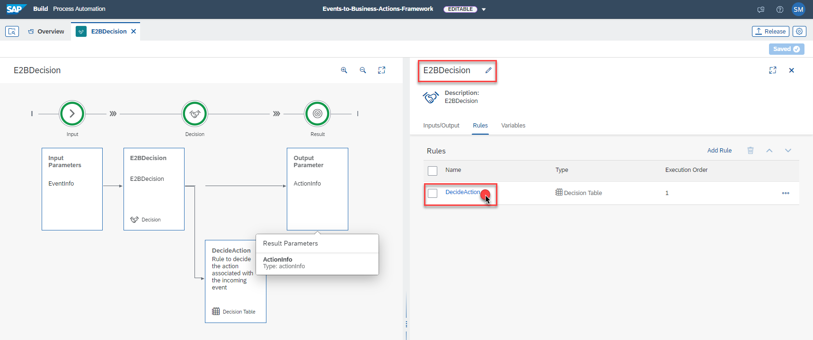

4. Click on the **ActionId** Field. 

    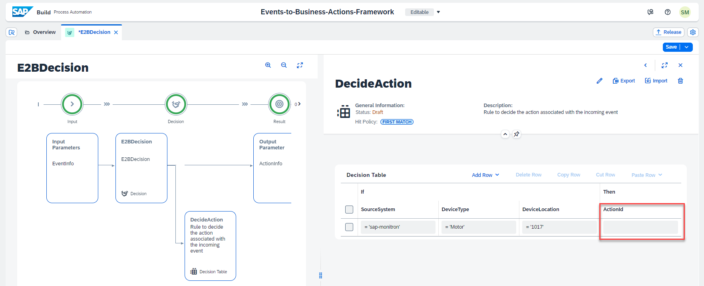

5. Paste the `ActionId` copied from the [Step7-Configure-BusinessActions](../Step7-Configure-BusinessActions/README.md). 

    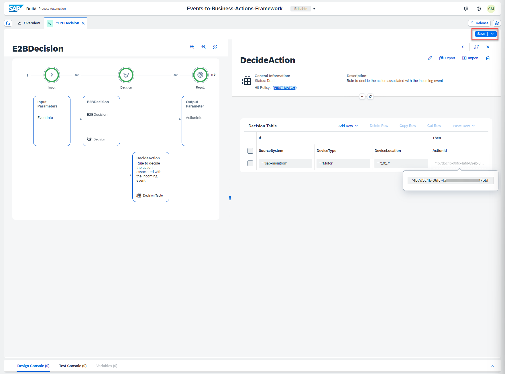

6. Your rule should look as follows. Now click on **Save** button to save the rule.

    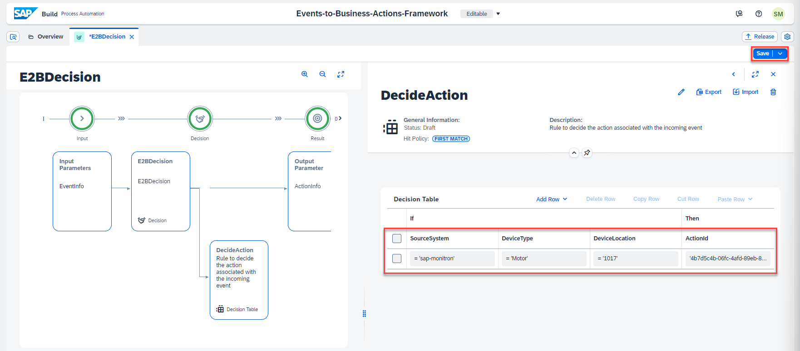

7. The Decision is now configured with the Rule successfully. To use the decision in our CAP extension application we need to deploy all the latest changes in the Decision. 

    First click on **Release** to release the Decisions. 
    
    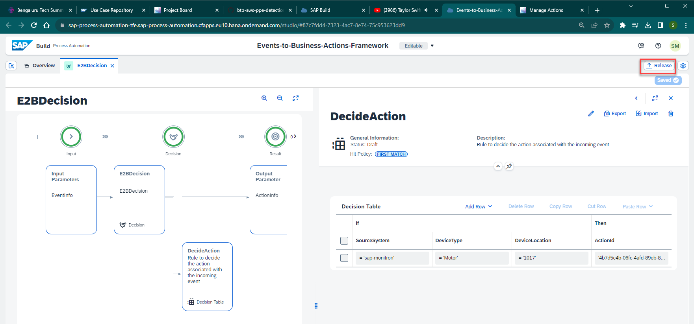

8. Select **Contains only patches**, **Version Number** is autofilled. Now Click on **Release**

    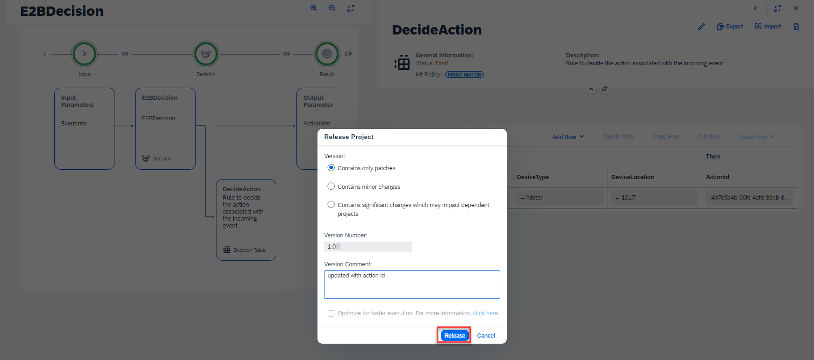

9. Now that the project is released, it is ready for deployment. Click on the **Deploy**

    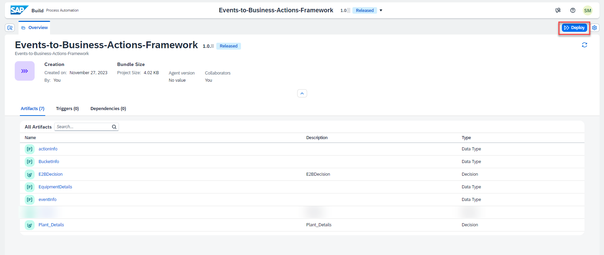

10. Follow the steps shown in the following screenshots.

    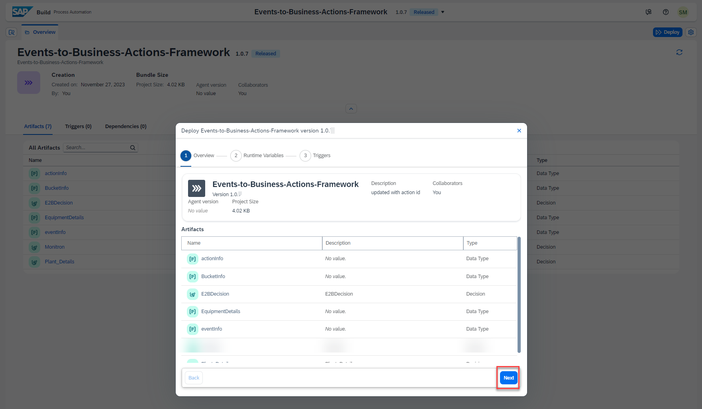

    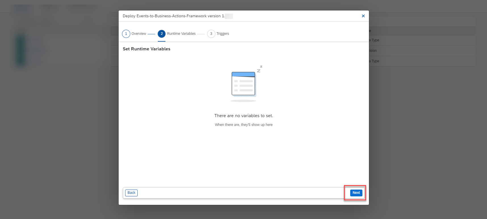

    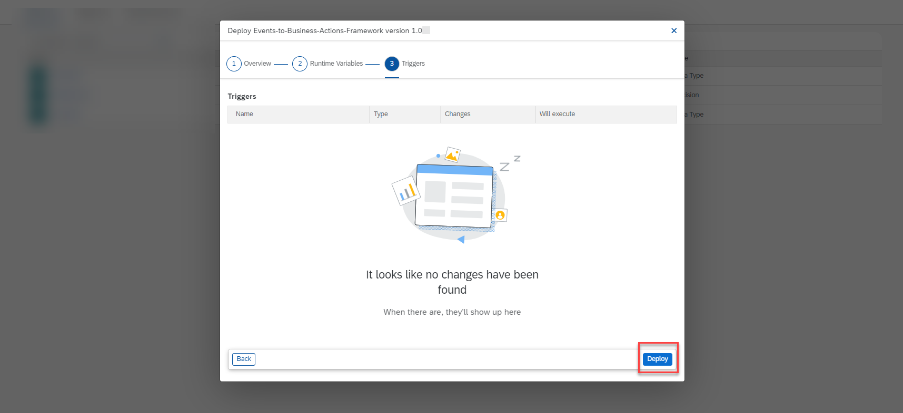

11. The Project is successfully Redeployed ! 

    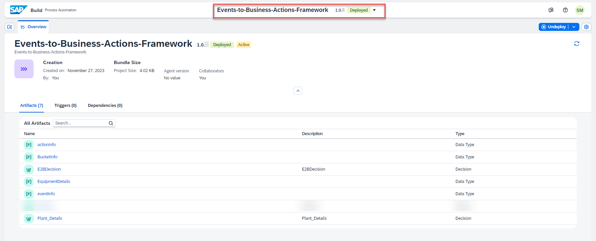

