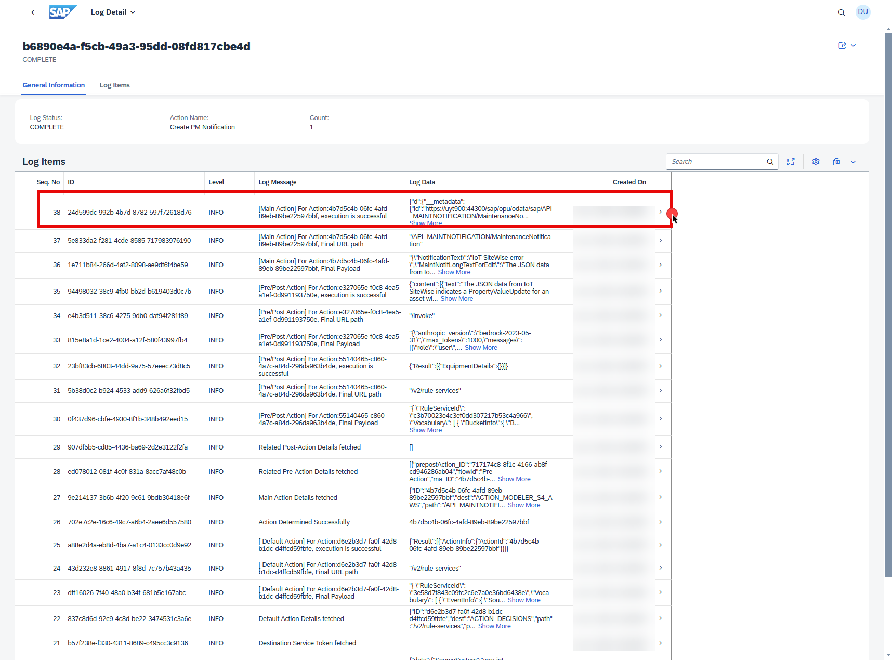
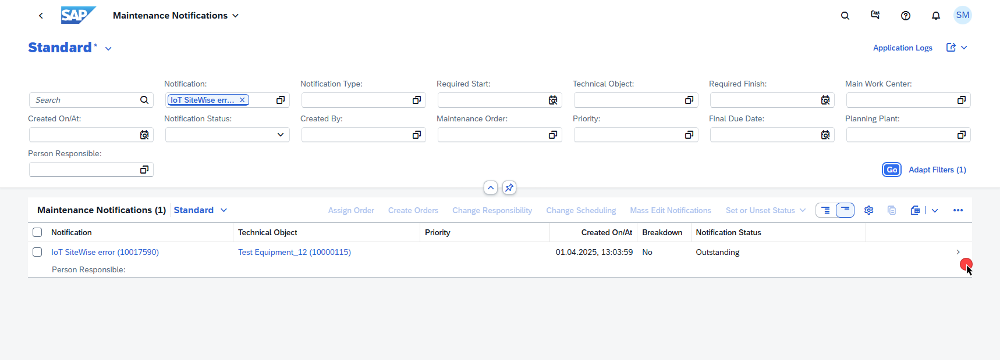

## Test the Extension Application and Execute the End-to-End Scenario

Now that you have successfully deployed the extension application in SAP BTP and completed the configurations in AWS, SAP BTP and SAP S/4HANA. 
From an SAP standpoint, we are only looking for inference data from AWS IoT Sitewise. To simulate the scenario, we will be using the event [payload](/payload.txt) file as a sample to integrate into SAP.

**Note** A S3 bucket is a prerequisite for the scenario.

Follow these steps to test the application.

1. Go to to your AWS account and Navigate to **S3** Service.

    

2. Choose the **S3 Bucket** that you have created earlier.

    

3. Choose the folder named **sitewise**

    

4. Download the **payload.txt** (payload.txt). This file has the sample event, which we use for testing the scenario. In the **sitewise** folder, Choose **Upload**

    

5. Click on **Add files**, choose the **payload.txt** downloaded in the previous step. Choose **Upload**.

    

6. Upon the file upload, you should get a **Upload Succeeded** message

    

7. In the SAP BTP cockpit, navigate to your subaccount and choose **Cloud Foundry** > **Spaces**. Choose your space and then choose **action-management** application. Choose the url provided under **Application Routes** section.

    

8. Choose **Business Action Logs** Tile.

    

9. Under **Log Details**, click on the **Complete** to expand it. You should see a entry with **Create PM Notification**. **Click** on it to see the details.

    

10. Expand the **Log Data** of the **Log Message** that says **execution is successful** , Click on the log to get the details. 

    

11. In the detailed log message, you can see that the maintenance notification was created in the **SAP S/4HANA System**. We can see the **ID** of the maintenance notification that was created. Now, copy the value of **ID** found in the paranthesis of **MaintenanceNotification('ID')**, **for example** : **MaintenanceNotification('10017590')**

    

12. To verify the creation of **PM Notification**, Log into **SAP S/4HANA Fiori Application**. In the **SAP S/4HANA Fiori Application** landing page, search for **Maintenance notification**, and select the app as shown in the image below.

    

13. You will get the **Maintenance Notifications Application** as shown below.

    

13. In the **Search** field, Enter the value of ID copied from **Step 11** and press **Enter** on the keyoboard. You see that, you get the Maintenance Notification that was created. To see the details, click on the entry as shown below.

    

14. You should be able to see the **Maintenance Notification** Screen, with the details of the event as follows. Observe that the **Long Text** field describes the event that might have caused the plant to undergo the maintenance. This description is the summary generated by the AWS Bedrock Claude 3 Sonnet Model, which was deployed and accessed via SAP GenAI Hub.

    

You have completed the end-to-end integration of events to business actions from **AWS IoTSiteWise** to **SAP S/4HANA** with **SAP BTP**.

