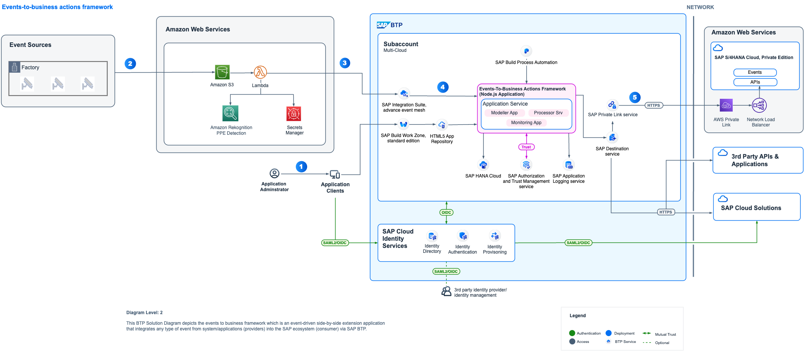

## Integrating Amazon Rekognition and SAP EHS with SAP BTP for PPE Detection

This repository contains code samples and instructions for developing an extension application in SAP BTP. The sample application has been developed in a partner collaboration to help customers integrate any type of events from systems into SAP ecosystem via SAP BTP. This application helps to configure actions that needs to be taken in SAP LoB systems based on the events that is received in SAP Integration Suite, Advanced Event Mesh. The application scenario you will develop in this tutorial leverages Event-To-Business actions framework (extension application). This framework can be used in combination with any hyperscalar/telco IoT.

In this tutorial, the **events** are received from **Amazon Rekognition - PPE Detection** and the **actions** for these events are taken in **SAP S/4HANA**. You can use this application to further customize it for other systems as well.

 ## Table of Contents

[Scenario](#scenario)\
[Solution Architecture](#solution-architecture)\
[Requirements](#requirements)\
[Implementation: Configuration and Development](#configuration-and-development)\
[Additional Resources](#additional-resources)\
[Known Issues](#known-issues)\
[Reference](#reference)\
[Disclaimer](#disclaimer)\
[How to Obtain Support](#how-to-obtain-support)\
[Code of Conduct](#codeofconduct)\
[Contributing](#contributing)\
[License](#license)

## Scenario

Safety hazards can exist in every workplace in many different forms: sharp edges, falling objects, flying sparks, chemicals, noise, and other potentially dangerous situations. Safety regulators such as Occupational Safety and Health Administration (OSHA) and European Commission often require that businesses protect their employees and customers from hazards that can cause injury by providing them personal protective equipment (PPE) and ensuring their use.With Amazon Rekognition PPE detection, customers can analyze images from their on-premises cameras across all locations to automatically detect if persons in the images are wearing the required PPE such as face covers, hand covers, and head covers. SAP customers use SAP Environment health and safety module to record these detections manually as safety observations.This solution provides an integration framework between Amazon Rekognition and SAP Envriroment, Health and Safety(EHS).

## Solution Architecture

The key services used from **AWS** are Amazon Rekognition PPE Detection, Amazon S3, Amazon Lambda Function, AWS Secrets Manager. The services used from **SAP BTP** are the Cloud Foundry Runtime, SAP Integration Suite Advanced Event Mesh, SAP Connectivity service, SAP Private Link service, SAP Build Process Automation - Decision capability, SAP Destination service and SAP Business Application Studio.

SAP Private Link service is used for connectivity between SAP BTP and SAP S/4HANA when both the systems are running on AWS Infrastructure, in this tutorial you will find implementation steps for SAP BTP Private Link service and AWS Private Link service. Alternatively you can use SAP Connectivity service and Cloud Connector for integration of SAP BTP and SAP S/4HANA as well.

 **Figure-1: High-level architecture (with SAP S/4HANA on AWS)**

The following steps depicts the information flow across systems:

(1) An application administrator logs into SAP BTP Extension application based on Events to Business Actions Framework via SAP Build Work Zone, standard edition, to configure the business rules/decisions and the business actions that needs to be triggered in the business systems.

(2) CCTV cameras at the factory capture images of people and upload them to Amazon S3, which triggers an AWS Lambda function that runs inference using Amazon Rekognition’s PPE detection model to identify missing safety gear, and if any safety violation is detected, it publishes an event to the SAP Integration Suite, Advanced Event Mesh.

(3) As the processor module's (part of the Events-to-Business-Action framework) subscribes to Advanced event mesh, the event is received

(4) Processor module (part of the Events-to-Business-Action framework) leverages the Decisions capability of SAP Build Process Automation to derive business action (for example, purchase order requisition creation in SAP S/4HANA) based on certain characteristics of incoming event.

(5) The defined action is triggered in SAP S/4HANA using the SAP Destination service and SAP Connectivity service leveraging cloud connector setup. In case SAP S/4HANA and SAP BTP are on same hyperscaler, communication with SAP S/4HANA happens via SAP Private Link service.

## Requirements

These are the technical prerequistics for an integration between AWS, SAP BTP and SAP S/4HANA. 

**Services in SAP BTP**
- Cloud Foundry Runtime
    > - Foundation for running the CAP extension application for translating events to business actions.
- Authorization & Trust Management Service
    > - Required for securing the extension application in SAP BTP
- SAP Integration Suite,Advanced Event Mesh 
    >- Required to receive events from Amazon Rekognition
- SAP HANA Cloud 
    >- Required to store action configuration and logs for CAP application
- SAP HANA Schemas & HDI Containers 
    >- Application database for CAP Application
- SAP Build Process Automation - Decision capability
    >- SAP Build Process Automation - Decisions service to configure business decisions that needs to be taken based on the type of event received from Amazon Rekognition.
- SAP S/4HANA System
    >- To execute the business action associated with the event received. 
- SAP Connectivity Service
    >- To establish connections between cloud applications and on-premise systems.
- SAP Destination Service
    >- To find the destination information required to access a remote service or system from your extension application.
- SAP Private Link Service
    >- To establishe a private connection between selected SAP BTP services and selected services in your own IaaS provider accounts.
- SAP Business Application Studio
    >- A powerful and modern development environment, tailored for efficient development of business applications for the Intelligent Enterprise.

**Amazon Web Services**
- A valid AWS subscription

- Amazon Rekognition - PPE Detection
    > - Required for receiving and sending the events whenever an abnormality is detected in the equipment.

- Amazon S3
    > - Required to store the received streaming event data.

- Amazon Secrets Manager
    >- Required to store the Advanced Event Mesh credentials that are accessed by the Amazon Lambda Function.

- Amazon Lambda Function
    >- Required to orchestrate the process of detecting a stream contains any alerts related to failure or warnings, and then the inference result is passed to SAP Advanced Event Mesh.

## Configuration and Development

This scenario talks about the steps needed for translating events from AWS IoT to business actions in SAP business systems.

These are the steps to configure SAP S/4HANA, SAP BTP and Amazon AWS.

[Step 1: Set Up the Subaccount in SAP BTP](./Documentation/Step1-Setup-SAPBTP-Subaccount/README.md)

[Step 2: Check SAP S/4HANA Readiness](./Documentation/Step2-SAPS4HANA-Readiness/README.md)

Step 3: Connect SAP BTP and SAP S/4HANA

   - [(Option 1) Using SAP BTP Connectivity Service](./Documentation/Step3a-SetupCloudConnector/README.md)

   - [(Option 2) Using SAP Private Link Service](./Documentation/Step3b-Setup-SAPPrivateLinkService/README.md)

[Step 4a: Build and Deploy the Extension Application](./Documentation/Step4a-Build-Deploy-ExtensionApplication/README.md)

[Step 4b: SAP Integration Suite, Advanced Event Mesh Configuration](./Documentation/Step4b-Advanced-Event-Mesh-Configuration/README.md)

[Step 5: Setup AWS Account](./Documentation/Step5-Setup-AWS/README.md)

[Step 6: Create SAP Build Process Automation-Decisions Project](./Documentation/Step6-Configure-Decisions-Part1/README.md)

[Step 7: Configure SAP S/4HANA Business Actions in the extension application](./Documentation/Step7-Configure-BusinessActions/README.md)

[Step 8: Update and Deploy SAP Build Process Automation Decisions Project](./Documentation/Step8-Configure-Decisions-Part2/README.md)

[Step 9: Test the Extension Application](./Documentation/Step9-Test-ExtensionApplication/README.md)

## Additional Resources

Related projects :

- [Events-to-Business-Actions-Framework](https://github.com/SAP-samples/btp-events-to-business-actions-framework/tree/main)

## Known Issues

No known issues.

## Reference

[AWS Rekognition](https://docs.aws.amazon.com/rekognition/latest/dg/what-is.html)

## Disclaimer

This project has been a proof of concept, including several limitations and prerequisites. The objective was to build a extension application for receiving and automating the actions in SAP S/4HANA. For this reason, the coding should not be seen as any recommendation for productive implementation. It fulfils the purpose and requirements of a proof of concept and is not intended for productive usage. It has been declared as pure proof of concept only to give the development teams ideas for solving potential challenges when integrating events from other platforms like Amazon Rekognition - PPE Detection and SAP S/4HANA using SAP BTP. This can be extended to integrate with any other SAP LoB system as well.

## How to Obtain Support

[Create an issue](https://github.com/SAP-samples/<repository-name>/issues) in this repository if you find a bug or have questions about the content.
For additional support, [ask a question in the SAP Community](https://answers.sap.com/questions/ask.html).

## Contributing

If you wish to contribute code, offer fixes or improvements,  send a pull request. Due to legal reasons, contributors will be asked to accept a DCO when they create the first pull request to this project. This happens in an automated fashion during the submission process. SAP uses [the standard DCO text of the Linux Foundation](https://developercertificate.org/).

Refer to the [CONTRIBUTING](CONTRIBUTING.md) file for guidelines to contributions from external parties.

For additional support, [ask a question in the SAP Community](https://answers.sap.com/questions/ask.html).

## Code of Conduct

Refer to the [CODE OF CONDUCT](CODE_OF_CONDUCT.md) file.

## License

Copyright (c) 2022 SAP SE or an SAP affiliate company. All rights reserved. This project is licensed under the Apache Software License, version 2.0, except as noted otherwise in the [LICENSE](LICENSE) file.

