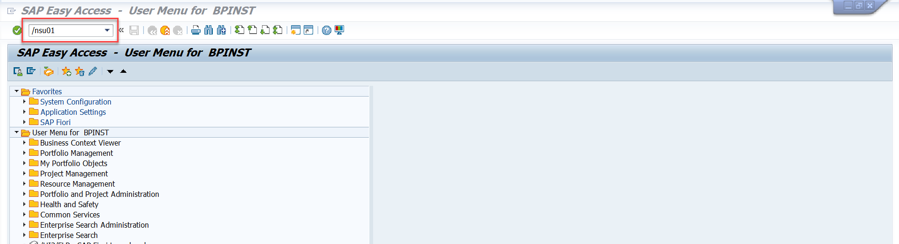

## Check SAP S/4HANA Readiness
In this section, you will activate the APIs related to SAP Environment, Health and Safety for this scenario.

### Activate the API_EHS_REPORT_INCIDENT_SRV Service

1. In your SAP S/4HANA system, open the **/n/IWFND/MAINT_SERVICE** trasaction.

2. Click on **Add Service** button.

    

3. In the **System Alias** field, select the system (For Example: Local_TGW), and in **External Service Name** field, enter API_EHS_REPORT_INCIDENT_SRV and then click on **Get Services** button

    
 
4. Select the service **API_EHS_REPORT_INCIDENT_SRV** and then click on **Add Selected Services** button

    

5. Click on **Local Object** button and then clik on tick mark button to add the service.

    

6. Once the service is added successfully, success message is displayed.

    

### Add roles to create EHS Incident Safety Observation

Creating a **EHS Incident Safety Observation**  requires two roles 
```
- SAP_BR_INDUSTRIAL_HYGIENIST
- SAP_EHSM_HSS_INCIDENT_MANAGER
```

Make sure to add these roles. To add these roles, in your SAP S/4HANA GUI system, 

1. Type **/nsu01** transaction in SAP S/4HANA and hit enter to open the **User Maintenance: Initial Screen**.

    

2. Find the SAP S/4HANA user you want to add the roles to and Press Enter. Then **Click** on the **Change** button as shown below.

    

3. You will see the **Maintain Users** Screen, Click the **Roles** Tab.

    

4. Add the first role, `SAP_BR_INDUSTRIAL_HYGIENIST` and hit enter.

    

5. Add the second role, `SAP_EHSM_HSS_INCIDENT_MANAGER` and hit enter.

    

6. Confirm both the roles are added and listed as shown be;low. Then click on **Save** button to save the role addition to the user.

    


Based on your business scenario, expose the respective APIs (For example, Record Safety Observation, Report Incident etc.).

In the next step, you can choose to either setup cloud connector or SAP Private Link Service based on the SAP S/4HANA installation.
