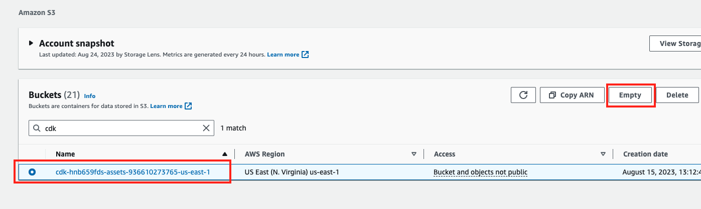
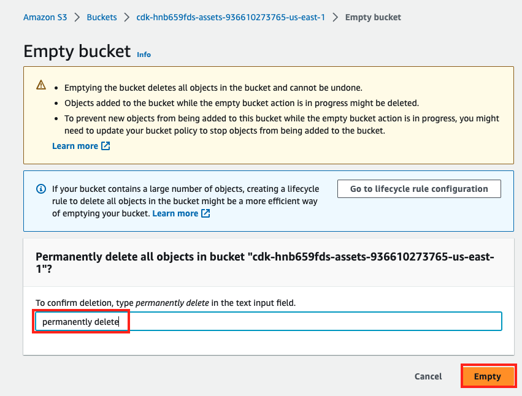
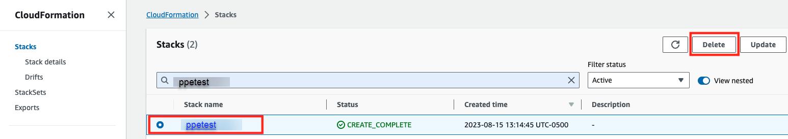
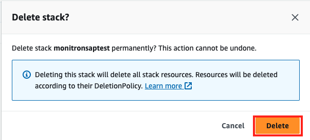

## Clean Up CDK stack
Following are the steps to cleanup CDK stack

1. Access the AWS Management Console, select **Services**. at the top of the screen, and select the S3 service. Or, you can type S3 in the search box to the right of Services, then select S3 from the list.
2. Check to make sure you're still in the correct region for your labs, by checking the region name at the top right of the AWS Console, such as the North Virginia region, us-east-1.
3. Select the S3 Bucket you created for example: cdk-xxxx
4. Click **Empty**.

 
  
5. To confirm delete, enter **'permanently delete’**, and click **empty** to delete all the objects in the S3 Bucket.

6. Access the AWS Management Console, select Services. at the top of the screen, and select the CloudFormation service. Or, you can type **CloudFormation** in the search box to the right of Services, then select **CloudFormation** from the list that comes up.
7. Select the stack name example <PPEtest>, and click **delete**.

8. Click **Delete** to delete stack permanently.

