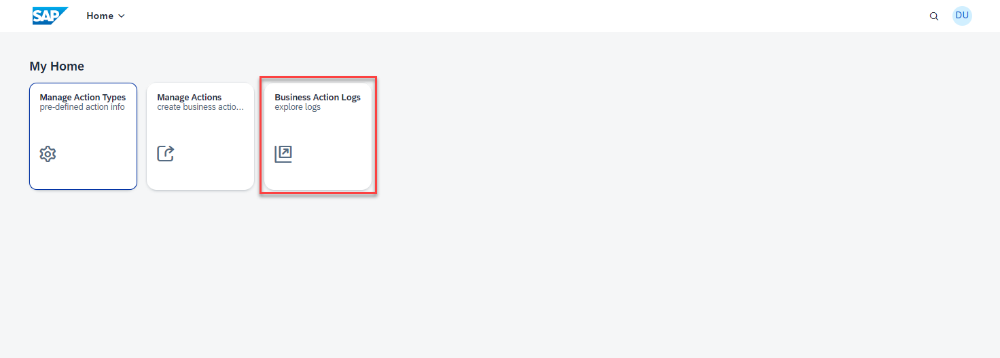

## Test the Extension Application and Execute the End-to-End Scenario

Now that you have successfully deployed the extension application in SAP BTP and completed the configurations in AWS, SAP BTP and SAP S/4HANA, follow these steps to test the application.

You have completed the end-to-end integration of events to business actions from **Amazon Rekognition - PPE detection** to **SAP S/4HANA** with **SAP BTP**.

1. Go to to your AWS account and Navigate to **Amazon S3** Service.

    

2. Choose your **Amazon S3 Bucket** which was created by you earlier.

    

3. Choose the folder named **1710/** and keep navigating into the folders, the final path would be **<your_S3_bucket>/1710/CB-FL-001/CAM-01** as shown in the image below. Download the [Missing-gloves.jpg](Missing-gloves.jpg). The image captures a group pf people working on site but have missing hand gloves, which in our case indicates a missing Personal Protective Equipment. Hence, this file is used as the sample event for testing the scenario.
    
    In the **CAM-01** folder, Choose **Upload**

    

5. Click on **Add files** button, choose the [Missing-gloves.jpg](Missing-gloves.jpg) downloaded in the previous step. Click on **Upload** button.
    
    

6. Upon the file upload, you should get a **Upload Succeeded** message

    

7. In the SAP BTP cockpit, navigate to your subaccount and choose **Cloud Foundry** > **Spaces**. Choose your space and then choose **action-management** application. Choose the url provided under **Application Routes** section.

    

8. Choose **Business Action Logs** Tile.

    

9. Under **Log Details**, click on the **Complete** to expand it. You should see a entry with **Create EHS Incident**. **Click** on it to see the details.

    

10. You can see the that the execution was successful, meaning an EHS Incident was created in the S/4HANA System.

    

11. To verify the creation of **EHS Incident**, Log into **SAP S/4HANA Fiori Launchpad**.

    

12. Navigate to **Health & Safety** Tab and Choose **Manage Incidents** Tile.

    

13. In the **Manage Incidents Screen**, Choose the latest record.

    

14. You should be able to see the **Safety Observation: PPE Incident detected** Screen, with the details of the event as follows:

    

You have completed the end-to-end integration of events to business actions from **Amazon Rekognition - PPE Detection** to **SAP S/4HANA** with **SAP BTP**.

