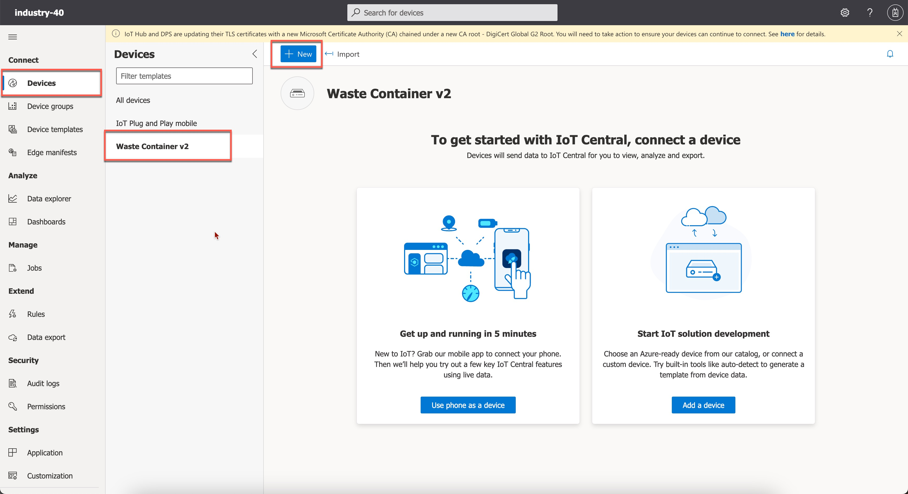

## Configure Microsoft Azure IoT Central

In this tutorial, you will configure the Microsoft Azure IoT Central Application. These are the Microsoft Azure services and components you will need for this scenario:

    - Valid Azure Subscription
    - Azure IoT Central
    - Azure Event Grid
    - Azure Function App
    - Azure Communication Service

Create a new Microsoft Azure account and get a free trial subscription. 

Once you have access to the Microsoft Azure account, you will be able to see the list of Azure services on the [Microsoft](http://portal.azure.com) Azure Portal Home Page](http://portal.azure.com).

 

In this section, you will create a Microsoft Azure IoT Central application and configure data export from the devices based on certain rules. Here you will use the GUI-based method to create the application.

### 1. Create Azure Resource Group

1. In the Azure portal, navigate to the **Home** page and choose **Resource groups**.

    

2. In the **Basics** tab, in the **Project details** section, in the **Resource group** field, enter **SAPBusinessActions**.

    

### 2. Create Azure IoT Central application

1. In your Microsoft Azure Portal Home page, choose the created Resource Group.

2. Choose **Create**. 

    

3. From the **Marketplace** search for the **IoT Central application**.

    

4. Select the **IoT Central application** tile and then choose **Create**.

    

5. In the **IoT Central application** template page,   

    - In the **Subscription** dropdown menu, select **Free Trial** in case of a free trial subscription or select your subscription.
    
    - In the **Resource group** dropdown menu, select the resource group created in Step 1.

    - In the **Resource name** field, enter **wastemgmt-iotapp**. This is a unique name you can choose.

    - In the **Application URL** field, enter **wastemgmt-iotapp**.

    - In the **Template** dropdown menu, select **Connected Waste Management**. In this scenario, you are using the template from the list of industry-relevant templates to get started quickly.

    - In the **Region** dropdown menu, select your preferred location where you would like to create your application.

    - In the **Pricing plan** dropdown menu, select your preferred plan.

6. Choose **Review + Create**.

    

 7. If you see a message **Validation Passed**, choose **Create**.

    

### 3. Create a new device template in the IoT Central application

1. Choose **Devices** and then choose **+ New** to create a new device. 

    
    <!--  -->

2. Fill the **Device name** as WC IN263-050  **Device ID** is auto-populated. In the **Device Template** dropdown menu, choose the device template named **Waste Container v2**. Set the **Simulate this device** toggle to **yes** and then choose **Create**.

    

3. Once your device is created, Under the **Form** tab, configure the following values: (value of Container ID could be of your choice)
    ```
    Container ID: Container-IN263-050
    Location Id: Plant A
    Status: Working
    ```
    Your configuration should be as shown below, and then **Save**

    

4. As we have enabled simulation, the device now simulates real-time IoT device events, you can see the generated events under the **Raw Data** tab.
5. 
    


### 4. Configure Data Export

During this step, you'll initially establish a Destination, outlining the connection specifics for the Advanced Event Mesh. Afterward, you'll configure a Data Export to transmit event information when the device's Fill Level drops below 30.

1. Choose **Data Export**, navigate to **Destinations** and then choose **New destination**

    

2. Enter the following values:
    - **Name: DEST-AEM-IN263-050**
    - **Destination type: Webhook**
    - **Callback URL: https://{Username}:{Password}@{Secured Rest HOST}/{Topic Subscription}** where Username, Password, Secured Rest HOST, Topic Subscription are noted in exercise 2. **Note:** remove the https:// from the Secured Rest HOST before pasting. Then choose **Save**.

    
       


3. Choose **Data Export** and then choose **+ New Data Export** to create a new Data export.

    

4. Enter **EXPORT-IN263-050** as value. 
   - Disable the Data export by switching of the status.
   - In the **Type of data to export** dropdown menu, select **Telemetry** and then choose **+Filter**. 

    

6. In the **Export the data if** dropdown menu, select **all of the conditions are true**. Add the following filters as shown in the following image:

    | Name | Operator |Value | 
    |---------|-------------|---------|
    | Device Template  | Equals |Waste Container v2  | 
    | Filling Level  | is less than |30  |
    | Waste Container / Status  | Equals |Working  |
    | Device name  | Equals |WC-IN263-050  | 
   
    

    <!--  -->

7.  In the **Enrichments** section, choose **+Custom String** and enter the below key value pairs as shown below.
    - Application: **Industry-40**
    - System: **Azure**     
    

8. In the **Enrichments** section, choose **+Property** and enter the below key-value pairs as shown below.
    - ContainerID: **Waste Container v2 / Container ID**
    - DeviceName: **Device name**
    - DeviceTemplate: **Device template name**
    - Location: **Waste Container v2 / Location Id**     
    

9. In the **Destinations** section, choose **+Destination** 

           

    Then select the destination created earlier in step 2 of part 4 and choose **Save**. 
        
